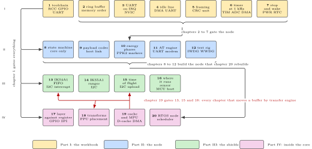

# Twenty Firmware Projects on the NUCLEO-H7A3ZI-Q

*from the Bench Inventory*

Joseph Ambrose Pagaran. Sunday 20 September 2026.

## About this document

This is a build plan for twenty firmware projects on one microcontroller board that is already on the bench, with three sensor shields, one power instrument, one data acquisition hat and a drawer of cables. Nothing here needs to be bought. Each chapter is self-contained and has the same shape: why it exists, the prior art and what is taken from it, the parts it uses, a system architecture figure, the peripheral configuration, the wiring, a memory and timing budget, a software design in UML, a data-flow sketch, a repository layout, numbered steps with real commands and code, measurable acceptance criteria, the variants it touches, pitfalls, best practices, stretch goals, a sourced roadmap, the evidence to publish, and its sources.

The twenty were chosen so that no two teach the same thing, and so that together they cover what a firmware engineer is expected to have done: a toolchain and a linker script owned end to end, buffering and interrupts, transfers by engine, framing and checksums, timing proved against an external instrument, low-power modes with a charge number, an application state machine, a codec with a host twin, energy accounted per phase, a command engine that never blocks, a test rig, three sensor shields with their bus topologies, the placement question for a classifier, the argument between a vendor layer and the registers, transforms with a numerical acceptance test, the cache and protection-unit trap this family is known for, and a real-time kernel with a measured latency distribution.

> [!NOTE]
> **What is deliberately left out**
>
> The STWIN.box is on this bench and appears in no chapter, because it is the committed subject of a separate condition-monitoring build and splitting that subject across two documents would serve neither. The Linux side of the same cable belongs to the sibling volume of twenty embedded Linux projects, whose Project 12 owns the service running on the Raspberry Pi; this volume owns the firmware side and does not repeat it. The kit-lab workbook puts this same board on the bench four times but always flashes a vendor sample in order to teach the Linux host, so its text is not repeated either, although its address map and its one-shield-at-a-time rule are authoritative here and are reused.

Where the chapters came from is worth one sentence, because it explains the numbering. Chapters 1 to 7 are the seven exercises of a workbook written for an interview on Wednesday 2 September 2026. Chapters 8 to 18 come from a scored project list, and appendix A prints every entry of that list which did not become a chapter, keeping its original number and score and saying which chapter absorbed it or why it stayed out. Chapters 19 and 20 are new: the cache and protection-unit chapter because this family's worst trap deserves one, and the real-time kernel chapter because a job-fit note records the absence of a shipped kernel application as the one standing gap in the portfolio.

## The trap that runs through this book

> [!NOTE]
> **This part is not the STM32H7 the internet is about**
>
> The STM32H7A3 is documented by reference manual RM0455. The popular member of the family, the STM32H743, is documented by RM0433. The clock tree, the power and regulator configuration and the memory map all differ. Most tutorials, blog posts, video series and example projects that say "STM32H7" were written against the other one. Code copied from them does not run slowly; it produces a board that does not boot.

Every well-engineered project encodes this distinction deliberately, and the ones that do not show exactly what it costs. The Rust hardware crate routes this part through its twin's peripheral module and selects the right manual, so the pin mapping is correct. MicroPython ships a linker script written for this part while borrowing the twin's alternate-function table. By contrast, the one board another language offers in this family hardcodes a different member's memory size in its only linker script for the family, and its own comments admit that two memory domains are unmapped and therefore skipped silently by cache maintenance.

The rule that follows is short. No linker script, clock configuration or memory map is inherited from a sibling part without being checked against RM0455 and the datasheet for this part. Any chapter that cites material written for the other member says so in the sentence that cites it. Where a fact has not been checked yet it is written as a question for the bench and not as an assertion, and the reader can tell the two apart at a glance.

## The board, and what it does not have

The NUCLEO-H7A3ZI-Q carries an STM32H7A3ZIT6Q: a Cortex-M7 at 280 MHz with 2 MB of flash, a switched-mode supply, and an on-board ST-LINK V3E that is a debug probe, a virtual COM port and a drag-and-drop disk at the same time. It has Zio and ST morpho connectors and an Arduino-compatible header that the three shields plug onto.

What it does not have matters more, because most of the published material assumes otherwise. There is no Ethernet: the upstream board description lists no network controller and no media access controller anywhere, so every tutorial that pairs this family with a network stack over Ethernet is for a different part. Any network path in this book goes through a coprocessor or a cellular modem. There is no on-board card socket, no external flash and no bus transceiver for the automotive bus. There is no cryptographic accelerator.

Four facts about the board are settled from two independent machine-readable sources that name this exact board, and are written as fact throughout: the 32.768 kHz crystal is fitted, so the real-time clock is usable and chapters 7, 10 and 20 rely on it; the high-speed clock is supplied by the debugger in bypass mode at 8 MHz, and 8 divided by 2, multiplied by 140, divided by 2 is the 280 MHz every chapter assumes; the user LEDs are LD1 green on PB0, LD2 yellow on PE1 and LD3 red on PB14; and the user button is on PC13. The virtual COM port is USART3, but the pins PD8 and PD9 are a convention of this board family rather than a checked fact, and are confirmed in the board manual before they are printed as one.

## How to read and how to work

- **Order.** Chapter 1 gates everything, because nothing else is meaningful without a build you trust. Chapters 2 to 7 are the workbook and prepare the node. Chapters 8 to 12 build the node, which chapter 20 then rebuilds on a kernel. Chapter 19 gates every chapter that moves a buffer with a transfer engine, which is 13, 15 and 18. **Figure 1** shows those dependencies and nothing else, because the rest of the order is a preference.
- **Effort.** Each chapter's key-facts box gives a difficulty from 1 to 5 and an estimate in evenings of about four hours. The total is roughly eighty evenings. Pick by interest and by what the next application asks for.
- **Evidence first.** Every chapter ends with the artefacts to publish: a repository whose README opens with a figure, a console log, a measurement table generated from data rather than typed, and a short note on what the measurement found. A chapter is finished when the evidence exists, not when the code runs once.
- **Measurements carry their instrument.** Every number in this book names the instrument that produced it, or says "not measured". There are no invented microamps and no borrowed cycle counts.
- **Licences before code.** Every dependency names its licence before a reader writes anything around it, because finding out afterwards is expensive.

*Figure 1. The twenty chapters against the peripherals and subsystems they exercise, with the four real dependencies drawn and nothing else. The red arrows are the one gate that is easy to miss: any chapter that moves a buffer with a transfer engine depends on chapter 19.*

## The bench inventory

| Item | What it is | Used in chapters |
| --- | --- | --- |
| NUCLEO-H7A3ZI-Q | STM32H7A3ZIT6Q, Cortex-M7 at 280 MHz, 2 MB flash, switched-mode supply, ST-LINK V3E | every chapter |
| X-NUCLEO-IKS4A1 | MEMS shield with three bus topologies selected by jumper | 13, 16, 20 |
| X-NUCLEO-IKS5A1 | Industrial MEMS shield: ISM6HG256X, ISM330IS with its in-sensor processor, IIS2DULPX, IIS2MDC, ILPS22QS | 14 |
| X-NUCLEO-53L8A1 | Eight by eight multizone time-of-flight shield | 15 |
| DFRobot SEN0032 | ADXL345 three-axis accelerometer breakout, I2C or SPI | 19 |
| MCC 118 DAQ HAT on a Raspberry Pi | 8 channels, 12 bit, 100 kS/s aggregate, the calibrated analogue reference | 6, 12 |
| nRF-PPK2 | Power Profiler Kit II, ammeter or source meter to 1 A, with eight digital inputs | 7, 10, 12 |
| Raspberry Pi 3, 3B+, 4 | Linux hosts for the edge side and for the test rig | 9, 12, 16 |
| SIM7020E, SIM7070G, SIM7600E-H | Cellular modems on their own supply, never fed from the board | 11 |
| Renkforce USB/TTL cable | 3.3 V serial console cable, red 5 V lead unconnected | several |
| Breadboard, jumpers, LEDs, resistors | Wiring and indicators. Every header on the bench is female | 19 and others |
| Windows 11 host with the Linux subsystem | Build host, and the Linux boards themselves | every chapter |

*Table 1. The inventory, and where each item is used. Small parts such as resistors, microSD cards and USB supplies are assumed to be in the drawer. The STWIN.box is on the bench and appears in no chapter, which is deliberate: it is the committed subject of a separate condition-monitoring build.*

## The twenty chapters at a glance

| No. | Chapter | Target | Level | Evenings |
| --- | --- | --- | --- | --- |
| 1 | The toolchain, first light, and printf over the ST-LINK | Nucleo alone | 3 | 3 |
| 2 | A single producer, single consumer ring buffer | Nucleo alone | 3 | 3 |
| 3 | Receiving on interrupt without losing bytes | Nucleo alone | 3 | 4 |
| 4 | Circular DMA and the idle line | Nucleo alone | 4 | 4 |
| 5 | Framing and the hardware CRC unit | Nucleo alone | 3 | 4 |
| 6 | Sampling on a timer at exactly 1 kHz | Nucleo + MCC 118 | 4 | 4 |
| 7 | Stop mode, RTC wake, and a battery number | Nucleo + PPK2 | 4 | 4 |
| 8 | The node's state machine, with a transmit that is a stub | Nucleo alone | 3 | 4 |
| 9 | The payload codec and its Python twin | Nucleo + host | 3 | 4 |
| 10 | Where the energy goes: wake, sense, compute, send | Nucleo + PPK2 | 4 | 4 |
| 11 | An AT engine that never blocks | Nucleo + SIM7020E | 4 | 5 |
| 12 | Energy as a regression test, and the rig that runs it | Nucleo + Pi + PPK2 | 5 | 5 |
| 13 | The IKS4A1: FIFO, watermark, interrupt | Nucleo + IKS4A1 | 3 | 4 |
| 14 | The IKS5A1: low and high g at once, wide pressure | Nucleo + IKS5A1 | 4 | 4 |
| 15 | Eight by eight time of flight, decided on the MCU | Nucleo + 53L8A1 | 4 | 4 |
| 16 | Where the classifier runs: sensor, MCU or host | Nucleo + IKS4A1 + Pi | 5 | 5 |
| 17 | The same driver twice: vendor layer against registers | Nucleo + a shield | 4 | 4 |
| 18 | Transforms and filters with a numerical acceptance test | Nucleo alone | 4 | 4 |
| 19 | Caches, the MPU, and why DMA reads stale bytes | Nucleo + ADXL345 | 5 | 4 |
| 20 | Three jobs at once: the node as an RTOS application | Nucleo + IKS4A1 | 5 | 6 |

*Table 2. Overview. Level is 1 for routine and 5 for research-grade; evenings are about four hours each and are estimates rather than promises. Where this table and a chapter's key-facts box differ, the key-facts box is authoritative.*

## Variants, and how to read along an axis

The same exercise solved several ways is the most useful thing a book like this can offer, and twenty chapters multiplied by seven axes is not a book. So each variant is built in full exactly once, in the chapter where it teaches most, and is referenced from everywhere else it applies. Appendix F prints the whole matrix, and every chapter's variants table names the chapter where each row is built in full.

The seven axes are: the execution model, from a polled loop through interrupts and transfers to a kernel task; synchronisation, from a volatile flag through semaphores, mutexes, queues, notifications, event groups and stream buffers; time and safety, covering the tick, the general and low-power timers, the real-time clock, tickless idle and the two watchdogs; peripheral substitution, meaning the same job done on different silicon; the operating system, bare metal against two kernels; the language, with C as the baseline and C++, Rust and MicroPython on the target; and intelligence and reach, from local only to a classifier in the sensor, on the microcontroller or on a host.

To read along an axis rather than front to back, start at the chapter that builds the variant in full and follow its variants table outward. The language axis, for example, starts at chapter 1 for the five-minute interpreter path, goes to chapter 9 for C++ and the host twin, and ends at chapter 17 for Rust. The synchronisation axis is almost entirely chapter 20.

## The instruments, and what the bench does not have

There is no oscilloscope, no logic analyser and no Joulescope on this bench, confirmed on Sunday 20 September 2026. There is also no soldering iron, so nothing that needs a solder bridge moved is proposed anywhere in this book. Every timing and energy claim therefore comes from one of three instruments: the nRF-PPK2, whose current trace and eight digital inputs are time-aligned and which is this book's logic recorder for slow signals; the MCC 118 on a Raspberry Pi at 100 kS/s aggregate, which is the calibrated analogue reference; and the board's own timers and cycle counter. A chapter that would be easier with an oscilloscope says so in one sentence and names the substitute.

## Conventions and assumptions

- **Host.** A Windows 11 machine with the Linux subsystem is the build host, and the Raspberry Pi boards are the second host for the test rig.
- **Console.** 115200 baud, 8N1, no flow control, over the probe's virtual COM port. The maximum reliable rate on that port is confirmed in chapter 3 rather than assumed.
- **Logic levels.** 3.3 V only. Nothing on this bench puts 5 V into a processor pin. The cellular modems need peaks of about 2 A from their own supply and are never fed from the board.
- **Pin numbers.** Port and pin as the board manual gives them, with the Arduino header name alongside where a shield is involved. Anything taken from the Nucleo-144 convention rather than the manual is marked as convention until it is checked.
- **Code.** C is the baseline, Python is the host language for design, analysis and test harnesses, and shell is the glue. Every snippet is a starting point rather than a tested build; the acceptance criteria are what count.
- **Generated code.** Nothing generated by a configuration tool is presented as reviewed source. Where a chapter uses a generator it names the peripherals to configure and the constraints they satisfy, then shows the code written on top.
- **Naming.** Repositories are lower case with hyphens and begin with the board name, one repository per chapter, each with a licence file and a README that opens with the architecture figure.

## How this document is built

The source is LaTeX with one file per chapter under `sections/` and one TikZ or circuitikz file per figure under `figures/`. `build.py` runs pdflatex for the PDF, renders every figure through latex and dvisvgm to SVG, and converts the same LaTeX subset to a single self-contained HTML file with the figures embedded. `python build.py --check sections/c19.tex` compiles one chapter alone for quick iteration, and `python lint.py` enforces the house rules a compiler cannot see. The authoring contract is in `AUTHORING.md` and the prior-art pool with its licence categories is in `SOURCE.md`.

---

[Contents](../README.md) &nbsp;&nbsp;|&nbsp;&nbsp; [Next](01-the-toolchain.md)
