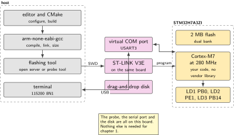
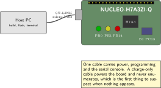
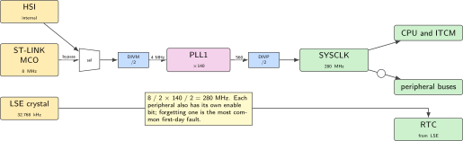
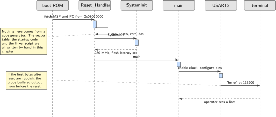
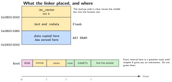

# Chapter 1. The toolchain, first light, and printf over the ST-LINK

> **Target board:** NUCLEO-H7A3ZI-Q  
> **Theme:** Cross toolchain, startup, linker script, flashing

> **Key facts**
>
> - **Board:** NUCLEO-H7A3ZI-Q, and nothing else
> - **Peripherals:** RCC and PWR for the clock tree, GPIO for three LEDs, USART3 for the console
> - **Toolchain:** arm-none-eabi-gcc with CMake, plus an open flashing tool. The vendor IDE is the alternative, not the baseline
> - **Operating system:** Bare metal
> - **Difficulty:** 3 of 5
> - **Effort:** 3 evenings of about four hours
> - **Deliverable:** A repository whose every byte you can account for: hand-written vector table, startup code and linker script, a build that runs from a clean clone in two commands, a blinking LED and a line of text on the console

## Why this project

Every later chapter needs a build you trust and a way to see what the board is doing. This chapter builds both, and does it without a code generator, because the one thing worth knowing before anything else is what is actually in the image. A generated project is several thousand lines pinned to one version of one vendor's tool. It compiles, and it teaches nothing about the first instruction the processor executes.

The deliverable is small on purpose: one blinking light and one line of text. What makes it worth three evenings is that you will have written the vector table, the startup code that copies initialised data into memory and zeroes the rest, the linker script that decides where each of those lives, and the clock configuration that takes the part from its reset state to full speed. Chapter 2 onwards assumes all of that exists and is understood.

There is a second reason, specific to this board, and it is the reason this volume exists at all. Most published material for this family was written for a different member of it. Starting from a hand-written, checked configuration is the only way to be sure you are not inheriting somebody else's part.

> [!NOTE]
> **This part is not the STM32H7 the internet is about**
>
> The STM32H7A3 is documented by reference manual RM0455. The popular member of the family, the STM32H743, is documented by RM0433, and its clock tree, power configuration and memory map all differ. Code copied from an H743 tutorial does not run slowly here; it produces a board that does not boot. Every linker script, clock configuration and memory map in this book is checked against RM0455, and every chapter that cites material written for the other part says so in the sentence that cites it.

## Prior art and what to reuse

| Source | What it gives | What it does not | Licence |
| --- | --- | --- | --- |
| Lyubka's bare-metal programming guide | The clearest open walkthrough of vector table, startup code and linker script, building up to a working clock tree | Its board templates stop at smaller cores. The clock tree, the caches and the memory regions of this part are yours | MIT |
| Oblaukhov's CMake package layer | A mature toolchain file and target handling that already knows this silicon family | It pulls in the vendor pack, so it is not the hand-written path this chapter takes | MIT |
| Two register-level projects for this exact board | One brings the part to 280 MHz with correct flash wait states; the other builds with a modern toolchain and no assembly file | Neither states a licence, so both are read and neither is copied | None stated |
| The MicroPython board definition | A working, checked clock configuration for this exact part, in a file you can read in a minute | It is a whole interpreter, not a starting point for C | MIT |
| The vendor's firmware package | Reference startup and linker scripts for this part, and a basic example tree | Its middleware sits under a licence tied to this vendor's silicon | Mixed |

*Table 1.1. Prior art for chapter 1. The two unlicensed repositories are read as worked examples and re-derived, because a repository with no licence file is not open source.*

What is left to write is the whole of it, and that is the point. The sources above settle questions rather than supply code: what the startup sequence must do, which multiplier and dividers reach 280 MHz, and which pins the three LEDs are on. The code is yours, which is what makes the repository portfolio evidence rather than a fork.

## Parts from the inventory

| Part | Role | Interface |
| --- | --- | --- |
| NUCLEO-H7A3ZI-Q | The whole chapter. Its on-board probe is also the programmer, the serial port and a drag-and-drop disk | Micro USB to the host |
| A USB data cable | Power, programming and console on one lead | Micro USB |
| Host PC | Build, flash and terminal | Windows with the Linux subsystem, or a Raspberry Pi |

*Table 1.2. Inventory items used in chapter 1. Nothing is wired and nothing is bought.*

## System architecture



*Figure 1.1. Everything in this chapter happens on one board and one cable. The probe on the left half of the board programmes the microcontroller on the right half and carries its console back to the host.*

The probe is a separate microcontroller on the same board. It presents three things to the host at once: a debug interface for programming and halting, a serial port bridged to USART3 on the target, and a small disk you can copy a binary onto. This chapter uses the first two and mentions the third, because knowing all three exist saves an hour the first time one of them misbehaves.

## Peripheral configuration

| Peripheral | Mode | Clock source | Pins and function | Interrupt and transfers |
| --- | --- | --- | --- | --- |
| RCC and PWR | Bypass input, then phase-locked loop | 8 MHz from the probe | None | None |
| GPIOB, GPIOE | Push-pull output | Peripheral bus | PB0, PE1, PB14 | None |
| USART3 | Asynchronous, 115200 8N1 | Peripheral bus | Confirm in the board manual | Polled in this chapter |
| GPIOC | Input | Peripheral bus | PC13, user button | None in this chapter |

*Table 1.3. Peripheral configuration. The LED and button pins are confirmed from two independent sources; the console pins are the usual convention for this board family and are checked in the board manual before you trust them.*

## Wiring



*Figure 1.2. Nothing is wired in this chapter. The three LEDs and the button are on the board, and their pins are confirmed.*

## Memory and timing budget



*Figure 1.3. The clock tree this chapter configures. The multiplier and dividers are taken from a working configuration for this exact part, not from a tutorial written for its sibling.*

| Quantity | Budget | Measured | Margin |
| --- | --- | --- | --- |
| Flash used | 12 kB, revised from 8 kB | 11 012 B | +1 276 B, 10.4 per cent |
| Static memory used | 4 kB | 484 B | +3 612 B, 88 per cent |
| Reset to first printed line | 100 ms | 2.489 ms | +97.5 ms, 97.5 per cent |

*Table 1.4. The budget table, which every chapter carries. Measured on the board at commit 8ecd613 on Saturday 3 October 2026, with `arm-none-eabi-size -A` for the first two rows and the part's own cycle counter for the third.*

**The flash budget was revised upward and the original is kept in the table, because a budget quietly replaced by whatever was built is not a budget.** 8 kB was chosen before anything had ever been compiled. Measured, `printf` and its dependencies from newlib-nano are 3 920 B on their own, which is 48 per cent of that original figure, in a chapter whose title is “the toolchain, first light, and printf over the ST-LINK”. The budget was set without measuring the thing the chapter is named after, which is exactly the mistake the article cited in this chapter's prior art table exists to warn about.

Where the 11 012 B goes, attributed from the link map rather than estimated:

| Source | Bytes | Share |
| --- | --- | --- |
| newlib-nano `libc`, almost all of it `printf` | 3 920 | 36 per cent |
| this repository's own code | 4 557 | 41 per cent |
| string literals and the remainder | 2 535 | 23 per cent |

*Table 1.5. Every byte of the image attributed to where it came from, read out of the link map. The compiler is not asked to estimate and neither is the author.*

The alternative to revising was to cut the explanatory text this project prints about its own provenance. That saves at most the 2 580 B of `.rodata` and would land at 8 432 B, still over the original 8 kB, so it would not even achieve the budget while making the volume worse at what it is for. On a part with 2 MB of flash the image is 0.53 per cent of what is available, so the budget's purpose here is to notice unintended growth rather than to fit, and 12 kB with 10 per cent headroom serves that.

**Static memory is 484 B, which is `.data` plus `.bss` and is what static conventionally means.** It is reported separately from the 9 220 B that the linker script reserves for the stack and heap, because that is a reservation rather than a set of variables: 8 kB of stack and 1 kB of heap, named in `c/ld/stm32h7a3zi.ld`. All of it together is 9 704 B, 7.40 per cent of the 128 kB of DTCM. Collapsing the two would have shown the 4 kB budget exceeded by a factor of two for no real reason.

**The last row was expected to wait for chapter 6 and did not.** The caption used to say so. Measuring the time from reset to the first printed character needs a clock running before anything else happens, and the Cortex-M7 has one: `DWT_CYCCNT` is architectural, defined by ARM for ARMv7-M, so RM0455 has nothing to say about it and it was available in this chapter all along. It is started at the top of `Reset_Handler`, before `.data` is copied, which is safe only because those are peripheral registers rather than RAM.

So the figure excludes only the hardware's own reset sequence and the vector fetch. Of the 2.489 ms, about 2.4 ms is the delay calibration deliberately spinning 8 000 iterations to measure itself, so this row is mostly the cost of a measurement rather than of startup. An earlier version spent 11.989 ms there, which was 99 per cent calibration, and the probe was reduced once that was visible.

## Firmware design (UML)



*Figure 1.4. From power-on to the first printed line. Everything before main is code written in this chapter.*

The processor does very little for you at reset. It reads two words from the start of flash, the initial stack pointer and the address of the first instruction, and jumps there. Everything a C programmer takes for granted, namely that initialised globals hold their values and uninitialised ones are zero, happens because the startup code copies one region and clears another before calling main. The linker script is what tells the startup code where those regions are, which is why the two are written together and neither makes sense alone.

## Data flow (ASCII)

```text
  host                                   board
  +------------------------------+       +--------------------------------+
  | cmake --build build          |       | reset: MSP and PC from flash   |
  |   |                          |       |   |                            |
  |   v                          |  SWD  |   v                            |
  | firmware.elf ----------------+-----> | startup: copy .data, zero .bss |
  |                              |       |   |                            |
  | terminal at 115200           |       |   v                            |
  |   ^                          | USART | clocks: 8 MHz -> 280 MHz       |
  |   |                          |  3    |   |                            |
  |   +--------------------------+-------+ main: blink LD1, print a line  |
  +------------------------------+       +--------------------------------+
```

## Repository layout

```text
nucleo-h7a3-firstlight/
  CMakeLists.txt
  cmake/arm-none-eabi.cmake     # the toolchain file, not the project file
  ld/stm32h7a3zi.ld             # written here, checked against RM0455
  src/startup.c                 # vector table and reset handler, in C
  src/system.c                  # clock tree, flash latency, voltage scaling
  src/uart.c                    # USART3 at 115200, polled
  src/retarget.c                # printf to USART3
  src/main.c
  tools/reconcile_size.py       # sums the map file against the size output
  README.md                     # starts with the architecture figure
```

## Steps

**Step 1.** **Install the toolchain and prove it runs.** You need a cross compiler, CMake and a flashing tool. Nothing here needs the vendor IDE.

```bash
arm-none-eabi-gcc --version
cmake --version
probe-rs --version          # or: openocd --version
```

The flashing tool knows this part by name. Confirm it before going further, because a tool that does not know your die will fail in a way that looks like a hardware fault.

```bash
probe-rs chip list | grep -i H7A3
```

**Step 2.** **Write the linker script.** Two regions to begin with. The sizes come from the datasheet, not from a sibling part.

```ld
MEMORY
{
  FLASH (rx) : ORIGIN = 0x08000000, LENGTH = 2048K
  RAM  (rwx) : ORIGIN = 0x24000000, LENGTH = 1024K   /* AXI SRAM, confirm */
}
ENTRY(Reset_Handler)
SECTIONS
{
  .isr_vector : { KEEP(*(.isr_vector)) } > FLASH
  .text   : { *(.text*) *(.rodata*) } > FLASH
  _sidata = LOADADDR(.data);
  .data   : { _sdata = .; *(.data*) . = ALIGN(4); _edata = .; } > RAM AT> FLASH
  .bss    : { _sbss = .; *(.bss*) *(COMMON) . = ALIGN(4); _ebss = .; } > RAM
  . = ALIGN(8);
  _estack = ORIGIN(RAM) + LENGTH(RAM);
}
```

The three symbol pairs are the contract with the startup code. Nothing else in the file matters yet.

**Step 3.** **Write the startup code.** It can be C. Assembly is traditional, not required.

```c
#include <stdint.h>

extern uint32_t _sidata, _sdata, _edata, _sbss, _ebss, _estack;
extern int main(void);
void SystemInit(void);

void Reset_Handler(void)
{
    uint32_t *src = &_sidata, *dst = &_sdata;
    while (dst < &_edata) *dst++ = *src++;      /* initialised globals */
    for (dst = &_sbss; dst < &_ebss; ) *dst++ = 0;   /* the rest */

    SystemInit();
    main();
    for (;;) { }                                 /* main must not return */
}

static void Default_Handler(void) { for (;;) { } }

__attribute__((section(".isr_vector"), used))
void (* const vector_table[])(void) = {
    (void (*)(void)) &_estack,
    Reset_Handler,
    Default_Handler,        /* NMI */
    Default_Handler,        /* HardFault, replaced properly in chapter 3 */
};
```

**Step 4.** **Bring the clock up to 280 MHz.** The input is 8 MHz from the probe, in bypass mode because it is a clock signal and not a crystal. Divide by two, multiply by 140, divide by two. Before raising the frequency, raise the core voltage and add flash wait states, in that order. Doing it in the wrong order is the classic way to produce a board that runs at reset speed or not at all.

**Step 5.** **Blink one LED.** LD1 is on PB0. Enable the port clock first; a pin configured before its clock is running does nothing and reports no error.

**Step 6.** **Bring up the console and retarget printf.** USART3 at 115200. Write the character output hook so the standard library finds it.

```c
int _write(int fd, const char *buf, int len)
{
    (void) fd;
    for (int i = 0; i < len; i++) uart_putc(buf[i]);
    return len;
}
```

Link against the small standard library and ask for floating point support only if you need it, because it is not free.

```bash
arm-none-eabi-gcc ... --specs=nano.specs --specs=nosys.specs
```

**Step 7.** **Account for every byte.** Compare the linker map against the size output and make a script do it, so the check survives being forgotten.

```bash
arm-none-eabi-size -A build/firmware.elf
python tools/reconcile_size.py build/firmware.map build/firmware.elf
```

**Step 8.** **Prove the clean-clone build.** Delete the build directory, clone into a fresh folder, and build and flash with two commands on a machine with no vendor IDE installed. If that does not work, the repository is not evidence of anything.

```bash
cmake -B build -DCMAKE_TOOLCHAIN_FILE=cmake/arm-none-eabi.cmake
cmake --build build -j && probe-rs run --chip STM32H7A3ZITx build/firmware.elf
```

## Build, flash and debug



*Figure 1.5. What the linker placed and where, and the boot timeline whose intervals are still unknown. Do not guess them; chapter 6 builds the instrument that measures them.*

Three ways to get the image onto the board, in the order you should try them: the flashing tool above, the open debug server, or copying the binary onto the disk the probe presents. The last needs no tools at all and is the fastest way to prove a board is alive.

```bash
openocd -f interface/stlink.cfg -f target/stm32h7x.cfg \
  -c "program build/firmware.elf verify reset exit"
```

> [!NOTE]
> **When the board enumerates but says nothing**
>
> In order of likelihood: a charge-only cable, which powers the board and never appears as a device; the wrong serial device, because the probe presents more than one and the wrong one is silent rather than an error; a host service that probes new serial devices and corrupts the first frames; and a peripheral whose clock was never enabled. If the first bytes after a reset are rubbish, the probe buffered output from before the reset.

## Verification and acceptance criteria

- A clean clone builds and flashes in two commands on a machine with no vendor IDE, proven on a second machine and not only on yours.
- The size output and the map file reconcile to the byte, and a script prints the reconciliation rather than you doing it by eye.
- A breakpoint on the first instruction of the reset handler is reached before any library code, and two sentinel variables show that initialised data was copied and uninitialised data was zeroed.
- The clock configuration is asserted at startup: a frequency above what the selected voltage scale allows stops the board with a named error rather than producing an intermittent fault later.
- The console prints a line within a second of reset, at 115200, and survives twenty scripted replug cycles.

## Variants

| Axis | Variant | What changes | Cost | Built in full in |
| --- | --- | --- | --- | --- |
| Language | MicroPython | Copy the published firmware for this exact board onto the probe's disk and you have a prompt in five minutes, with no build at all | Determinism and direct control of transfers | Here, as the five-minute path |
| Language | C++ | The same startup code, plus what you disable: exceptions cost roughly 10 to 30 kB of tables, which on 2 MB of flash is a choice rather than a necessity | A decision to justify | Chapter 9 |
| Language | Rust | The hardware crate names this part and routes it through its twin with the right manual selected; the async framework names this exact package and pin count | The vendor library is replaced entirely | Chapter 17 |
| Operating system | Bare metal | The baseline here | None | Here |
| Execution model | Polled loop | The baseline here. Everything is in main | Nothing runs while you wait | Chapter 3 |
| Peripheral | Probe disk instead of a debugger | Drag a binary onto a disk. No tools, no drivers | No debugging | Here, in the step above |

*Table 1.6. Variants for chapter 1. The interpreter path is worth trying first even if you never use it again, because it proves the board and the cable before you have written a line.*

## Pitfalls

- Inheriting a linker script from the better-known member of this family. Its memory sizes and layout are different, and the failure looks like a hardware fault.
- Raising the clock before the voltage scale and the flash wait states.
- Configuring a pin before enabling its port clock. No error is reported.
- Believing a summarised read of a large generated file. One check of the flashing tool's target list reported that this part was absent; searching the raw file found the exact die. Search the file, not a summary of it.
- Letting main return. The loop at the end of the reset handler is not decoration.
- Assuming the console pins from a tutorial. The peripheral is confirmed; the pins are convention until you read the board manual.

## Best practices applied

- Nothing generated is presented as reviewed source. Every line in the image was written or read by the author.
- The build is reproducible from a clean clone, which is the only definition of a build that means anything to someone else.
- Facts about the board carry their evidence. Pins confirmed from two independent sources are written plainly; pins taken from convention are marked as such.
- A measurement stays blank until it has been taken.

## Stretch goals

- Add a second build configuration that places the hot loop in tightly coupled memory and compare the size output, which is the thread chapter 19 picks up.
- Replace the polled console with the interrupt-driven one from chapter 3 and measure the difference in time spent waiting.
- Build the same project with the modern LLVM-based toolchain. Note the rename: the older embedded toolchain for this architecture ended at version 19.1.5 and is superseded.

## Roadmap and next steps

Chapter 2 gives the console somewhere to put bytes that arrive faster than they are consumed, which is the first thing that breaks once the link is faster than a human reading it.

For going deeper on what happens before main, the standard progression is the series that starts at bare-metal C and works through the standard library and a bootloader. For the build system, the vendor's own tool has generated this kind of project since version 6.11 of its configurator, and the distinction it draws between tool-owned and author-owned files is worth reading even if you never use it. Appendix H lists the courses; the one that walks a single problem from a polled loop to an event-driven architecture across fifty-six lessons is the best free companion to this whole volume, though its code licence means it is recommended and never quoted.

## Portfolio evidence

- A public repository whose README opens with the architecture figure and states, in one sentence, that no line of the image was generated.
- The reconciliation output showing the map file and the size output agreeing to the byte.
- A terminal recording of a clean clone building, flashing and printing, on a machine that has never had the vendor IDE installed.

## Sources

Normative references:

- Reference manual RM0455, for this part. Not RM0433, which is its sibling.
- The board user manual for MB1363, for the connectors, the jumpers and the console pins.
- The STM32H7A3xI datasheet, for memory sizes and the clock limits at each voltage scale.

Reusable implementations:

- Lyubka's bare-metal programming guide, MIT.  
  <https://github.com/cpq/bare-metal-programming-guide>
- Oblaukhov's CMake package layer for this silicon family, MIT.  
  <https://github.com/ObKo/stm32-cmake>
- The flashing and debugging tool whose target list includes this die.  
  <https://github.com/probe-rs/probe-rs>
- Memfault's article on printf for embedded systems, which is the definitive treatment of the retarget hook and its costs.  
  <https://interrupt.memfault.com/blog/printf-on-embedded>
- The MicroPython board definition for this exact board, MIT, which is the shortest readable statement of a working clock configuration.  
  <https://github.com/micropython/micropython>

---

[Previous](00-about-this-volume.md) &nbsp;&nbsp;|&nbsp;&nbsp; [Contents](../README.md) &nbsp;&nbsp;|&nbsp;&nbsp; [Next](02-a-single-producer.md)
