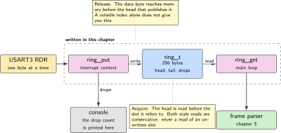
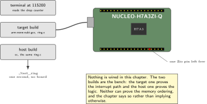
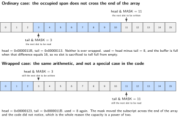
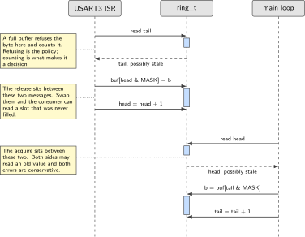
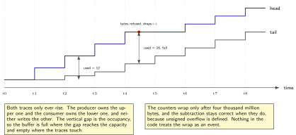

# Chapter 2. A single producer, single consumer ring buffer

> **Target board:** NUCLEO-H7A3ZI-Q  
> **Theme:** Lock-free buffering, memory ordering on the M7

> **Key facts**
>
> - **Board:** NUCLEO-H7A3ZI-Q, and nothing else
> - **Peripherals:** USART3 receive interrupt as the producer, the cycle counter for the cost measurement, one spare pin as a marker
> - **Toolchain:** arm-none-eabi-gcc with CMake for the target, and the host compiler for the same two source files
> - **Operating system:** Bare metal
> - **Difficulty:** 3 of 5
> - **Effort:** 2 evenings of about four hours
> - **Deliverable:** One C file and its header that compile unchanged on the target and on the host, a test that pushes tens of millions of bytes through the structure off-target, a barrier you can justify line by line, and a counter that reports how many bytes were dropped

## Why this project

Chapter 1 left you with a console that prints. The moment anything arrives faster than the code that reads it, you need somewhere to put bytes that is not a single variable. That place is a ring buffer, and it is the single most reused structure in this book: chapter 3 fills it from an interrupt, chapter 4 fills it from a transfer engine, chapter 5 parses frames out of it, and chapter 11 runs a command queue on top of it. Getting it right once is worth two evenings.

The structure itself is twenty lines. What takes the two evenings is the argument for why those twenty lines are correct when one side of them runs in an interrupt handler and the other runs in the main loop. That argument has three parts, and only the first is widely understood. The first part is that a power-of-two capacity turns a modulo into a mask. The second is that free running indices, never wrapped and only masked at the point of use, give you the occupancy for free and remove a whole class of off-by-one faults. The third part is the ordering of the data write against the index publication, which is where the word `volatile` is usually written and where it does not do the job people think it does.

This chapter also builds the habit that makes every later chapter testable. The buffer compiles for the host with no change, so the logic is exercised by a test that runs in a second on a laptop rather than by flashing a board and watching a terminal. What the host cannot test is named plainly rather than glossed over: the host is strongly ordered, so it will never reproduce a reordering fault. The ordering is argued from the architecture and from the published correctness proof, not from a passing test.

> [!NOTE]
> **What volatile does and what it does not do**
>
> Declaring the head and tail indices `volatile` stops the compiler holding them in a register across the loop and stops it reordering them against each other. It says nothing about the ordinary store to the data array that has to be visible before the index that publishes it. A compiler is free to sink that store past a volatile one, and the C standard gives you no ordering between a volatile access and a non-volatile access. The fix is an explicit release on the publishing store and an acquire on the consuming load, which is what the rest of this chapter is about.

## Prior art and what to reuse

| Source | What it gives | What it does not | Licence |
| --- | --- | --- | --- |
| Majerle's lightweight ring buffer | A mature, maintained implementation with zero-copy regions designed for handing a contiguous span to a transfer engine, which is exactly what chapter 4 needs | It assumes a coherent view of memory. With the data cache on and the buffer in main memory, the maintenance step is yours and is chapter 19 | MIT |
| Quantum Leaps’ lock-free ring buffer | The smallest readable version, with its atomicity assumptions stated in the header rather than implied, and a test suite you can run | Single byte elements and no zero-copy path. It is a teaching reference more than a dependency | MIT |
| Le, Guatto, Cohen and Pop, SBAC-PAD 2013 | The correctness argument under the C11 memory model, with the precise placement of the acquire and the release, and the batching variants that reduce how often the two sides look at each other's index | It is a paper about queues on cache-coherent multiprocessors, not about an interrupt handler on one core. The mapping to this case is yours | Paper |
| Arm application note DAI0321A | What the barrier instructions actually order on this profile, and when a data synchronisation barrier is needed rather than a data memory barrier | It predates this core's revision and says nothing about the cache maintenance operations chapter 19 needs | Vendor note |

*Table 2.1. Prior art for chapter 2. Both libraries are permissively licensed and either could be a dependency. This chapter writes the structure anyway, because the ordering argument is the deliverable and you cannot make that argument about code you have not written.*

What is left to write is small and specific: the structure, the two access functions, the placement of the two barriers, the overflow counter, and the host test harness. If you would rather depend on a library in production, depend on the first one in the table; it is maintained and it has the zero-copy path this book needs by chapter 4. Write it once yourself first, because the alternative is a project where the most load-bearing twenty lines are the only ones you cannot explain.

## Parts from the inventory

| Part | Role | Interface |
| --- | --- | --- |
| NUCLEO-H7A3ZI-Q | Target build, the interrupt that fills the buffer, and the cycle counter that costs it | Micro USB to the host |
| A USB data cable | Power, programming and console on one lead | Micro USB |
| Host PC | The second build of the same source, and the test that runs in a second | Windows with the Linux subsystem, or a Raspberry Pi |

*Table 2.2. Inventory items used in chapter 2. Nothing is wired and nothing is bought. The host build is half the chapter.*

## System architecture



*Figure 2.1. One producer, one consumer, one buffer. The two marked points are where the ordering is established: the producer releases the data before it publishes the head, and the consumer acquires the head before it reads the data.*

Only two pieces of code touch the structure, and they touch different halves of it. The producer writes the data array and advances the head. The consumer reads the data array and advances the tail. Neither writes the other's index. That restriction is the whole reason the structure needs no lock, and it is also the restriction that a second producer quietly removes: the moment a second interrupt source calls the put function, everything in this chapter stops being true. Chapter 20 is where that case is handled properly, with a queue owned by a kernel.

## Peripheral configuration

| Peripheral | Mode | Clock source | Pins and function | Interrupt and transfers |
| --- | --- | --- | --- | --- |
| USART3 | Asynchronous, 115200 8N1 | Peripheral bus | Confirm in the board manual | Receive interrupt as the producer; the handler is chapter 3's subject |
| DWT cycle counter | Free running | Core clock | None | None. Confirm it runs with no debugger attached |
| GPIO, one Zio pin | Push-pull output | Peripheral bus | Chosen from the pins a shield leaves free | Marker for the power instrument |
| Memory | Buffer placement | Not applicable | None | DTCM first, main memory once a transfer engine is the producer |

*Table 2.3. Peripheral configuration. The buffer itself is not a peripheral, but where it lives is a configuration decision and it is the one that chapter 19 revisits. The cycle counter behaviour without a debugger is on the confirm list and is checked before the measurement in the last step is trusted.*

## Wiring



*Figure 2.2. Nothing is wired in this chapter. The only physical connection is the one cable from chapter 1, and the only optional addition is a marker pin for the power instrument, which chapter 10 uses and this chapter merely leaves room for.*

## Memory and timing budget



*Figure 2.3. The buffer as a strip of slots. The upper strip is the ordinary case and the lower strip is the wrapped case, which is the same arithmetic and not a special case in the code. The indices are free running counts of bytes ever written and ever read; only the array subscript is masked.*

| Quantity | Budget | Measured | Margin |
| --- | --- | --- | --- |
| Buffer capacity | 256 bytes | 256 bytes | exact by construction |
| Structure overhead | 16 bytes | 12 bytes | +4 bytes |
| Added cycles for one DMB in put and one in get | 10 | 7 | +3 |
| Added flash for the same | no budget set | 28 bytes |  |
| Bytes dropped | 0 in one hour | 0 in 3.2 million | duration short, see below |
| Mismatched bytes delivered | 0 | 0 in 12.2 million | across all four modes |

*Table 2.4. Measured on the board on Saturday 3 October 2026 at 64 MHz, with the cycle counter for the cycles and `arm-none-eabi-size` for the flash. Two rows the budget asked for are missing on purpose and the reason is below.*

**Two rows the budget asked for are not filled, and dividing a measurement in half to fill them would be inventing a number.** The budget asks for cycles per put and cycles per get separately. What was measured is a put and a get as a pair, inside a loop, including the loop control and two function calls that do not inline across translation units. Splitting that into two halves would assume they cost the same, which is the thing a measurement is supposed to settle. Isolating them needs a further measurement that subtracts an empty loop of the same shape, and it has not been made.

The absolute figure is therefore a harness figure: 141 cycles for a pair at mode 0. All four modes carry the identical harness, so the *differences* between them are clean even though the absolute value is not, and the differences are what the chapter is about.

| Mode | Ordering | Cycles | Flash | Mismatches |
| --- | --- | --- | --- | --- |
| 0 | none, not shippable | 141 | 8 552 | 0 in 3.0 M |
| 1 | compiler only, a signal fence | 141 | 8 560 | 0 in 3.2 M |
| 2 | compiler and processor, one DMB | 148 | 8 580 | 0 in 3.2 M |
| 3 | acquire load and release store | 158 | 8 604 | 0 in 2.8 M |

*Table 2.5. The four ordering choices measured on the part. Cycles are for a put and get pair including the harness; flash is the `text` section of the whole image. The producer runs in thread mode and the consumer in the SysTick handler.*

**The compiler barrier costs nothing in time and is not a no-op.** Modes 0 and 1 agree to the hundredth of a cycle, which is expected because a signal fence emits no instruction. But the two images are not identical: mode 1 is 8 bytes larger, so the compiler did generate different code. Something was being reordered, or could have been, and the fence prevented it at no cost in time. That is the one unambiguous recommendation this chapter can make from its own numbers: take mode 1, because it is free.

**The DMB costs 7 cycles per pair, 5.0 per cent, and 28 bytes.** Acquire and release cost 17 cycles, 12.1 per cent, and 52 bytes, which is more than double the DMB and is consistent with a barrier at each of two accesses rather than one between them.

**Nothing failed, in any mode, including the one with no barrier at all.** Twelve point two million bytes passed through the ring across the four builds with zero mismatched bytes. The reading that follows from this is narrower than it looks, and the firmware prints the caveat rather than a tick.

It does not show the barriers are unnecessary. It is consistent with the single-core argument, that a core sees its own stores in program order and that taking an exception on the same core is a context-synchronising event, so the producer's data write cannot be observed by its own handler after the index write that followed it. It is equally consistent with the compiler simply not having reordered anything that mattered on these three million bytes, and mode 1 being 8 bytes different says the compiler was doing something.

An absence over three million bytes is not proof of correctness. The case where a barrier is expected to earn its 7 cycles is the one where the other observer is a bus master rather than an interrupt, which is chapter 4 with a transfer engine and chapter 19 with the cache. Neither is built, so this chapter reports what it measured and leaves that question where it belongs.

**The drop row is short of its budget and says so.** The budget asks for a one hour soak. Each mode ran about fourteen seconds, which is 3.2 million bytes and zero drops, with the consumer comfortably ahead of the producer throughout. An hour is a different claim and has not been made.

## Firmware design (UML)



*Figure 2.4. The put and the get as a sequence. The three notes sit beside the lifelines rather than on them, and each marks a point where the order of two adjacent operations is the whole argument.*

The design has exactly one invariant and it is worth writing down in the header above the structure: the consumer may read a slot only after the producer has published a head that includes it, and the producer may write a slot only after the consumer has published a tail that releases it. Everything else follows. The occupancy is the difference of the two free running counts, which is correct across the wrap of the counters themselves because unsigned arithmetic wraps in a defined way. The buffer is full when that difference equals the capacity, and empty when it is zero, which means no slot is sacrificed to distinguish the two states and the capacity is the number you wrote and not one less.

## Data flow (ASCII)

```text
  producer side                      shared state                consumer side
  (USART3 interrupt)                                             (main loop)

  read RDR ---------> byte
                        |
                        v
                   buf[head & MASK] = byte        buf[256]
                        |                         head: free running count in
                   release barrier                tail: free running count out
                        |                         drops: bytes refused
                        v
                   head = head + 1  ------------> head ---+
                                                          |
                                                    acquire barrier
                                                          |
                                                          v
                        +---------------------  used = head - tail
                        |                                 |
                   tail = tail + 1  <------------ tail <--+
                        ^                                 |
                        |                                 v
                        +--------------------- byte = buf[tail & MASK]
```

## Repository layout

```text
nucleo-h7a3-ring/
  CMakeLists.txt                # target build, arm-none-eabi
  cmake/arm-none-eabi.cmake     # reused unchanged from chapter 1
  src/ring.c                    # the whole structure, no target headers
  src/ring.h                    # the interface and the invariant, in a comment
  src/barrier.h                 # the three ordering choices, one macro each
  src/main.c                    # target: fill from USART3, drain in the loop
  test/Makefile                 # host build: cc -std=c11 -O2 -Wall -Wextra
  test/test_ring.c              # single-threaded property test
  test/test_ring_threads.c      # two-thread soak, with its limits documented
  tools/soak_report.py          # reads the console counters into a table
  README.md                     # opens with the architecture figure
```

## Steps

**Step 1.** **Write the interface before the implementation.** Two functions, one structure, no dynamic allocation and no target headers. The header is where the invariant is recorded, because a comment in the header is read and a comment in the source is not.

```c
#ifndef RING_H
#define RING_H
#include <stddef.h>
#include <stdint.h>

/* Single producer, single consumer. Exactly one context may call ring_put
 * and exactly one other may call ring_get. Two producers are not supported
 * and the structure gives no diagnostic if you try.
 *
 * head and tail are free running counts of bytes ever written and ever read.
 * They are never wrapped; only the array subscript is masked. Unsigned
 * overflow is defined, so head - tail stays correct across the wrap.
 */
#define RING_SIZE 256u                    /* power of two, checked below */
#define RING_MASK (RING_SIZE - 1u)

typedef struct {
    uint8_t  buf[RING_SIZE];
    uint32_t head;                        /* written by the producer only */
    uint32_t tail;                        /* written by the consumer only */
    uint32_t drops;                       /* producer only: refused bytes  */
} ring_t;

void     ring_init(ring_t *r);
int      ring_put(ring_t *r, uint8_t b);  /* 1 accepted, 0 refused */
int      ring_get(ring_t *r, uint8_t *b); /* 1 delivered, 0 empty  */
uint32_t ring_used(const ring_t *r);
#endif
```

The capacity check belongs in the source, not in a comment, so that a later edit to an awkward number stops the build rather than producing a structure whose mask silently no longer matches its size.

```c
_Static_assert((RING_SIZE & RING_MASK) == 0u, "RING_SIZE must be a power of two");
_Static_assert(RING_SIZE <= 0x80000000u, "capacity must stay under half the counter");
```

**Step 2.** **Understand why the mask is not an optimisation.** A modulo by a runtime value is a division, and on this core a division is not single cycle. A modulo by a power of two known at compile time is a mask, which is one instruction. That much is ordinary. The reason the power of two is structural rather than an optimisation is the free running index: if the capacity were not a power of two, the counters would have to be wrapped explicitly at the capacity, and then the difference between them would no longer be the occupancy, and you would be back to sacrificing a slot to tell full from empty. The mask and the free running counters are one decision, not two.

**Step 3.** **Put the barrier where the argument says it goes.** Write the data, then release, then publish the head. Read the head, then acquire, then read the data. Three implementations of that pair of barriers are worth having in one header so you can choose with your eyes open.

```c
/* barrier.h: three choices, in rising order of strength and cost. */

/* 1. Compiler only. Correct when the counterpart is code on this same core,
 *    because exception entry and return are context synchronising: the
 *    handler cannot observe a partially retired program order. It is not
 *    correct when the counterpart is a transfer engine or another master. */
#define RING_RELEASE()  __atomic_signal_fence(__ATOMIC_RELEASE)
#define RING_ACQUIRE()  __atomic_signal_fence(__ATOMIC_ACQUIRE)

/* 2. Compiler and processor. One DMB. Correct in every case in this book,
 *    including a transfer engine as the counterpart, and this is the
 *    default. Cost is a handful of cycles, measured in the last step. */
/* #define RING_RELEASE()  __atomic_thread_fence(__ATOMIC_RELEASE) */
/* #define RING_ACQUIRE()  __atomic_thread_fence(__ATOMIC_ACQUIRE) */

/* 3. The index accesses themselves carry the ordering. Clearest to read,
 *    and what the C11 correctness argument in the paper is written against.
 *    Requires head and tail to be plain uint32_t, not volatile. */
/* store: __atomic_store_n(&r->head, h + 1u, __ATOMIC_RELEASE);            */
/* load:  uint32_t t = __atomic_load_n(&r->tail, __ATOMIC_ACQUIRE);        */
```

Note what is not in that list: `volatile` on its own. It appears in most published versions of this structure and it is not sufficient, for the reason in the box above. Note also what the third choice requires. If you mark the indices `volatile` and then also use the atomic builtins on them, you have written something the compiler is allowed to treat as undefined; pick one.

**Step 4.** **Write the two functions.** They are short because the decisions were made before the typing started.

```c
#include "ring.h"
#include "barrier.h"

void ring_init(ring_t *r)
{
    r->head = r->tail = r->drops = 0u;
}

/* Producer context only. Returns 0 and counts the refusal when full. */
int ring_put(ring_t *r, uint8_t b)
{
    uint32_t h = r->head;                    /* our own index: plain read  */
    uint32_t t = r->tail;                    /* theirs: see note below     */
    RING_ACQUIRE();                          /* their tail, then our write */
    if ((uint32_t)(h - t) >= RING_SIZE) {
        r->drops++;                          /* policy, counted not hidden */
        return 0;
    }
    r->buf[h & RING_MASK] = b;               /* the data                   */
    RING_RELEASE();                          /* data visible before index  */
    r->head = h + 1u;                        /* publish                    */
    return 1;
}

/* Consumer context only. Returns 0 when empty. */
int ring_get(ring_t *r, uint8_t *b)
{
    uint32_t t = r->tail;
    uint32_t h = r->head;
    RING_ACQUIRE();                          /* their head, then our read  */
    if (h == t)
        return 0;
    *b = r->buf[t & RING_MASK];
    RING_RELEASE();                          /* read done before release   */
    r->tail = t + 1u;
    return 1;
}

uint32_t ring_used(const ring_t *r)
{
    return (uint32_t)(r->head - r->tail);    /* correct across wrap        */
}
```

The stale read in each function is safe in one direction only, and that is worth saying out loud. The producer may read a tail that is older than the truth; the consequence is that it believes the buffer is fuller than it is and refuses a byte it could have taken. The consumer may read a head that is older than the truth; the consequence is that it believes the buffer is emptier than it is and returns early. Both errors are conservative. Neither can produce a read of a slot that has not been written, which is the only outcome that would be a fault.

**Step 5.** **Decide the overflow policy and then count it.** Two policies are defensible. Refuse the newest byte, which keeps the oldest data and is right for a command stream where the front of a frame matters. Or overwrite the oldest, which keeps the most recent data and is right for a sample stream where the latest reading is the useful one. This chapter refuses the newest, because chapter 5 parses frames and a frame with its head removed is worse than a frame that never arrived.

What makes it a design decision rather than an accident is the counter. A buffer that silently refuses bytes looks exactly like a link that works, until the day it does not. Print the counter with every status line and make a non-zero value visible.

```c
printf("rx ok=%lu drops=%lu used=%lu peak=%lu\n",
       (unsigned long) stats.accepted, (unsigned long) rx.drops,
       (unsigned long) ring_used(&rx), (unsigned long) stats.peak_used);
```

The peak occupancy is the number that tells you how close to the edge the system runs. Record it in the consumer, which is the only context allowed to call the occupancy function without racing itself, and reset it when the line is printed.

**Step 6.** **Build the same source for the host.** No target headers were included, so this is a two line makefile and not a porting exercise. This is the habit that makes chapters 5, 9 and 12 possible.

```bash
cd test && make && ./test_ring
```

```make
CFLAGS = -std=c11 -O2 -Wall -Wextra -Werror -I../src
test_ring: test_ring.c ../src/ring.c
	$(CC) $(CFLAGS) -o $@ $^
```

**Step 7.** **Write the test that would find an off-by-one.** A test that puts three bytes and gets three bytes proves nothing. The test that matters drives random burst sizes through the structure for tens of millions of bytes and checks the sequence on the far side, so that every boundary is crossed many times. Two hundred thousand steps with burst sizes uniform over 0 to 263, and two loops per step, accepts about 21.6 million bytes, not the million a first estimate of this suggests.

The generator matters more than it looks, and the obvious choice is wrong here. A linear congruential generator with a power-of-two modulus has low bits of very short period: its lowest three bits repeat with period eight. Taking the burst size as that value modulo `RING_SIZE + 8`, which is 264, which is <span class="math">8 × 33</span>, therefore gives burst sizes with a period-eight structure, and the test crosses the buffer boundaries far less randomly than it appears to. Use a generator with no low-bit weakness and record the seed.

```c
/* xorshift32. Not a linear congruential generator: the low bits of one with a
 * power-of-two modulus have period 8, and the burst size below is taken modulo
 * 264, which is 8 times 33, so the sizes would carry that period. */
static uint32_t xs32(uint32_t *s)
{
    uint32_t x = *s;
    x ^= x << 13; x ^= x >> 17; x ^= x << 5;
    *s = x;
    return x;
}

int main(void)
{
    ring_t r; ring_init(&r);
    uint32_t seed = 0x2026091u;                  /* recorded on purpose */
    uint64_t offered = 0, in = 0, out = 0, drops = 0;
    for (uint32_t step = 0; step < 200000u; step++) {
        uint32_t n = xs32(&seed) % (RING_SIZE + 8u);      /* over capacity */
        for (uint32_t i = 0; i < n; i++) {
            offered++;
            if (ring_put(&r, (uint8_t)(in & 0xffu))) in++; else drops++;
        }
        n = xs32(&seed) % (RING_SIZE + 8u);
        for (uint32_t i = 0; i < n; i++) {
            uint8_t b;
            if (!ring_get(&r, &b)) break;
            if (b != (uint8_t)(out & 0xffu)) { puts("ORDER FAULT"); return 1; }
            out++;
        }
        if (ring_used(&r) != in - out) { puts("OCCUPANCY FAULT"); return 1; }
    }
    /* The reconciliation, asserted and not merely printed. A buffer that
     * silently refuses bytes looks exactly like a link that works. */
    if (offered != in + drops)        { puts("POLICY FAULT"); return 1; }
    if (ring_drops(&r) != drops)      { puts("POLICY FAULT"); return 1; }
    printf("offered=%llu in=%llu out=%llu drops=%llu used=%u\n",
           offered, in, out, drops, ring_used(&r));
    return 0;
}
```

Three properties are checked and each one catches a different class of fault: the byte sequence catches a masking or wrap fault, the occupancy catches an index fault, and the drop count reconciling against the difference between bytes offered and bytes accepted catches a policy fault.

**Step 8.** **Be honest about what the host test cannot show.** Run the two thread version as well, because it costs ten lines and it will find a genuine logic fault if one exists. Then write in the file, at the top, that it cannot find an ordering fault: the host is strongly ordered and will happily run a version with both barriers removed for a week without complaint. The ordering argument comes from the architecture reference and the published proof, and the only machine that can falsify it is the target.

**Step 9.** **Connect it to the target and measure the cost.** The producer is the receive interrupt, which chapter 3 builds properly; here it can be the simplest possible handler that reads the data register and calls the put function. Measure with the cycle counter, around a block of puts rather than around one, because a single call is shorter than the measurement overhead.

```c
DWT->CYCCNT = 0;                                  /* see the confirm list  */
for (int i = 0; i < 1000; i++) ring_put(&rx, (uint8_t) i);
uint32_t cyc = DWT->CYCCNT;
printf("put: %lu cycles per byte at 280 MHz\n", (unsigned long)(cyc / 1000u));
```

Run it three times: with the compiler-only barrier, with the processor barrier, and with no barrier at all. The third is not a configuration you would ship; it is there so the cost of correctness is a number in your table rather than a belief.

**Step 10.** **Record where the buffer lives.** Put it in the tightly coupled data memory for now and write one line in the README saying so, because the moment a transfer engine becomes the producer that choice reverses: the main engines cannot reach that memory at all. That is chapter 19, and the note you write now is what stops the bug in chapter 4.

## Build, flash and debug



*Figure 2.5. The two indices as an event timeline: values on the left, events across the bottom. The occupancy is the gap between the traces, the refusal is where the gap reaches the capacity, and the wrap is invisible because the counters never wrap in the region that matters.*

The build is chapter 1's, with two source files added and one new target for the host. Keep the two builds in one repository and run the host one on every commit, because it costs a second.

```bash
cmake -B build -DCMAKE_TOOLCHAIN_FILE=cmake/arm-none-eabi.cmake
cmake --build build -j && probe-rs run --chip STM32H7A3ZITx build/firmware.elf
make -C test && ./test/test_ring && ./test/test_ring_threads
```

To look at the structure on a halted target, print it as a whole rather than field by field, and print the occupancy as an expression so that you are reading the same arithmetic the code uses.

```bash
(gdb) print rx
(gdb) print rx.head - rx.tail
(gdb) print/x rx.buf[rx.tail & 0xff]
```

> [!NOTE]
> **When a board stops responding after this chapter**
>
> A put function called from two different interrupt priorities is the likely cause, and it presents as data that is fine for hours and then wrong once. The recovery for a board that no longer enumerates is chapter 1's: hold the reset, connect under reset with the flashing tool, and erase. Nothing in this chapter touches option bytes, and nothing in this book does until the question on the confirm list about unrecoverable option-byte writes has been settled.

## Verification and acceptance criteria

- The host test runs two hundred thousand random bursts, which accepts about 21.6 million bytes, and reports zero order faults and zero occupancy faults. It runs in under two seconds and is part of the build. Write the loop in C rather than driving the structure from a scripting language through a foreign function interface: the same two hundred thousand steps cost about two minutes that way, and a test that takes two minutes is a test somebody switches off.
- Bytes offered equals bytes accepted plus bytes dropped, *asserted* by the test rather than printed by it, and against the structure's own counter as well as the caller's tally, which are two different numbers that must agree. A count that is only printed is not a check.
- The structure compiles for the host and for the target from the same two files with no conditional compilation in either.
- The capacity assertion stops the build when the capacity is changed to a number that is not a power of two. Verified on every test run by a script that compiles the structure with 100, 255 and 1 and requires each to fail on the assertion, then with 2, 256 and 4096 and requires each to succeed. Both halves matter: a check that only ever expects failure would pass against a compiler that refused everything. Verifying it by hand once and then trusting it is a check nobody is running.
- The cost of each barrier choice is a measured number in the budget table, taken with the cycle counter, with the no-barrier case included for comparison and marked as not shippable.
- An overnight soak at the highest rate chapter 3 establishes reports a drop count of zero and a peak occupancy well under the capacity.

## Variants

| Axis | Variant | What changes | Cost | Built in full in |
| --- | --- | --- | --- | --- |
| Execution model | Interrupt into a ring buffer | The producer is an interrupt handler and the consumer is the main loop. This is the baseline here and the structure is the deliverable | The handler must stay short | Here and chapter 3 |
| Execution model | Interrupt with a flag | One byte and a flag instead of a buffer. Simpler, and it loses data the moment two bytes arrive between visits to the loop | Data loss at any real rate | Chapter 3 |
| Execution model | DMA | The producer becomes a transfer engine, the head is derived from the transfer counter rather than written by code, and the compiler-only barrier stops being sufficient | Cache maintenance appears | Chapter 4 |
| Synchronisation | A volatile flag | The minimal case, useful only to show what it cannot do | Correct for one byte and nothing else | Chapter 3 |
| Synchronisation | Queue owned by a kernel | The restriction to one producer is lifted, and the kernel takes the cost of the critical section | Several hundred cycles and a dependency | Chapter 20 |
| Synchronisation | Stream buffer | The kernel's own single producer single consumer structure, which is this structure with a kernel's blocking semantics around it | Blocking needs a scheduler | Chapter 20 |
| Overflow policy | Overwrite the oldest | The producer advances the tail as well when full, which breaks the rule that each side owns one index and needs rethinking rather than a one-line edit | Correctness argument changes | Here, as the discussion in the step |
| Language | C++ | A template over the element type and the capacity, with the capacity check as a static assertion on the type | Nothing at run time | Chapter 9 |
| Intelligence and reach | Local only | The buffer feeds a parser on the same board | None | Here |

*Table 2.6. Variants for chapter 2. The overwrite-the-oldest policy is listed as a discussion rather than as code because it is not a variant of this structure; it is a different structure with a different correctness argument, and pretending otherwise is how the two get mixed in one file.*

## Pitfalls

- Believing `volatile` is a barrier. It orders volatile accesses against each other and nothing else, and the access that matters here is the ordinary store to the data array.
- Wrapping the indices at the capacity instead of masking at the point of use. It works, and then the occupancy is no longer a subtraction, and then one slot is sacrificed, and then somebody changes the capacity to the number they first wrote in the specification.
- Drawing the burst size from the low bits of a linear congruential generator. With a power-of-two modulus its lowest three bits repeat with period eight, and the burst size here is taken modulo 264, which is <span class="math">8 × 33</span>, so the sizes inherit that period and the test crosses the buffer boundaries far less randomly than it appears to. The symptom is a test that looks thorough and is not.
- Printing the drop count instead of asserting on it. Reconciling bytes offered against bytes accepted plus bytes dropped is only a check if something fails when it does not hold.
- A capacity that is not a power of two. The mask silently stops matching the size, and the failure appears as data corruption under load rather than as an error.
- A second producer. Two interrupt sources calling the put function is the most common way this structure fails in the field, and it presents as rare corruption that a test never reproduces.
- Reading the occupancy from the producer context for a control decision. The value is conservative in one direction only, and code that treats it as exact will eventually act on a stale number.
- Leaving the buffer in tightly coupled memory when a transfer engine becomes the producer. The main engines cannot reach that memory, and the symptom is a transfer that never completes rather than an error.
- Testing only on the host and concluding the ordering is proven. The host is strongly ordered. It cannot tell you anything about this.

## Best practices applied

- The invariant is written in the header, above the structure, in the place a reader reaches before writing code against it.
- The overflow policy is counted rather than hidden, and the counter is printed whether or not it is zero.
- The capacity constraint is a static assertion, so an edit that breaks it stops the build instead of producing a silent fault.
- The same source compiles for the host and for the target with no conditional compilation, which keeps the test honest.
- The limit of the test is documented in the test file itself, so the next reader does not infer a guarantee the test cannot give.
- The cost of correctness is measured rather than assumed, including the case that is not shippable.

## Stretch goals

- Add the zero-copy pair of functions that hand out a contiguous span and then commit it, which is what chapter 4 needs to give a transfer engine a destination without an intermediate copy. The maintained library in the prior art table is the reference for the interface.
- Implement the batching variant from the correctness paper, where each side caches the other's index and refreshes it only when its own arithmetic says the buffer looks full or empty. Measure whether it is worth anything at this scale, and publish the answer either way.
- Add a second structure holding fixed-size records rather than bytes, and measure whether the parser in chapter 5 gets simpler or merely different.
- Run the target soak with the barriers removed and see whether a fault ever appears on this core. A negative result after a week is a publishable finding about this part, not a proof that the barriers are unnecessary.

## Roadmap and next steps

Chapter 3 fills this buffer from a real interrupt handler, which is where the vendor library's two documented failure modes appear and where the rate at which bytes begin to be lost is measured rather than asserted. Chapter 4 replaces the handler with a transfer engine and the head with a hardware counter. Chapter 5 parses frames out of the buffer and is the first place the structure is load bearing for something other than a console.

For the ordering material itself, the architecture reference for this profile and the barrier application note are the primary sources, and the correctness paper in the prior art table is the only place the acquire and release placement is derived rather than asserted. The community roadmap referenced in appendix H places this structure in the firmware track rather than the Linux one, and its central advice, that projects teach more than reading, is the reason this chapter ends with a soak and not with a summary.

## Portfolio evidence

- A repository whose README opens with the architecture figure and states the invariant in two sentences before any code appears.
- The host test output showing tens of millions of bytes through the structure with zero faults, run from the build system rather than by hand.
- The budget table with the measured column filled in for all three barrier choices, naming the cycle counter as the instrument.
- An overnight soak log with the drop counter and the peak occupancy, and a sentence saying what rate produced it.

## Sources

Normative references:

- The architecture reference manual for this profile, for what the memory barrier instructions order and for the rule that exception entry and return are context synchronising.
- Arm application note DAI0321A, on the memory barrier instructions and when each is required.
- Reference manual RM0455, for this part, when the buffer's placement and the memories reachable by each transfer engine become the question in chapter 19. Not RM0433, which is its sibling.
- The C11 standard, for the memory model the atomic builtins implement and for the definition of unsigned wraparound the free running indices rely on.

Reusable implementations:

- Majerle's lightweight ring buffer, MIT, with the zero-copy regions that chapter 4 needs.  
  <https://github.com/MaJerle/lwrb>
- Quantum Leaps’ lock-free ring buffer, MIT, which states its atomicity assumptions in the header.  
  <https://github.com/QuantumLeaps/lock-free-ring-buffer>
- Le, Guatto, Cohen and Pop, Correct and Efficient Bounded FIFO Queues, SBAC-PAD 2013, the correctness argument under the C11 memory model.  
  <https://www.irif.fr/ guatto/publications/sbac13.pdf>

---

[Previous](01-the-toolchain.md) &nbsp;&nbsp;|&nbsp;&nbsp; [Contents](../README.md) &nbsp;&nbsp;|&nbsp;&nbsp; [Next](03-receiving-on-interrupt-without-losing-bytes.md)
