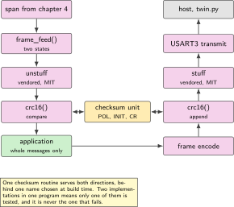
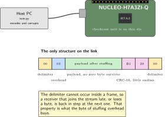
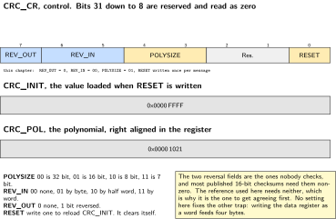
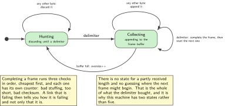
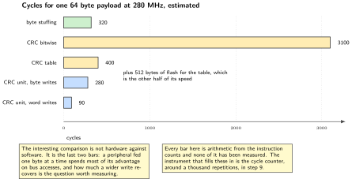

# Chapter 5. Framing and the hardware CRC unit

> **Target board:** NUCLEO-H7A3ZI-Q  
> **Theme:** Byte stuffing against a length prefix, CRC-16, and the peripheral's reversal settings

> **Key facts**
>
> - **Board:** NUCLEO-H7A3ZI-Q, and nothing else
> - **Peripherals:** The hardware checksum unit, USART3 with the receive path of chapter 4, the cycle counter
> - **Toolchain:** arm-none-eabi-gcc with CMake on the target, Python on the host, and the same C files built for both
> - **Operating system:** Bare metal
> - **Difficulty:** 3 of 5
> - **Effort:** 3 evenings of about four hours
> - **Deliverable:** A frame format with a stated reason for every field, an encoder and decoder that build unchanged on the host, a 16-bit checksum computed by the peripheral that agrees with a software reference on every input tested, and a Python twin that corrupts frames on purpose and counts what gets through

## Why this project

The previous three chapters delivered bytes. Bytes are not messages. A message has a beginning, an end, and some way of telling you that what arrived is what was sent, and none of those three things exists in a serial byte stream. This chapter supplies all three and then does the part that almost every project skips: it proves that the checksum the silicon computes is the same number a published reference computes, on every input that was tried, rather than on the one input somebody tested first.

There are two honest ways to find the end of a frame and they trade against each other in a way worth understanding before choosing. A length prefix is cheap and obvious, and it fails badly: corrupt the length and the receiver skips an arbitrary number of bytes, so a single bad byte costs several frames and there is no reliable way back into step. Byte stuffing removes one value from the payload so that value can be an unambiguous delimiter, which costs a pass over the data and about one byte in every two hundred and fifty four, and buys resynchronisation that is exactly as hard as looking for the next delimiter. This chapter builds the second and analyses the first, because the analysis is what makes the choice a decision.

The checksum half of the chapter is where the specific engineering is. This family carries a programmable checksum peripheral, and the vendor's own application note exists because getting it to agree with a standard reference is a known trap with a trail of community questions behind it. Three settings have to be right, and they are not the three you would guess: the polynomial and the initial value, which are obvious, and the input and output bit reversal, which are not. There is a fourth trap that no setting fixes, and it is the width of the write you use to feed the data register.

> [!NOTE]
> **This chapter depends on the confirm list**
>
> Item 18 asks whether this part has a checksum peripheral and how programmable it is. The register layout drawn in this chapter's figure is read from RM0455 for this device and not inherited from a sibling. If a check shows the unit here is fixed rather than programmable, the chapter does not collapse: the software reference in step 3 becomes the implementation, the measurement in step 9 becomes a comparison of two software routines, and the finding is written down. What must not happen is a chapter that assumes the feature and a reader who discovers otherwise.

## Prior art and what to reuse

| Source | What it gives | What it does not | Licence |
| --- | --- | --- | --- |
| Majerle's lightweight packet library | Close to this whole chapter in a box: framing, an address field, a command field, flags, a selectable checksum, and it is built on the ring buffer of chapter 2, which is a pleasing fit | It offers an 8-bit and a 32-bit checksum and **not a 16-bit one**, so the 16-bit variant and its routing to the peripheral is the work this chapter does | MIT |
| McQueen's byte stuffing library | The best implementation of consistent overhead byte stuffing there is, with the encode and decode both in a form you can vendor, and clear handling of the worst case expansion | No frame concept, no checksum and no state machine for receiving. It solves one problem completely and stops | MIT |
| The vendor's application note AN4187 | The reason this chapter exists: what each configuration bit of the checksum peripheral does, and how to set them so the result matches a standard reference. It is the document the community threads all end at | It is written for the family rather than for this device, so its register layout is checked against RM0455 before use | Vendor note |
| Chapters 2 and 4 of this book | The buffer the frames arrive in, and the span delivery that hands the decoder a pointer and a length | Nothing about frames | This volume |

*Table 5.1. Prior art for chapter 5. The first row would be the right dependency in a product. It is not used here because the 16-bit checksum it lacks is precisely the part that has to be built against the peripheral, and a chapter that vendored the library would have skipped its own subject.*

What is left to write is the 16-bit checksum in both forms, the configuration that makes them agree, the receive state machine, and the Python twin that corrupts frames deliberately. The byte stuffing is vendored and wrapped rather than rewritten, because it is permissively licensed, complete, and there is nothing to learn from typing it again.

## Parts from the inventory

| Part | Role | Interface |
| --- | --- | --- |
| NUCLEO-H7A3ZI-Q | The checksum peripheral, the decoder and the counters | Micro USB to the host |
| A USB data cable | Power, programming and the framed link | Micro USB |
| Host PC | The Python twin: encodes, decodes, and corrupts on purpose | Python, no extra packages beyond pyserial |

*Table 5.2. Inventory items used in chapter 5. Nothing is wired and nothing is bought. The interesting hardware in this chapter is a peripheral, not a part.*

## System architecture



*Figure 5.1. The framing layer sits between the span delivery of chapter 4 and the application. The checksum peripheral is the only piece of silicon added, and it is used by both the encoder and the decoder.*

Two things about the shape are deliberate. The encoder and the decoder share the checksum routine rather than each having one, because two implementations of a checksum in one program is two chances to be wrong and only one of them gets tested. And the peripheral is behind a two-function interface, so the software reference can be substituted at build time, which is what makes the agreement test in step 6 possible at all.

## Peripheral configuration

| Peripheral | Mode | Clock source | Pins and function | Interrupt and transfers |
| --- | --- | --- | --- | --- |
| Checksum unit | 16-bit polynomial, programmable initial value, reversal as the reference requires | Peripheral bus, clock enabled before any access | None | None. It is a register, not an event source |
| USART3 | As chapter 4 left it | Peripheral bus | Confirm in the board manual | Line idle only |
| DMA1 stream 0 | As chapter 4 left it | Bus clock | None | Half transfer and transfer complete |
| DWT cycle counter | Free running | Core clock | None | Measures the four checksum implementations |

*Table 5.3. Peripheral configuration. The checksum unit has no interrupt and no transfer capability: you write bytes to it and read a result. Its clock enable is the one thing that can make every configuration look correct and every result be zero.*

## Wiring



*Figure 5.2. Nothing is wired. The only structure this chapter adds to the link is the frame, so the frame is what the figure draws: the delimiter, the stuffing overhead byte, the payload and the checksum, with the sizes each field costs.*

## Memory and timing budget



*Figure 5.3. The checksum peripheral's control register, and the two value registers beside it. Four settings decide whether the result matches a published reference, and two of them are the ones people do not think to check.*

| Quantity | Budget | Measured | Margin |
| --- | --- | --- | --- |
| Frame overhead, stuffing | 1 byte per 254 | from the format, not measured | not applicable |
| Frame overhead, fixed | 4 bytes | from the format, not measured | not applicable |
| Checksum table in flash | 512 bytes | not measured | not measured |
| Cycles, bit at a time, 64 bytes | 3100 | not measured | not measured |
| Cycles, table driven, 64 bytes | 400 | not measured | not measured |
| Cycles, peripheral, byte writes | 280 | not measured | not measured |
| Cycles, peripheral, word writes | 90 | not measured | not measured |
| Decoder state, per link | 32 bytes | not measured | not measured |

*Table 5.4. The budget table. Every cycle figure is an estimate from the instruction counts until the cycle counter has run, and the two peripheral rows are the interesting comparison: the width of the write matters more than the fact that it is hardware at all.*

## Firmware design (UML)



*Figure 5.4. The receive framer as a state machine. There are only two states and one of them does all the work, which is the property that makes resynchronisation after a corrupt frame trivial rather than an exercise.*

The state machine is small because the frame format was chosen to make it small. A delimiter that cannot occur inside a frame means the decoder never has to guess: any delimiter ends the current frame and starts the next one, and a receiver that has just powered up in the middle of a transmission discards whatever it has and is in step from the next delimiter onwards. Compare that with the length-prefixed alternative, where recovering from a corrupt length means guessing where the next frame might start and checking whether the checksum happens to pass, which is a guess with a one in sixty five thousand chance of being wrong each time you try it.

## Data flow (ASCII)

```text
  transmit                                      receive
  payload  [ 41 00 42 7E ]                      span from chapter 4
     |                                             |
     v  append CRC-16 over the payload             v  bytes until a delimiter
  [ 41 00 42 7E ][ B1 29 ]                      [ 03 41 03 42 7E B1 29 ]
     |                                             |
     v  byte stuffing removes every 00             v  unstuff
  [ 03 41 03 42 7E B1 29 ]                      [ 41 00 42 7E ][ B1 29 ]
     |                                             |
     v  add the delimiter                          v  CRC-16 over the payload
  00 [ 03 41 03 42 7E B1 29 ] 00                compare, accept or count
     |                                             |
     +----------------> USART3 ------------------->+
```

## Repository layout

```text
nucleo-h7a3-framing/
  CMakeLists.txt                  # -DCRC_IMPL=hw|table|bitwise
  cmake/arm-none-eabi.cmake       # reused unchanged from chapter 1
  src/crc16.c, src/crc16.h        # the software reference, host and target
  src/crc16_hw.c                  # the peripheral, same two-function interface
  src/cobs.c, src/cobs.h          # vendored, MIT, copyright header kept
  src/frame.c, src/frame.h        # encode, and the two-state decoder
  src/main.c
  test/test_crc_agree.c           # host: reference against known vectors
  test/test_frame_roundtrip.c     # host: encode then decode, random payloads
  host/twin.py                    # the Python twin, and the bit flipper
  docs/crc_settings.md            # the four settings and why each one is that
  README.md
```

## Steps

**Step 1.** **Choose the frame shape and record the reason.** Two candidates, and the table belongs in the repository as well as here, because the next person to touch this will otherwise redo the analysis or, worse, change the format without it.

| Property | Length prefix | Byte stuffing with a delimiter |
| --- | --- | --- |
| Overhead | Fixed, 2 bytes | About 1 byte in 254, plus 1 |
| Finding the end | Trust the length | Look for the delimiter |
| After one corrupt byte | The length may be wrong, so an arbitrary number of following frames are lost | The next delimiter re-synchronises, always |
| Joining a stream late | Cannot be done reliably | Discard to the next delimiter |
| Cost | None | One pass over the payload each way |
| Knowing the size early | Yes, which suits a fixed buffer | No, which suits a stream |

*Table 5.5. The framing decision for chapter 5. The deciding row is the third one: on a link that shares a cable with a debugger and is unplugged regularly, recovering in step matters more than two bytes.*

**Step 2.** **Vendor the byte stuffing and wrap it.** It is permissively licensed and complete. Keep the copyright header, record the version and the date in the README, and write a thin wrapper so that the rest of the program calls your names and not a third party's.

```c
/* cobs.c is vendored unchanged. Upstream is MIT licensed; the copyright
 * header at the top of that file stays there. This wrapper exists so that
 * frame.c never names a third party symbol directly, which makes the
 * dependency one file to replace rather than a search across the tree. */
size_t frame_stuff(const uint8_t *in, size_t n, uint8_t *out, size_t cap);
size_t frame_unstuff(const uint8_t *in, size_t n, uint8_t *out, size_t cap);
```

**Step 3.** **Write the software reference and pin it to a published check value.** The reference is the arbiter for everything that follows. Its check value is the checksum of the nine characters `123456789`, which every published catalogue of these polynomials lists, and it is the single most useful line in the test file.

```c
/* CRC-16 with polynomial 0x1021, initial value 0xFFFF, no input or output
 * reversal, no final exclusive-or. The published check value over the nine
 * bytes "123456789" is 0x29B1. If your implementation does not produce
 * that, nothing further in this chapter is worth doing. */
uint16_t crc16_ref(const uint8_t *d, size_t n)
{
    uint16_t c = 0xFFFFu;
    while (n--) {
        c ^= (uint16_t)((uint16_t) *d++ << 8);
        for (int i = 0; i < 8; i++)
            c = (c & 0x8000u) ? (uint16_t)((c << 1) ^ 0x1021u)
                              : (uint16_t)(c << 1);
    }
    return c;
}
```

**Step 4.** **Configure the peripheral one setting at a time.** Four settings and each one has a reason. Enable the peripheral clock first: without it every register reads back as it was written in your imagination and the result is always zero.

```c
void crc16_hw_init(void)
{
    RCC->AHB4ENR |= RCC_AHB4ENR_CRCEN;    /* the clock, before anything   */
    (void) RCC->AHB4ENR;                  /* read back: the write posts   */

    CRC->POL  = 0x1021u;                  /* the polynomial               */
    CRC->INIT = 0x0000FFFFu;              /* the initial value            */
    CRC->CR   = CRC_CR_POLYSIZE_0         /* 01: a 16-bit polynomial      */
              | CRC_CR_RESET;             /* load INIT, start clean       */
    /* REV_IN stays 00 and REV_OUT stays 0: this reference reverses
     * neither. A reference that does reverse needs 01 or 11 here, and
     * that single choice is what the application note is about. */
}
```

The read back after enabling the clock is not superstition. The write to the enable register is posted on the bus, and an access to the peripheral issued in the next instruction can arrive before the clock does. The read forces the write to complete and costs a handful of cycles once at startup.

**Step 5.** **Feed it one byte at a time and know why the write width matters.** This is the trap that no configuration bit fixes and that produces a result which is wrong in a way that looks almost right.

```c
uint16_t crc16_hw(const uint8_t *d, size_t n)
{
    CRC->CR |= CRC_CR_RESET;              /* reload INIT for this message */

    /* An 8-bit write feeds exactly one byte. Writing the same value as a
     * 32-bit word feeds four bytes, three of them zero, and gives a
     * different and entirely plausible looking answer. The cast is the
     * whole point of this line and deserves the comment. */
    volatile uint8_t *dr8 = (volatile uint8_t *) &CRC->DR;
    while (n--)
        *dr8 = *d++;

    return (uint16_t) CRC->DR;            /* low half for a 16-bit poly   */
}
```

Once agreement is established, add the faster path: feed four bytes at a time with 32-bit writes for the aligned middle of the buffer and bytes for the ends. Do it second, not first, because the byte order within a word is one more thing that has to agree, and adding two unknowns at once makes neither findable.

**Step 6.** **Prove agreement rather than assuming it.** One test, on the host, comparing the reference against the peripheral is impossible, because the peripheral is on the target. So the test runs in two halves: the host proves the reference against the published vectors, and the target proves the peripheral against the reference over a large input space and reports a single number.

```c
/* On the target. Both implementations are compiled in for this build. */
uint32_t mismatches = 0;
for (uint32_t len = 0; len <= 300u; len++) {
    for (uint32_t trial = 0; trial < 64u; trial++) {
        fill_pseudorandom(buf, len, len * 1000u + trial);
        if (crc16_ref(buf, len) != crc16_hw(buf, len))
            mismatches++;
    }
}
printf("crc agree: %lu mismatches over %lu inputs\n",
       (unsigned long) mismatches, 301UL * 64UL);
```

Lengths from zero upwards matter. The zero-length case is where an implementation that resets in the wrong place shows itself, and lengths around multiples of four are where the word-feeding path in the previous step will fail if the byte order is wrong.

**Step 7.** **Write the decoder as two states.** It takes the span that chapter 4 delivers, which may be any length and may arrive in pieces, and turns it into whole frames.

```c
void frame_feed(const uint8_t *p, size_t n)     /* from rx_deliver */
{
    while (n--) {
        uint8_t b = *p++;
        if (b == FRAME_DELIM) {
            if (rx.len > 0u)
                frame_complete();               /* may accept or count   */
            rx.len = 0u;                        /* either way, start over */
            continue;
        }
        if (rx.len < sizeof rx.buf) {
            rx.buf[rx.len++] = b;
        } else {
            rx.len = 0u;                        /* too long: drop it     */
            stats.oversize++;                   /* and say so            */
            rx.dropping = 1u;
        }
    }
}
```

The oversize counter is there for the same reason chapter 2's drop counter is. A decoder that silently discards a frame longer than its buffer looks exactly like a link that works until somebody sends a longer message.

**Step 8.** **Complete the frame and be strict about what you accept.** Three checks in order, cheapest first, and each with its own counter so that a link that is failing tells you how.

```c
static void frame_complete(void)
{
    uint8_t out[FRAME_MAX];
    size_t  m = frame_unstuff(rx.buf, rx.len, out, sizeof out);

    if (m == 0u)               { stats.bad_stuffing++; return; }
    if (m < 2u)                { stats.too_short++;    return; }

    size_t   plen = m - 2u;
    uint16_t want = (uint16_t) out[plen] | (uint16_t)(out[plen + 1u] << 8);
    uint16_t got  = crc16(out, plen);       /* hw or reference, one name */

    if (want != got)           { stats.bad_crc++;      return; }

    stats.accepted++;
    app_on_frame(out, plen);
}
```

Note the single name `crc16`. Which implementation it resolves to is a build switch, which is what lets the same decoder run on the host in the test and on the target with the peripheral.

**Step 9.** **Write the Python twin and make it corrupt frames on purpose.** The twin is the second opinion. A bug that exists in both the C and the Python is possible but unlikely; a bug in one of them is found the first time they disagree.

```python
#!/usr/bin/env python3
"""twin.py: encode, decode and deliberately corrupt frames."""

DELIM = 0x00

def crc16(data: bytes, init: int = 0xFFFF, poly: int = 0x1021) -> int:
    c = init
    for b in data:
        c ^= b << 8
        for _ in range(8):
            c = ((c << 1) ^ poly) & 0xFFFF if c & 0x8000 else (c << 1) & 0xFFFF
    return c

assert crc16(b"123456789") == 0x29B1, "the reference itself is wrong"

def encode(payload: bytes) -> bytes:
    body = payload + crc16(payload).to_bytes(2, "little")
    return bytes([DELIM]) + cobs_encode(body) + bytes([DELIM])

def flip(frame: bytes, bit: int) -> bytes:
    """Invert one bit of a frame, counting bits from the first byte."""
    b = bytearray(frame)
    b[bit // 8] ^= 1 << (bit % 8)
    return bytes(b)

def sweep(payload: bytes):
    """Flip every single bit of a frame in turn and report what the
    receiver did with each one. Nothing here should ever be accepted."""
    frame = encode(payload)
    for bit in range(len(frame) * 8):
        send(flip(frame, bit))
    return read_counters()          # accepted must still be zero
```

The single-bit sweep is the acceptance test. Every frame in it is corrupt, and the accepted counter on the target must not move. Then run a two-bit sweep, which is a longer job and a more interesting result, and finally a random corruption run that flips a random number of bits in random positions. The last one is where a 16-bit checksum starts to let frames through, and the rate at which it does is a measurement to report rather than a property to claim.

**Step 10.** **Measure the four implementations.** Bit at a time, table driven, peripheral with byte writes, peripheral with word writes, over a 64 byte payload, with the cycle counter.

```c
for (int impl = 0; impl < 4; impl++) {
    crc16_select(impl);
    uint32_t t0 = DWT->CYCCNT;
    for (int i = 0; i < 1000; i++) (void) crc16(payload, 64);
    printf("%s: %lu cycles per frame\n", crc16_name(impl),
           (unsigned long) ((DWT->CYCCNT - t0) / 1000u));
}
```

The result worth writing up is the comparison between the two peripheral rows rather than the comparison between hardware and software. A peripheral fed one byte at a time spends most of its advantage on bus accesses, and the interesting question is how much of that a wider write recovers. Report the table's 512 bytes of flash alongside, because that is the other side of its speed.

## Build, flash and debug



*Figure 5.5. Where a frame's time goes, for a 64 byte payload. Every bar is an estimate from the instruction counts until the cycle counter has run, and the figure says so rather than presenting estimates as results.*

```bash
cmake -B build -DCMAKE_TOOLCHAIN_FILE=cmake/arm-none-eabi.cmake -DCRC_IMPL=hw
cmake --build build -j && probe-rs run --chip STM32H7A3ZITx build/firmware.elf
make -C test && ./test/test_crc_agree && ./test/test_frame_roundtrip
python host/twin.py /dev/ttyACM0 --sweep single
```

> [!NOTE]
> **When the checksum is always zero or always the same value**
>
> In order of likelihood: the peripheral clock was never enabled, so every write lands nowhere and every read returns the same thing; the data register was written as a 32-bit word rather than a byte, which gives a stable wrong answer that changes with the data and therefore looks plausible; the reset bit was not set between messages, so the second frame continues the first one's computation; or the initial value was written after the reset rather than before it. Read the control register and the polynomial register back on a halted target before changing any code.

```bash
(gdb) print/x CRC->CR
(gdb) print/x CRC->POL
(gdb) print/x CRC->INIT
```

## Verification and acceptance criteria

- The software reference produces 0x29B1 over the nine bytes `123456789`, checked by an assertion in both the C test and the Python twin, so that neither can drift alone.
- The peripheral and the reference agree on every input in the sweep: lengths zero to three hundred, sixty four pseudorandom inputs at each length, zero mismatches reported as one number.
- The word-feeding path agrees with the byte-feeding path for every length, including lengths that are not a multiple of four.
- A round trip on the host, encode then decode, returns the original payload for ten thousand random payloads including empty ones, payloads that are all delimiter bytes, and payloads at the maximum length.
- The single-bit sweep over a whole frame produces zero accepted frames and a bad-checksum counter equal to the number of bits flipped, minus any flips that the stuffing rejects first, which are counted separately.
- A random corruption run reports the rate at which corrupt frames are accepted, as a measured number with the number of trials beside it.
- The four implementations are timed with the cycle counter and the table's flash cost is reported next to its speed.

## Variants

| Axis | Variant | What changes | Cost | Built in full in |
| --- | --- | --- | --- | --- |
| Framing | Byte stuffing with a delimiter | The baseline here. Resynchronisation is finding the next delimiter | One pass each way | Here |
| Framing | Length prefix | Two bytes and no pass over the data, and no reliable recovery from a corrupt length | Frames lost after one bad byte | Here, as the analysis in step 1 |
| Checksum | Peripheral, 16-bit | The baseline here, with the four settings that make it agree with the reference | Four settings that must be right | Here |
| Checksum | Software, table driven | 512 bytes of flash buys most of the speed with none of the configuration | Flash | Here |
| Checksum | Software, bit at a time | No flash, no peripheral, and the slowest by a wide margin. The arbiter for the other three | Cycles | Here |
| Checksum | 8-bit or 32-bit | What the packet library in the prior art table already offers, which is why this chapter built the one it does not | None | Named, not built |
| Peripheral substitution | Checksum in a transfer | Feeding the unit from a transfer engine rather than by hand, which only pays on long payloads | An engine and a stream | Chapter 17 |
| Language | C++ | The frame type as a template over the payload size, with the maximum stuffed size computed at compile time | Nothing at run time | Chapter 9 |
| Language | Host in Python | The twin, the bit flipper and the sweeps | None | Chapter 3 |
| Intelligence and reach | Edge host over a framed link | This frame format is what chapters 9 and 11 send over | None here | Chapters 9 and 11 |

*Table 5.6. Variants for chapter 5. Three checksum implementations are built in full here rather than one, because the chapter's subject is that they agree, and agreement needs more than one.*

## Pitfalls

- Writing the data register as a word when you mean a byte. The answer is stable, depends on the data, and is wrong.
- Forgetting the peripheral clock. Every register reads back as zero and every result is the same value, which reads as a configuration problem and is not.
- Setting the initial value after the reset bit rather than before it. The reset loads whatever is in the initial value register at that moment.
- Assuming the reversal settings are zero because the reference did not mention them. Most published 16-bit checksums reverse both input and output, and the one used here is chosen partly because it does not, which keeps the first agreement test simple.
- Reusing the unit between two interrupt priorities without protecting it. It has one accumulator, and a handler that computes a checksum in the middle of a longer one returns a corrupted result to both.
- Trusting a length field. One corrupt byte in the length costs an unbounded number of following frames.
- Reporting that a checksum detects all errors. It detects a large fraction, the twin measures which, and the number belongs in the README.
- Two checksum implementations in one program, one for sending and one for receiving. Only one of them ends up tested.

## Best practices applied

- The choice of framing is a table with a deciding row, kept in the repository, so that the next change to the format is a decision and not a preference.
- Every implementation of the checksum is behind one name, chosen at build time, which is what makes them comparable and testable against each other.
- Agreement is proven over a range of inputs and reported as a single number, not demonstrated on one example.
- The vendored library keeps its copyright header and its version is recorded, and it is reached through a wrapper so the dependency is one file.
- Every rejection has its own counter, so a failing link says how it is failing rather than only that it is.
- The corruption rate that gets through is measured and published rather than asserted from a property of the polynomial.

## Stretch goals

- Add the reversed configuration and reproduce a second published checksum with the same peripheral, changing only the two reversal fields. That exercise is the application note's whole content and it takes twenty minutes once the first one agrees.
- Feed the unit from a transfer engine over a long payload and find the length at which it beats the word-writing loop, which is a crossing point nobody has published for this part.
- Extend the twin into a property test that generates payloads and corruptions from a specification, and run it as part of the build in the way chapter 12 runs its rig.
- Measure the undetected error rate against payload length for this polynomial on this format, and publish the curve. It is a small piece of real work and the answer is specific to the frame shape rather than to the polynomial alone.

## Roadmap and next steps

Chapter 6 leaves the serial link and starts sampling on a timer, where the frames built here become the way a block of samples leaves the board. Chapter 9 puts a payload codec inside this frame and gives it a Python twin of its own, built on the pattern established here. Chapter 11 sends these frames to a modem, where the reason for choosing resynchronisation over two bytes of overhead becomes concrete.

The vendor's application note in the prior art table is the document to read alongside this chapter, and the packet library named there is the right dependency for a product that needs addressing and a command field rather than a bare payload. The community roadmap referenced in appendix H places protocol work in the firmware track and pairs it with the testing material that chapter 12 draws on; its argument that projects teach more than reading is the reason this chapter ends with a corruption sweep rather than a summary of checksum theory.

## Portfolio evidence

- A repository containing a frame format, a settings document that explains each of the four peripheral settings, and a test that fails if the software reference drifts from its published check value.
- The agreement result: zero mismatches over the full input sweep, printed by the target itself, with the full date of the run.
- The corruption sweep output: single-bit, double-bit and random, with the accepted count for each and the number of trials beside it.
- The four-way timing table with the table implementation's flash cost next to its speed, naming the cycle counter as the instrument.

## Sources

Normative references:

- Reference manual RM0455, for this part: the checksum peripheral's registers, the meaning of each control field, the polynomial size encoding and the reset behaviour. Not RM0433, which is its sibling.
- The vendor's application note AN4187, on configuring the checksum peripheral so that its result matches a standard reference, which is the document behind every community thread on this subject.
- The published catalogue of checksum polynomials and their check values, for the constant 0x29B1 that pins the software reference.

Reusable implementations:

- McQueen's byte stuffing library, MIT, vendored with its copyright header intact.  
  <https://github.com/cmcqueen/cobs-c>
- Majerle's lightweight packet library, MIT, which is the right dependency for a product and which offers 8-bit and 32-bit checksums but not the 16-bit one this chapter builds.  
  <https://github.com/MaJerle/lwpkt>
- Majerle's lightweight ring buffer, MIT, which that packet library is built on and which chapter 2 of this volume re-derives.  
  <https://github.com/MaJerle/lwrb>
- pyserial, BSD-3-Clause, under the Python twin.  
  <https://github.com/pyserial/pyserial>

---

[Previous](04-circular-dma-and-the-idle-line.md) &nbsp;&nbsp;|&nbsp;&nbsp; [Contents](../README.md) &nbsp;&nbsp;|&nbsp;&nbsp; [Next](06-sampling-on-a-timer-at-exactly-1-khz.md)
