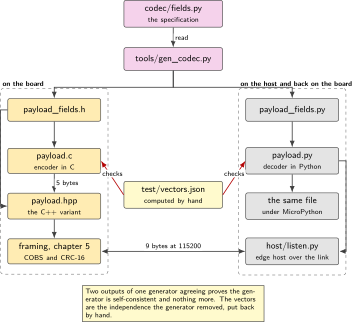
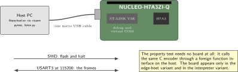
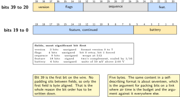
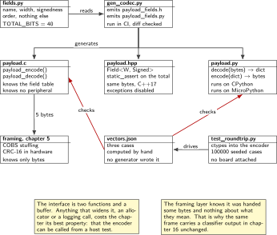
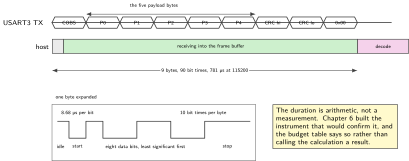

# Chapter 9. The payload codec and its Python twin

> **Target board:** NUCLEO-H7A3ZI-Q with a host  
> **Theme:** Bit packing, CBOR, round-trip property tests

> **Key facts**
>
> - **Board:** NUCLEO-H7A3ZI-Q, with the host at the other end of the same USB cable
> - **Peripherals:** USART3 for the framed link, and nothing else. The codec itself touches no peripheral at all
> - **Toolchain:** arm-none-eabi-gcc with CMake as in chapter 1; a native compiler and Python 3 on the host; MicroPython on the board for the third variant
> - **Operating system:** Bare metal on the board, anything on the host
> - **Difficulty:** 3 of 5
> - **Effort:** 3 evenings of about four hours, one of them on the C++ variant
> - **Deliverable:** A 40-bit payload whose encoder is C and whose decoder is Python, a round-trip property test over random inputs that runs on the host in continuous integration, and a written justification for not using a standard serialisation format

## Why this project

Chapter 8 ends with a transmit step that logs a frame. This chapter writes the code that produces that frame, and writes it twice: an encoder in C that runs on the board and a decoder in Python that runs on the host. Two implementations of one specification is normally a defect waiting to happen, and the whole of this chapter is about turning that liability into the strongest test in the volume. If the two agree over a hundred thousand random inputs, and both agree with a set of vectors that a human worked out by hand, the specification is real.

The payload is bit-packed rather than serialised with a standard format, and that decision has to be justified rather than assumed. Three good permissive implementations of the obvious alternative exist and are named below. The argument for packing bits is that this payload is 5 bytes and the same content in a self-describing format is several times that, on a link where the payload size is the design constraint. How many times depends entirely on the shape chosen, and quoting one figure without naming the shape hides the decision: measured over the golden vectors and 100000 random cases, a map with one-letter keys averages 21.07 bytes, a positional array 11.07, and a map with full field names 50.07. The array is the cheapest and gives up the only thing the format was chosen for, which is being readable without the header. The argument against is everything else: schema evolution, tooling, and the fact that a self-describing frame can be read by somebody who does not have your header file. The chapter states both, picks one, and says what would change the decision.

The third reason is that a codec is the one piece of firmware that can be tested properly with no hardware at all. It has no timing, no peripherals and no state. That makes it the right place to introduce property-based testing to this volume: instead of a handful of examples, assert a property over random inputs and run it on every commit. Chapter 12 turns that habit into a rig.

> [!NOTE]
> **Two implementations generated from one specification is not two implementations**
>
> The field table below generates both the C header and the Python module, which removes the possibility of the two drifting apart. It also removes their independence, and an agreement between two outputs of one generator proves only that the generator is self-consistent. That is why the golden vectors matter: they are computed by hand from the written bit order, checked into the repository, and no generator has ever touched them. The round-trip test catches drift; the vectors catch a specification that was wrong from the start.

## Prior art and what to reuse

| Source | What it gives | What it does not | Licence |
| --- | --- | --- | --- |
| NanoCBOR | The smallest of the three encoders, written for constrained nodes, and effectively public domain so it can be vendored without a thought | It is a serialisation format, so it carries type and key information this payload does not need. It does not pack bits | CC0 |
| zcbor | Schema-driven generation from a written description, used in production, and the closest of the three to the generate-both-sides idea this chapter uses | It generates for a self-describing format rather than for a fixed bit layout, and it brings a build step | Apache-2.0 |
| TinyCBOR | A minimalist alternative with a stable C API and a long history | The same objection as the other two, and no Python counterpart in the same repository | MIT |
| CrustyAuklet's bit packer | Exactly this chapter's idea done well: one format string shared between a C++ implementation and a Python counterpart, so the two sides cannot disagree about layout | It is C++14 and this book is C. That is a real obstacle and not a detail to paper over, and it is why the C++ variant below exists rather than a dependency | MIT |
| Python's standard library | `ctypes` to call the C encoder from the test, `struct` for the byte handling, and `random` with a recorded seed for reproducible cases | No shrinking, so a failing case is whatever random produced rather than the smallest failing case | Standard library |

*Table 9.1. Prior art for chapter 9. The bit packer is the closest thing to this chapter that exists and the language difference is the reason it is read rather than used; the C++ variant below is the honest response to that.*

What is left to write is the field specification, the generator, the C bit writer, the Python bit reader, the golden vectors and the property test. The three serialisation libraries are named, compared and then not used, and the chapter says why in one paragraph rather than leaving the reader to guess that they were not considered.

## Parts from the inventory

| Part | Role | Interface |
| --- | --- | --- |
| NUCLEO-H7A3ZI-Q | Runs the encoder, and in the third variant the decoder as well | Micro USB to the host |
| A USB data cable | Programming and the framed link on one lead | Micro USB |
| Host PC | Runs the decoder, the property test and the continuous integration job | Virtual COM port at 115200 |

*Table 9.2. Inventory items used in chapter 9. Nothing is wired and nothing is bought. The property test needs no board at all, which is the point of putting it in continuous integration.*

## System architecture



*Figure 9.1. One specification, two generated headers, three consumers. The golden vectors sit outside the generator on purpose, because two outputs of one generator agreeing proves less than it looks.*

The generator is fifty lines and it earns its place by removing a class of defect rather than by saving typing. A bit layout written twice will diverge, and it will diverge silently, because both sides will still produce five bytes. What it cannot do is check that the layout is the one the specification intended, and that is what the hand-computed vectors are for.

## Peripheral configuration

| Peripheral | Mode | Clock source | Pins and function | Interrupt and transfers |
| --- | --- | --- | --- | --- |
| None, for the codec | The encoder is pure computation with no hardware dependency at all | None | None | None |
| USART3 | Asynchronous, 115200 8N1, carrying the framed link of the edge-host variant | Peripheral bus | Console pins, confirmed in the board manual | Circular transfer as in chapter 4 |
| The CRC unit | The frame checksum of chapter 5, reused unchanged | Peripheral bus | None | None |

*Table 9.3. Peripheral configuration. The first row is the interesting one: a codec that touches no peripheral is a codec that can be tested on a host, which is what makes the property test possible.*

## Wiring



*Figure 9.2. Nothing is wired. The edge-host variant uses the same cable the debugger is already on, because the probe presents a serial port alongside the debug interface.*

## Memory and timing budget



*Figure 9.3. The 40 bits, drawn the way a reference manual draws a register, with the most significant bit leftmost and first on the wire. This is a payload layout rather than a peripheral register; chapters 5 and 17 draw the silicon registers.*

| Quantity | Budget | Measured | Margin |
| --- | --- | --- | --- |
| Payload | 40 bits | 5 B by construction | none needed |
| Framed length on the wire | 9 B by construction | 9 B by construction | none needed |
| The same content as CBOR, map with short keys | about 17 B by arithmetic | 21.07 B mean | none needed |
| The same content as CBOR, positional array | not estimated | 11.07 B mean | none needed |
| The same content as CBOR, full field names | not estimated | 50.07 B mean | none needed |
| Encoder flash cost | under 512 B | 366 B | +146 B |
| Encoder cycles per frame, I-cache off | under 300 | 2 955, 3 185, 3 143 | OVER by about 10x |
| Encoder cycles per frame, I-cache on | under 300 | 2 375 | OVER by about 8x |
| One frame at 115200 8N1 | 781 µs by arithmetic | not measured | not measured |
| Random cases per test run | 100000 | 100000 by construction | none needed |

*Table 9.4. The budget for chapter 9. The two arithmetic rows are labelled as arithmetic rather than as measurements, because 9 bytes at ten bits each over 115200 is a calculation and the instrument that would confirm it is the one built in chapter 6. The flash and cycle rows were measured on the board on Saturday 3 October 2026.*

**The cycle budget was wrong by about a factor of ten, and the cause is one function.** The budget said under 300 cycles per frame. The part says 2 955, as an upper bound that includes the measuring loop and a call that does not inline across translation units.

The measurement is not the suspect. It is the two-point form with a warm-up that chapters 1 and 2 arrived at, and an order of magnitude is far outside what the harness could contribute: the harness is a loop and one call, tens of cycles, not thousands. The encoder really is that expensive, and reading it says why.

`bw_put` writes ONE BIT AT A TIME. For each of the forty bits it computes a source shift, a destination byte index and a mask, then does a read-modify-write of a byte in memory, under a branch on the bit's value. Forty iterations of that, five calls to reach them, a `memset` first, and every instruction fetched from flash with no instruction cache enabled. Seventy-odd cycles a bit is unremarkable under those conditions; forty of them is the figure.

**Two figures are given because the encoder was measured twice and the answers differ by 7.8 per cent.** The second build differed from the first by a renamed variable and three extra `printf` lines. Nothing about the encoder changed at all.

The new string literals grew `.rodata`, every byte of code after them moved, and with no instruction cache enabled every instruction is fetched from flash, so what the loop costs depends on where the linker put it.

An earlier version of this paragraph attributed this to 32 byte flash fetch lines. That 32 bytes was borrowed from the Cortex-M7 cache line length, which ARM fixes by the architecture and which chapters 4 and 19 cite correctly, then applied to the flash interface, which is a different thing and is described in RM0455 rather than in anything read here. The correction matters because the invented detail made the explanation sound settled when only the observation was: code moved and the cost changed.

This is the third time today that an unrelated edit moved a cycle figure. Chapter 1 watched its delay loop go from 9 cycles an iteration to 19 because four register writes were added to the reset handler. It is not noise in the measurement, which repeats to a few parts in a hundred thousand within one build; it is a real property of the code as placed.

So the rule for every cycle figure in this volume: it belongs to a build, not to a function, and a difference smaller than about ten per cent between two builds cannot be attributed to the change under test. Chapter 2's comparison of ordering barriers carries the same caveat and says so.

What fixes it was found later the same day, and it was nearer than chapter 19. ARM's `cachel1_armv7.h` in the Cube pack holds the instruction cache enable sequence, the device header declares the cache present on this Cortex-M7 r1p2, and every name in that sequence is ARMv7-M architectural, so none of it waits on RM0455. This chapter's measurement is now taken twice in one image, once with the cache off as the part comes out of reset and once with it on, from a single function called twice so that both runs execute the same instructions at the same address. The difference between those two figures is the cache and nothing else.

**The cache is worth 1.32 times on this function: 3 142.99 cycles with it off and 2 374.99 with it on.** Measured on Saturday 3 October 2026, and the same report came out identical to the hundredth of a cycle in three separate captures, so the figures are reproducible within one image.

That is a smaller gain than the word cache tends to suggest, and the reason is worth stating. About a quarter of this function's time was instruction fetch. `bw_put` spends the rest reading, modifying and writing single bytes, and no instruction cache helps with data. A function that is mostly arithmetic in a tight loop would gain far more; one that is mostly memory traffic would gain less.

**The third cold figure is itself the evidence for why this was needed.** The cold column now reads 2 955, 3 185 and 3 143 across three builds. The last of those was measured in the build that added the cache support, which changed nothing in the encoder: a file was added and the measurement was moved into its own function. The figure moved 1.3 per cent anyway. That is the fourth instance of the effect in two days and it arrived as an unplanned control.

What has NOT yet been established is the claim this work was done to support: that the cached figure is stable across builds where the cold one is not. One build gives one cached number. The test is a build that deliberately shifts the code and a check that the cached figure holds while the cold one moves, and it has not been run. Until it is, the right statement is that the cache is measured to be worth 1.32 times here, not that cycle figures are now trustworthy.

Against a budget of 300 none of it matters: cached or not, the encoder is about an order of magnitude over and the conclusion is the same either way.

That is a defensible implementation and an indefensible budget. The bit-by-bit writer is the clearest possible statement of the specification in `docs/bitorder.md`, which is why it was written that way, and the codec's correctness is the chapter's deliverable rather than its speed. What was wrong was estimating 300 without counting what the loop does.

Whether it matters depends on the duty cycle, and that is the honest framing rather than a reflex to optimise. At 64 MHz, 2 955 cycles is 46 microseconds. One frame per minute makes it irrelevant. One frame per millisecond makes it 4.6 per cent of the processor. The node of chapters 8 to 12 sends on the order of one frame a minute, so the encoder is not the thing to improve, and chapter 12's energy budget is where that would show if it were.

A byte-oriented writer would be perhaps ten times faster and a great deal harder to read against the specification. That trade is a stretch goal rather than a correction, and it is recorded as one.

The nine bytes are worth spelling out because they are the argument for packing bits. One byte of byte-stuffing overhead, five bytes of payload, two bytes of checksum and one delimiter. Replace the five with seventeen and the frame is twenty-one bytes, which is more than twice the air time on a link where air time is the budget. On a link where it is not, the comparison inverts and the self-describing format wins, and the chapter says so.

## Firmware design (UML)



*Figure 9.4. The components and what each of them is allowed to know. The encoder knows the field table; the framing layer knows only that it was handed some bytes; the decoder knows the same field table and nothing about the board.*

The interface between the codec and everything else is two functions and a buffer, and keeping it that narrow is what lets the same encoder be called from the board, from a host test through a foreign function interface, and from the C++ variant without change. Anything that widens it, an allocator, a logging call, a dependency on the node context, costs the chapter its best property.

## Data flow (ASCII)

```text
  codec/fields.py  (the specification, written once, read by everything)
        |
        +--> tools/gen_codec.py --> payload_fields.h   (C, for the board)
        |                       \-> payload_fields.py  (Python, for the host)
        |
        +--> docs/bitorder.md    (the written bit order: MSB first, bit 39 first on the wire)
                 |
                 v
        test/vectors.json   hand computed from the document, no generator touched it
                 |
   board                                          host
   +-----------------------------+                +-------------------------------+
   | node ctx (chapter 8)        |                | ctypes -> libpayload.so       |
   |   |                         |                |   encode(fields) -> 5 bytes   |
   |   v                         |                |        |                      |
   | payload_encode() -> 5 bytes |                |        v                      |
   |   |                         |   COBS+CRC16   | payload_decode() -> fields    |
   |   v                         |  9 bytes at    |        |                      |
   | lwpkt frame (chapter 5)     | ------------>  |        v                      |
   |   |                         |   115200 8N1   | assert fields == the input    |
   |   v                         |                | 100000 random cases, seeded   |
   | USART3                      |                +-------------------------------+
   +-----------------------------+
```

## Repository layout

```text
nucleo-h7a3-codec/
  CMakeLists.txt                  # board target, host shared library, tests
  codec/fields.py                 # the specification, and the only place it lives
  codec/payload.c                 # the bit writer and the bit reader in C
  codec/payload.h
  codec/payload.hpp               # the C++ variant, compile-time field widths
  codec/payload.py                # the Python twin: bit reader and writer
  tools/gen_codec.py              # emits payload_fields.h and payload_fields.py
  docs/bitorder.md                # the written bit order, the normative document
  test/vectors.json               # hand computed, never generated
  test/test_roundtrip.py          # the property test, ctypes into the C encoder
  test/test_vectors.py            # both sides against the hand-computed vectors
  test/test_cpp.cpp               # the C++ variant against the same vectors
  micropython/payload_mpy.py      # the same decoder under MicroPython on the board
  host/listen.py                  # the edge-host variant: frames in, fields out
  README.md
```

## Steps

**Step 1.** **Write the field table once, as data.** It is the specification and everything else is generated from it or checked against it. Widths, signedness and order, and nothing else: no encoding logic lives here.

```python
# codec/fields.py -- the only place the layout is written.
# Order is most significant bit first. Bit 39 is the first bit on the wire.
FIELDS = [
    # name        bits  signed  note
    ("version",    3,   False,  "format version, 0 to 7"),
    ("flags",      4,   False,  "bit 0 retry, bit 1 forced, bits 2 and 3 spare"),
    ("sequence",   9,   False,  "wraps at 512"),
    ("feature",   18,   True,   "two's complement, scaled by 1/16"),
    ("battery",    6,   False,  "units of 50 mV above 2.00 V"),
]
TOTAL_BITS = sum(f[1] for f in FIELDS)     # 40
assert TOTAL_BITS % 8 == 0, "the payload must be a whole number of bytes"
```

**Step 2.** **Write the bit order down in prose and treat that document as normative.** This is the step that is always skipped and it is the one that costs a week when a second implementation appears. Three sentences are enough: the most significant bit of the first field is the most significant bit of byte zero; fields follow in table order with no padding between them; a signed field is two's complement in its stated width. Everything else in this chapter is checked against those three sentences.

**Step 3.** **Write the bit writer in C.** It is twenty lines and it is worth writing rather than depending on, because every dependency that could replace it brings either a different language or a different format.

```c
/* codec/payload.c: MSB first, no padding between fields. */
#include <stdint.h>
#include <string.h>
#include "payload.h"

typedef struct { uint8_t *buf; size_t cap; size_t bit; } bw_t;

static int bw_put(bw_t *w, uint32_t value, unsigned width)
{
    if (w->bit + width > w->cap * 8u) return -1;
    for (unsigned i = 0; i < width; i++) {
        unsigned src = width - 1u - i;                 /* MSB of the field */
        unsigned dst = w->bit + i;
        uint8_t  bit = (uint8_t) ((value >> src) & 1u);
        uint8_t  mask = (uint8_t) (0x80u >> (dst & 7u));
        if (bit) w->buf[dst >> 3] |= mask;
        else     w->buf[dst >> 3] = (uint8_t) (w->buf[dst >> 3] & ~mask);
    }
    w->bit += width;
    return 0;
}

size_t payload_encode(uint8_t *out, size_t cap, const payload_t *p)
{
    if (cap < PAYLOAD_BYTES) return 0;
    memset(out, 0, PAYLOAD_BYTES);
    bw_t w = { out, cap, 0 };
    if (bw_put(&w, p->version,  PAYLOAD_W_VERSION))  return 0;
    if (bw_put(&w, p->flags,    PAYLOAD_W_FLAGS))    return 0;
    if (bw_put(&w, p->sequence, PAYLOAD_W_SEQUENCE)) return 0;
    if (bw_put(&w, (uint32_t) p->feature & PAYLOAD_M_FEATURE,
                                PAYLOAD_W_FEATURE))  return 0;
    if (bw_put(&w, p->battery,  PAYLOAD_W_BATTERY))  return 0;
    return PAYLOAD_BYTES;
}
```

The signed field is masked to its width before it is written, which is the line that decides whether the codec is portable. A negative `int32_t` shifted right is implementation defined in C, so the value is converted to unsigned and masked rather than shifted arithmetically.

**Step 4.** **Write the reader, in C and in Python, and sign-extend explicitly.** Sign extension is where a bit-packed codec goes wrong, because it works for every positive test value.

```python
# codec/payload.py
from payload_fields import FIELDS, TOTAL_BITS

def _bits(data: bytes, start: int, width: int) -> int:
    v = 0
    for i in range(width):
        b = start + i
        v = (v << 1) | ((data[b >> 3] >> (7 - (b & 7))) & 1)
    return v

def decode(data: bytes) -> dict:
    if len(data) * 8 != TOTAL_BITS:
        raise ValueError(f"expected {TOTAL_BITS // 8} bytes, got {len(data)}")
    out, pos = {}, 0
    for name, width, signed, _ in FIELDS:
        v = _bits(data, pos, width)
        if signed and (v >> (width - 1)) & 1:
            v -= 1 << width                      # two's complement, explicit
        out[name] = v
        pos += width
    return out
```

**Step 5.** **Compute the golden vectors by hand and check them in.** Take three cases, work the bits out on paper from the written bit order, and write the expected bytes into a file. Do this before running either implementation, so that neither can talk you into its own answer.

```text
test/vectors.json
[
  {"fields": {"version": 1, "flags": 0, "sequence": 0,
              "feature": 0, "battery": 0},
   "bytes": "2000000000"},
  {"fields": {"version": 7, "flags": 15, "sequence": 511,
              "feature": 131071, "battery": 63},
   "bytes": "FFFF7FFFFF"},
  {"fields": {"version": 7, "flags": 15, "sequence": 511,
              "feature": -1, "battery": 63},
   "bytes": "FFFFFFFFFF"},
  {"fields": {"version": 1, "flags": 2, "sequence": 5,
              "feature": -1, "battery": 40},
   "bytes": "2405FFFFE8"}
]
```

The second and third vectors look like one case and are two, which is the error this step exists to prevent and which an earlier printing of this chapter made. The largest positive value of an eighteen-bit two's complement field is 131071, which is a zero followed by seventeen ones, not eighteen ones. That zero is bit seventeen of the stream, so byte two is `7F` and not `FF`. Five bytes of `FF` is also a real case and it decodes to a feature of <span class="math">-1</span>. Carry both.

The maximum case catches a width error, the all-ones case catches reading 131071 as eighteen set bits, and the negative case catches sign extension. The last vector is the one to work out slowly; if your implementation disagrees with it, do not change the vector.

**Step 6.** **Run the C encoder from the test through a foreign function interface.** The host build produces a shared library from exactly the same source the board links, and the test calls into it. Nothing is reimplemented for the test.

```python
# test/test_roundtrip.py
import ctypes, random, json
from payload import decode
from payload_fields import FIELDS

lib = ctypes.CDLL("./build/libpayload.so")

class Payload(ctypes.Structure):
    _fields_ = [("version", ctypes.c_uint32), ("flags", ctypes.c_uint32),
                ("sequence", ctypes.c_uint32), ("feature", ctypes.c_int32),
                ("battery", ctypes.c_uint32)]

def _random_case(rng):
    out = {}
    for name, width, signed, _ in FIELDS:
        lo = -(1 << (width - 1)) if signed else 0
        hi = (1 << (width - 1)) - 1 if signed else (1 << width) - 1
        out[name] = rng.randint(lo, hi)
    return out

def test_roundtrip_100k():
    rng = random.Random(20260920)          # the seed is recorded on purpose
    buf = (ctypes.c_uint8 * 8)()
    for _ in range(100000):
        case = _random_case(rng)
        n = lib.payload_encode(buf, 8, ctypes.byref(Payload(**case)))
        assert n == 5, f"encoder returned {n} for {case}"
        assert decode(bytes(buf[:5])) == case, case
```

The seed is fixed and recorded so that a failure is reproducible. A test whose random input changes on every run finds more defects and reports them in a form nobody can act on, so the compromise here is a fixed seed plus a second job that runs with a random one and prints the seed it used.

**Step 7.** **Build the C++ variant.** This is the language variant this chapter owns, and the reason to build it is a real one: the field widths can be checked at compile time instead of at run time, and the offsets stop being written by hand.

```cpp
// codec/payload.hpp -- C++17, exceptions and RTTI both disabled.
#include <array>
#include <cstdint>
#include <cstddef>

template <std::size_t Width, bool Signed>
struct Field { static constexpr std::size_t width = Width;
               static constexpr bool is_signed = Signed; };

using Version  = Field<3,  false>;
using Flags    = Field<4,  false>;
using Sequence = Field<9,  false>;
using Feature  = Field<18, true>;
using Battery  = Field<6,  false>;

constexpr std::size_t total_bits =
    Version::width + Flags::width + Sequence::width
  + Feature::width + Battery::width;
static_assert(total_bits % 8 == 0, "payload must be a whole number of bytes");
static_assert(total_bits == 40, "layout changed: regenerate the vectors");
```

Two static assertions replace two runtime checks and one class of review comment. What it costs is the argument the reader actually wants: exceptions cost roughly 10 to 30 kB of unwinder tables, which on 2 MB of flash is a choice rather than a necessity, and this build disables them anyway because nothing here throws. Compile both variants, run both against the same vectors, and put the two size outputs in the README rather than asserting which is smaller.

**Step 8.** **Run the same decoder on the board under MicroPython.** The board definition for this exact part exists in the interpreter's main branch and prebuilt firmware is published, so this variant costs a drag-and-drop and no build at all. It proves something worth proving: one decoder source serving the host and the target.

```bash
cp firmware.hex /media/$USER/NODE_H7A3ZI/       # the probe's disk, chapter 1
mpremote cp codec/payload.py :payload.py
mpremote cp payload_fields.py :payload_fields.py
mpremote exec "import payload; print(payload.decode(bytes.fromhex('2405FFFFE8')))"
```

Two constraints apply and they are worth stating before somebody discovers them at the prompt. The decoder must avoid anything outside the interpreter's subset, which for this module means no f-string formatting in the hot path and no type annotations that require a module the firmware does not carry. And the board definition's declared feature list is empty, so nothing here should promise networking or USB host on that firmware without building it.

**Step 9.** **Build the edge-host variant over the framed link.** This is the second variant this chapter owns. The frame is the one from chapter 5: byte stuffing, a 16-bit checksum from the hardware unit, and a delimiter.

```python
# host/listen.py -- frames in, fields out, on the virtual COM port
import serial
from cobs import decode_cobs          # chapter 5's Python side
from crc16 import crc16               # the same polynomial the unit uses
from payload import decode

port = serial.Serial("/dev/ttyACM0", 115200, timeout=1)
buf = bytearray()
while True:
    b = port.read(1)
    if not b:
        continue
    if b == b"\x00":                  # the delimiter
        frame = decode_cobs(bytes(buf)); buf.clear()
        body, got = frame[:-2], int.from_bytes(frame[-2:], "big")
        if crc16(body) != got:
            print("checksum mismatch, frame discarded"); continue
        print(decode(body))
    else:
        buf += b
```

The host is the same Python module the property test uses, which is the point: the edge host is not a new implementation, it is the existing decoder given a different source of bytes.

**Step 10.** **Write the comparison with the serialisation format and commit to a decision.** Encode the same fields with one of the three libraries named above, measure the result, and put both numbers in the README with the reasoning. State what would change the decision: a link where air time is not the constraint, a payload that has to be read by a party who does not have the header, or a schema that will change more than once a year.

## Build, flash and debug



*Figure 9.5. Nine bytes on the wire at 115200, and what the host is doing while they arrive. The frame duration is arithmetic rather than a measurement, and chapter 6 built the instrument that would confirm it.*

```bash
python tools/gen_codec.py codec/fields.py --out-c codec --out-py codec
cmake -B build-host -DPAYLOAD_HOST=ON && cmake --build build-host -j   # libpayload.so
python -m pytest test -q                                     # vectors, then 100k cases
cmake -B build-fw -G Ninja "-DCMAKE_TOOLCHAIN_FILE=cmake/arm-none-eabi.cmake"
cmake --build build-fw --target p09-codec     # then copy the .bin onto the probe's disk
```

> [!NOTE]
> **When the two sides disagree by one byte**
>
> The order of suspicion, and it is almost always the first: bit order inside a field, where one side writes the most significant bit first and the other writes the least. Then byte order of a multi-byte field that happens to straddle a boundary. Then sign extension, which is invisible until a negative value appears, which is why the third golden vector is negative. Then a width that was changed in the specification and not regenerated on one side, which the static assertion in the C++ header catches at compile time and the C build does not. Print both byte strings in hexadecimal before reasoning about them; a disagreement that looks like a field error is often a length error.

## Verification and acceptance criteria

- The round-trip property holds over 100000 random cases with a recorded seed, run on the host in continuous integration with no board attached, and a second job runs the same test with a random seed and prints it.
- Both implementations reproduce the hand-computed vectors exactly, including the all-ones case and the negative case.
- The bytes the encoder produces are identical to the bytes chapter 8's transmit stub logs for the same input, which is that chapter's acceptance criterion and this one's.
- The C++ variant produces byte-identical output to the C variant for every vector and for the whole random run, and both size outputs are published rather than one being asserted as smaller.
- The Python decoder runs unmodified under the interpreter on the board and returns the same fields for the vector bytes.
- The framed link delivers a frame end to end and a deliberately corrupted frame is discarded by the checksum rather than decoded into plausible rubbish.
- The generator is run in continuous integration and the build fails if the generated files differ from the committed ones, so a specification change cannot be merged without the regeneration.

## Variants

| Axis | Variant | What changes | Cost | Built in full in |
| --- | --- | --- | --- | --- |
| Language | C++ | Field widths become template parameters and the layout is checked by static assertion at compile time rather than by a test at run time | A decision about exceptions and a second toolchain configuration | Here |
| Language | MicroPython on the target | The same Python decoder file runs on the board, so one source serves the host and the target | Determinism and direct control | Here, and chapter 1 as the five-minute path |
| Intelligence and reach | Edge host over a framed link | The frame crosses the virtual COM port to a host that runs the same decoder module the tests use | A link and its error handling | Here, and chapter 11 for the cellular case |
| Peripheral substitution | CBOR instead of bit packing | Self-describing, readable without the header, about three times the size for this payload | Air time, and a dependency | Named here, not built |
| Language | Host in Python | The decoder is Python here because the twin has to be readable; a different host language would be a second twin and a second liability | Another implementation to keep honest | Chapter 3 |
| Execution model | DMA circular receive on the host link | The frame arrives without the processor polling, which is what chapter 4 built | Cache maintenance | Chapter 4 |
| Intelligence and reach | Classifier output instead of a scalar | The feature field becomes a class index and a confidence, which changes the widths and nothing else in this chapter | Flash and cycles | Chapter 16 |

*Table 9.5. Variants for chapter 9. Three are built in full here because the matrix assigns them here; the serialisation format is named and compared and deliberately not built, which is a decision rather than an omission.*

The three built variants make one point between them. A specification written as data, with the layout generated from it, survives being re-implemented in a second language on the same machine, in a third language on a different machine, and across a link. What does not survive that treatment is a layout that lives only in the offsets of one encoder, and that is the failure mode the whole chapter is arranged to prevent.

## Pitfalls

- Not writing the bit order down. Every other pitfall here is a consequence of this one.
- Shifting a signed integer right to extract a field. The result is implementation defined in C. Convert to unsigned and mask.
- Forgetting to sign-extend on the way back. It works for every positive test value, which is why one golden vector is negative.
- Testing only with values that are easy to read in hexadecimal. The all-ones case and the boundary case are the ones that find width errors.
- Letting the generated files drift from the specification. Run the generator in continuous integration and fail the build on a difference.
- Believing that two generated implementations agreeing proves the layout is right. It proves the generator is self-consistent. The hand-computed vectors are what prove the layout.
- Choosing a serialisation format without measuring the size, or choosing bit packing without measuring what the format would have cost.
- Using a random seed that is not recorded. A failure nobody can reproduce is a failure nobody will act on.

## Best practices applied

- The specification is data, written once, and both implementations are generated from it. The written bit order is normative and is committed before either implementation.
- The independence the generator removes is restored deliberately, with vectors computed by hand and checked in.
- Every dependency names its licence before any code is written around it, and the one that fits best is read rather than used because it is in a different language, which is said plainly.
- The test runs on the host with no hardware, on every commit, and the seed that produced any failure is in the output.
- The alternative that was not chosen is measured rather than dismissed, and the conditions that would reverse the decision are written down.
- Two chapters verify each other. The bytes here and the bytes chapter 8 logs are compared as arrays.

## Stretch goals

- Replace the seeded random generator with a property-based testing library that shrinks a failing case to the smallest one that still fails. Hypothesis is the usual choice for Python; read its licence before depending on it, because this volume's prior-art pool does not record it.
- Generate the decoder for a third language from the same field table and run it against the same vectors, which costs an evening and tests the generator rather than the codec.
- Add a format version negotiation: the three version bits exist for that reason, and a decoder that refuses an unknown version cleanly is a small piece of work with a large payoff.
- Measure the encoder in cycles with chapter 6's counter and compare the C, the C++ and a handwritten table-free version, then publish all three rather than the fastest.
- Extend the round-trip test across the framed link itself, so that the property is checked end to end on hardware in the rig chapter 12 builds.

## Roadmap and next steps

Chapter 10 takes the frame this chapter produces and asks what it cost to make it, by splitting the duty cycle measured in chapter 7 into phases with marker pins. Chapter 11 replaces the stub and the virtual COM port with a modem and a command set, and the frame crosses the same interface unchanged.

For going deeper, the community embedded roadmap is the map worth following, and the free open textbook that grew out of a university course is the closest thing to a curriculum for the chapters after this one. On the serialisation question specifically, the schema-driven generator named above is worth reading even if the decision goes the other way, because its approach of generating from a written description is the same argument this chapter makes in a smaller space. Appendix H lists the courses; the one that walks a single problem from a polled loop to an event-driven architecture is the best free companion to the node chapters, though its code licence means it is recommended and never quoted.

## Portfolio evidence

- A repository whose README opens with the bit-layout figure and the sentence that the layout is generated from one specification and checked against vectors no generator produced.
- A continuous integration run on a machine with no board attached, showing the vectors passing, the round trip passing over 100000 cases, and the generated files matching the committed ones.
- Two size outputs, C and C++, published side by side with no claim about which is better until the numbers are there.
- A terminal recording of the same decoder file returning the same fields on the host and on the board under the interpreter.

## Sources

Normative references:

- The written bit order document in this repository, which is normative for both implementations and for the vectors.
- The C language standard, for the rules on shifting signed integers and on conversion to unsigned that the encoder depends on.
- The board user manual for MB1363, for the virtual COM port pins used by the edge-host variant.
- Reference manual RM0455, for the checksum unit's configuration that chapter 5 established and this chapter reuses unchanged.

Reusable implementations:

- NanoCBOR, CC0, the smallest of the three encoders and effectively public domain.  
  <https://github.com/bergzand/NanoCBOR>
- zcbor, Apache-2.0, schema-driven and used in production.  
  <https://github.com/NordicSemiconductor/zcbor>
- TinyCBOR, MIT, the minimalist alternative.  
  <https://github.com/intel/tinycbor>
- CrustyAuklet's bit packer, MIT, which shares one format string between a C++ implementation and a Python counterpart. It is C++14 where this book is C, which is why it is read rather than used.  
  <https://github.com/CrustyAuklet/bitpacker>
- Majerle's lightweight packet library, MIT, which supplies the framing this chapter's edge-host variant rides on.  
  <https://github.com/MaJerle/lwpkt>

---

[Previous](08-the-nodes-state-machine.md) &nbsp;&nbsp;|&nbsp;&nbsp; [Contents](../README.md) &nbsp;&nbsp;|&nbsp;&nbsp; [Next](10-where-the-energy-goes.md)
