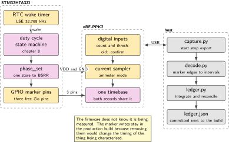
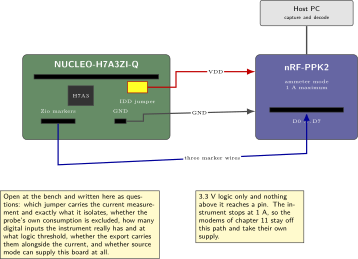
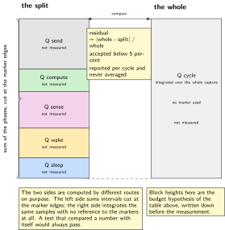
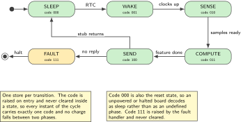
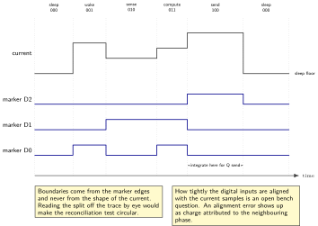

# Chapter 10. Where the energy goes: wake, sense, compute, send

> **Target board:** NUCLEO-H7A3ZI-Q with the nRF-PPK2  
> **Theme:** Marker pins, per-phase charge accounting

> **Key facts**
>
> - **Board:** NUCLEO-H7A3ZI-Q, with the nRF-PPK2 as the ammeter and as this book's logic recorder
> - **Peripherals:** RTC for the wake, GPIO marker pins on free Zio pins, I2C for the sense phase, USART3 held silent during a capture
> - **Toolchain:** arm-none-eabi-gcc with CMake on the target; Python on the host for capture, decode and the ledger
> - **Operating system:** Bare metal
> - **Difficulty:** 4 of 5
> - **Effort:** 3 evenings of about four hours
> - **Deliverable:** A per-phase charge ledger for one duty cycle, with the marker trace that proves the split, whose phases sum to the measured cycle total within five percent

## Why this project

Chapter 7 ends with one number: the charge drawn by one complete duty cycle, measured with the nRF-PPK2 in ammeter mode. That number answers the question a customer asks, which is how long a battery lasts. It answers no question an engineer can act on. If the cycle costs more than the budget allows, the number does not say whether the cost is in the wake-up transient, in the sensor read, in the computation, or in the transmit stub that is standing in for a radio. Halving the computation is pointless if the wake-up transient owns most of the charge, and that is a thing you cannot know from a single figure.

This chapter turns the single number into a ledger. The method is small and it is the whole chapter: the firmware raises a pattern on a few spare output pins at each phase boundary, the instrument records those pins on its digital inputs time-aligned with the current it is already sampling, and a host script cuts the current trace at the marker edges and integrates each piece separately. The acceptance test is then arithmetic rather than opinion. The phases must sum to the whole within five percent, and if they do not, either the split is wrong or there is charge being drawn in a phase nobody named.

There is a second reason this chapter exists on this bench in particular. There is no oscilloscope, no logic analyser and no Joulescope here, confirmed on Sunday 20 September 2026. The instrument's digital inputs are the only time-aligned logic record available, and they are sampled by the same instrument that samples the current, which is exactly the property a phase split needs. A separate logic capture on a separate clock would have to be aligned after the fact, and alignment error would appear as charge attributed to the wrong phase. Using the ammeter's own inputs removes that class of problem, or rather moves it inside the instrument where it can be characterised once.

> [!NOTE]
> **The sum is the test**
>
> A per-phase breakdown that does not reconcile against the whole-cycle figure is a plausible-looking picture and nothing more. Measure the cycle total first, as chapter 7 does, before any markers exist. Then split it. The reconciliation residual is the honest error bar on every per-phase number in the ledger, and it belongs in the report next to them.

## Prior art and what to reuse

| Source | What it gives | What it does not | Licence |
| --- | --- | --- | --- |
| Chapter 7 of this volume | The measurement set-up, the instrument in ammeter mode, the whole-cycle charge figure, and the clock-restore trap that keeps current high after a wake | One number per cycle and no way to attribute it | This volume |
| The Python interface to the power instrument | Scripted capture, start and stop, and export from the host so a run is repeatable rather than a screenshot | It is GPL-2.0. Install it from its package index and do not fork it into a portfolio repository | GPL-2.0 |
| Golioth's method article on this instrument | The practical set-up: source mode against ammeter mode, what the two leads do, and where the ground reference has to be | No phase splitting. It produces the single number that chapter 7 already has | Article, read and cite |
| Published empirical work on cellular module energy | The presentation model this chapter copies: a trace divided into named states with a charge for each | A different part, a different modem and a host that is not this board | Paper |
| Sensor-node lifetime estimation literature | The arithmetic from charge per cycle to battery months, including self-discharge and the duty-cycle algebra | It assumes a per-phase split exists and never says how to obtain one | Papers |

*Table 10.1. Prior art for chapter 10. The instrument's host library is installed and never vendored, because its licence is the one category in this book that a portfolio repository must keep at arm's length.*

What is left to write is the marker protocol, the decoder and the reconciliation. No peer-reviewed method exists for this instrument, which is recorded in this volume's provenance notes as a gap rather than an oversight, so the rigour here is original work and has to be stated in enough detail that somebody else can repeat it. That means writing down the marker encoding, the cost of raising a marker, the assumed alignment between the digital inputs and the current samples, and what happens to charge drawn while no marker is asserted.

The phase splitting by marker pin is the author's contribution. Everything else in the chapter is borrowed and credited: the instrument, its host library, the set-up method and the presentation format.

## Parts from the inventory

| Part | Role | Interface |
| --- | --- | --- |
| NUCLEO-H7A3ZI-Q | The node under measurement. Its own probe is a load, so it is considered in the budget rather than ignored | Micro USB for flashing, then the question of what powers the target during a capture |
| nRF-PPK2 | Ammeter for the current, and the logic recorder for the marker pins on its digital inputs | USB to the host; measurement leads to the board; digital inputs to the marker pins |
| Jumper wires | Marker pins to the instrument's digital inputs, and the ground reference they share | Female headers on both sides, which is a constraint and not a detail |
| X-NUCLEO-IKS4A1 | Optional, to make the sense phase real rather than a delay. One shield at a time, never two | Arduino header |
| Host PC | Capture, decode, integrate, report | USB |

*Table 10.2. Inventory items used in chapter 10. Nothing is bought and nothing is soldered. Whether male-to-male jumper wires exist in the drawer is an open question on the bench list, and every header here is female.*

## System architecture



*Figure 10.1. One instrument samples two things at once. The current path and the marker path share the instrument's timebase, which is the property that makes the phase split trustworthy rather than approximate.*

The firmware does not know it is being measured. It raises and lowers output pins at points it would have to mark anyway for any kind of tracing, and those pins happen to be wired to an instrument. That separation matters: the same firmware runs when the instrument is not connected, and the marker writes stay in the production build because removing them would change the timing of the thing being characterised.

## Peripheral configuration

| Peripheral | Mode | Clock source | Pins and function | Interrupt and transfers |
| --- | --- | --- | --- | --- |
| RTC | Wake timer, periodic | LSE at 32.768 kHz, fitted on this board and confirmed | None | Wake-up interrupt from Stop mode |
| GPIO markers | Push-pull output, written through the set and reset register | Peripheral bus | Free Zio pins. Which pins are free alongside a fitted shield is on the confirm list | None |
| I2C1 | Fast mode, sense phase | Peripheral bus | Arduino D14 and D15 by convention, checked in the board manual | Polled here; DMA in chapter 4 |
| USART3 | Console, held silent during a capture | Peripheral bus | Confirm in the board manual | None during a capture |
| DWT cycle counter | Free-running | Core clock | None | None. Cross-check only |

*Table 10.3. Peripheral configuration for chapter 10. The console is configured and then not used during a capture, because a line of text at 115200 is charge that belongs to no phase and would appear in the reconciliation residual.*

The cycle counter earns its place as an independent check on the phase boundaries. It costs nothing to read, it runs on a completely different mechanism from the instrument, and if the phase durations it reports disagree with the marker edge times the instrument recorded, one of the two is wrong and it is worth knowing which before trusting either. Whether the counter works with no debugger attached is on the confirm list for this silicon, and if it turns out to need one, the cross-check is lost and the marker edges stand alone.

## Wiring



*Figure 10.2. The measurement wiring. Three open questions are drawn as questions: which jumper carries the current measurement and what it isolates, how many digital inputs the instrument really has and at what threshold, and whether the instrument can supply the board at all in source mode.*

> [!NOTE]
> **Three limits that are not negotiable**
>
> The instrument measures at most 1 A, so nothing that draws more goes through it. The board's logic is 3.3 V and nothing above that reaches a pin. The cellular modems of chapter 11 need 2 A peaks from their own supply and are never fed from the board or through this instrument, which is why the send phase here is a stub and the real modem waits for the next chapter.

## Memory and timing budget



*Figure 10.3. The ledger, drawn as a shape rather than as numbers. Every quantity in it is unmeasured until the bench produces it, and the figure exists to fix the arithmetic and the reconciliation band before any number is written into it.*

| Quantity | Budget | Measured | Margin |
| --- | --- | --- | --- |
| Charge per cycle, whole | from chapter 7 | not measured | not measured |
| Wake phase charge | 15 percent of cycle | not measured | not measured |
| Sense phase charge | 25 percent of cycle | not measured | not measured |
| Compute phase charge | 10 percent of cycle | not measured | not measured |
| Send phase charge | 40 percent of cycle | not measured | not measured |
| Sleep phase charge | 10 percent of cycle | not measured | not measured |
| Reconciliation residual | below 5 percent | not measured | not measured |
| Cost of one marker write | below 0.1 percent of cycle | not measured | not measured |
| Marker code in flash | 256 B | not measured | not measured |
| Ledger record in RAM | 128 B | not measured | not measured |

*Table 10.4. The budget for chapter 10. The percentages in the budget column are the hypothesis to be tested, written down before the measurement so that agreement is evidence and disagreement is a finding. Nothing enters the measured column until the instrument has produced it.*

Writing the budget down first is not a formality. A per-phase measurement is easy to read backwards: once a trace is on screen it is very natural to decide that the tall part must be the transmit and the flat part must be the sleep, and to stop asking. Stating the expected split in advance makes a surprise visible as a surprise.

## Firmware design (UML)



*Figure 10.4. The duty cycle as a state machine, with the marker code each state asserts. The code is raised on entry and never cleared inside a state, so every instant of the cycle carries exactly one code and charge cannot fall between two phases.*

The design rule that makes the arithmetic work is that the marker code changes exactly once per transition and never inside a state. If a marker is cleared at the end of a phase and the next is raised at the start of the next, the interval between the two writes belongs to no phase, and on a part running at 280 MHz that interval is short but it is not zero. Writing the whole code in one store to the set and reset register removes the gap entirely: the old code and the new code change in the same cycle, and there is no instant where the pins show neither.

An encoding decision follows from that. A one-hot code with one pin per phase is the easiest to read on a screen and the easiest to decode, and it costs one pin per phase. A binary code on three pins covers eight phases and frees pins for other uses, at the cost of a decoder that has to handle the transient if the pins are not written atomically. Since the set and reset register does write them atomically, the binary code carries no real risk here, and the choice comes down to how many pins the fitted shield leaves free. That is an open item on the bench list and it is decided at the bench, not in this text.

## Data flow (ASCII)

```text
  board                                    instrument                      host
  +-------------------------------+        +--------------------+   +-----------------------+
  | RTC wake  -> marker code 001  |        |                    |   | capture script        |
  | sense     -> marker code 010  | pins   | 8 digital inputs   |   |   start, stop, export |
  | compute   -> marker code 011  +------->|   same timebase    |   |        |              |
  | send stub -> marker code 100  |        |        +           |   |        v              |
  | sleep     -> marker code 000  |        | current sampler    |-->| decode marker edges   |
  |                               |        |   ammeter mode     |USB|        |              |
  | VDD, GND                      | leads  |        ^           |   |        v              |
  |   +---------------------------+------->|--------+           |   | integrate per phase   |
  +-------------------------------+        +--------------------+   |        |              |
                                                                    |        v              |
                                                                    | reconcile vs total    |
                                                                    | ledger.json           |
                                                                    +-----------------------+
```

## Repository layout

```text
nucleo-h7a3-energy-ledger/
  CMakeLists.txt
  ld/stm32h7a3zi.ld              # from chapter 1, unchanged
  src/phase.h                    # the marker protocol, one header, no code
  src/phase.c                    # one store to BSRR, nothing else
  src/cycle.c                    # the duty cycle state machine of chapter 8
  src/sense.c                    # shield read, or a calibrated delay if bare
  src/main.c
  host/capture.py                # drives the instrument, writes a raw export
  host/decode.py                 # marker edges -> phase intervals
  host/ledger.py                 # integrate, reconcile, emit ledger.json
  host/report.py                 # the figure in this chapter, regenerated
  host/requirements.txt          # the instrument library, installed not vendored
  docs/method.md                 # the alignment assumption, written down
  ledgers/                       # one ledger.json per run, committed
  README.md
```

The ledger directory is committed deliberately. A run that is not kept is a demonstration; a run that is kept next to the firmware revision that produced it is a measurement, and chapter 12 turns the committed ledgers into a regression test that fails a build when the charge moves.

## Steps

**Step 1.** **Reproduce the whole-cycle number before splitting anything.** Run chapter 7's measurement again on the firmware you are about to instrument, and write the figure down. If it does not reproduce within a few percent of what chapter 7 recorded, stop here: something in the set-up has moved, and a phase split built on an unstable baseline will attribute the instability to whichever phase happens to be running when it occurs.

**Step 2.** **Write the marker protocol as a header before any code.** The protocol is the contract between the firmware and the decoder, and it is short enough to read in one screen.

```c
/* phase.h: the marker protocol. Three pins, binary code, one store per change.
 * Code 000 means sleep and is also the reset state, so an unpowered or
 * halted board reads as sleep rather than as an undefined phase.          */
#ifndef PHASE_H
#define PHASE_H

typedef enum {
    PHASE_SLEEP   = 0u,   /* 000 */
    PHASE_WAKE    = 1u,   /* 001  clock restore included, see chapter 7 */
    PHASE_SENSE   = 2u,   /* 010 */
    PHASE_COMPUTE = 3u,   /* 011 */
    PHASE_SEND    = 4u,   /* 100  a stub until chapter 11 */
    PHASE_FAULT   = 7u    /* 111  raised by the fault handler, never cleared */
} phase_t;

void phase_init(void);           /* clock the port, configure the three pins */
void phase_set(phase_t p);       /* exactly one store to BSRR                */

#endif
```

The fault code is worth the pin it costs. A trace that ends in a code nobody raises deliberately tells you the run is invalid without anyone reading a log.

**Step 3.** **Make a marker cost one store.** The set and reset register takes a set mask in its low half and a reset mask in its high half, so setting some pins and clearing others is a single write with no read, no modify and no interrupt window in the middle.

```c
/* The three marker pins are adjacent, at PHASE_PIN0 and up, on one port.
 * Adjacency is a convenience, not a requirement; a scattered set works with
 * a lookup table instead of a shift.                                      */
#define PHASE_PIN0   4u
#define PHASE_MASK   (7u << PHASE_PIN0)

void phase_set(phase_t p)
{
    uint32_t set   = ((uint32_t) p << PHASE_PIN0) & PHASE_MASK;
    uint32_t clear = (~set) & PHASE_MASK;
    PHASE_PORT->BSRR = set | (clear << 16);   /* one store, atomic on the pins */
}
```

Two properties follow and both matter for the arithmetic. The write is atomic with respect to interrupts, so a marker change cannot be interrupted halfway and leave the pins showing a code that was never a phase. And the port clock must already be running: a pin written before its clock is enabled does nothing and reports no error, which is the same trap as chapter 1 and it is worth checking first when the markers are simply absent from a capture.

**Step 4.** **Bound the cost of a marker and put the bound in the report.** The markers are inside the thing being measured, so their cost is part of the answer. Measure it the only way the bench allows: run the whole cycle with the markers compiled in and again with `phase_set` reduced to an empty function, and compare the whole-cycle charge from the instrument. The difference is an upper bound on the total marker cost, because it also contains whatever the compiler did differently. State the bound; do not claim the markers are free.

**Step 5.** **Wire the digital inputs and settle three questions at the bench.** The inventory records eight digital inputs on this instrument. How many there are, what logic threshold they use, at what rate they are sampled, whether the export carries them alongside the current samples, and how tightly they are aligned with the current timebase are all open items on the confirm list. None of them is written as fact in this chapter. Settle them by capturing a known square wave from a timer output on a marker pin, at a period you have set yourself, and reading it back out of the export.

```bash
python host/capture.py --seconds 5 --out runs/align_check.raw
python host/decode.py runs/align_check.raw --expect-period-ms 10
```

If the decoded period differs from the programmed period by more than the instrument's own sample interval, the alignment assumption is not safe and the phase boundaries inherit that error.

**Step 6.** **Capture one duty cycle with room either side.** A capture that starts inside the cycle produces a first phase that is truncated and a ledger that silently under-counts it. Start the capture in sleep, wait for at least two complete cycles, and stop in sleep, then let the decoder find whole cycles by looking for the code transitions rather than by trusting the capture window.

**Step 7.** **Decode the marker edges into phase intervals.** The decoder is the piece worth writing carefully, because every later number depends on it. Treat a code change as an instantaneous boundary, reject any interval shorter than the instrument's sample interval as a decoding artefact rather than as a phase, and count how many it rejected so the count can go in the report.

```python
def intervals(samples, codes, dt):
    """Yield (code, t_start, t_end) for each run of a constant marker code."""
    out, start, cur = [], 0.0, codes[0]
    for i in range(1, len(codes)):
        if codes[i] != cur:
            out.append((cur, start, i * dt))
            start, cur = i * dt, codes[i]
    out.append((cur, start, len(codes) * dt))
    return [iv for iv in out if (iv[2] - iv[1]) >= dt]
```

**Step 8.** **Integrate charge per phase, then reconcile.** Charge is the integral of current over time, which on a uniformly sampled trace is a sum times the sample interval. Integrate each phase separately, sum the phases, and compare against the integral of the whole cycle computed independently from the same samples without reference to the markers at all.

```python
def ledger(current_a, codes, dt):
    per = {}
    for code, t0, t1 in intervals(current_a, codes, dt):
        i0, i1 = int(t0 / dt), int(t1 / dt)
        per[code] = per.get(code, 0.0) + sum(current_a[i0:i1]) * dt
    total = sum(current_a) * dt              # computed without the markers
    split = sum(per.values())
    residual = abs(total - split) / total if total else 1.0
    return per, total, residual              # residual is the acceptance test
```

The two totals are computed by different routes on purpose. If the residual were defined as the difference between the phase sum and itself it would always be zero and the test would prove nothing.

**Step 9.** **Attribute the residual rather than hiding it.** A residual above five percent has a small number of usual causes, and they are distinguishable. Charge drawn in an interval the decoder rejected as too short shows up as a rejection count above zero. Charge drawn while the fault code is asserted shows up as a phase nobody expected. Charge drawn by something that is not the target at all, such as the on-board probe, shows up as a floor under every phase including sleep, which is the reason the measurement jumper and what exactly it isolates is on the confirm list. Report which of these it was.

**Step 10.** **Run the experiment the ledger is for.** With a per-phase split in hand, reorder the cycle and measure again. The classic question is whether it pays to finish the computation quickly at full clock and return to sleep, or to run slower and longer, and the answer depends entirely on the ratio between the compute phase charge and the fixed cost of the wake transient. On a part chosen for speed the expectation is that racing to sleep wins, but the point of the chapter is that the expectation is now testable.

```bash
python host/capture.py --seconds 12 --out runs/race.raw
python host/ledger.py runs/race.raw --baseline ledgers/baseline.json
```

## Build, flash and debug



*Figure 10.5. One duty cycle as the instrument records it. The current trace and the three marker lanes share one timebase, and the phase boundaries are the marker edges rather than features picked out of the current by eye.*

The build is chapter 1's build with two files added, so there is nothing new to say about it. What is new is that the board is being measured while it runs, which changes how it is flashed and how it is recovered.

```bash
cmake -B build-fw -G Ninja -DCMAKE_TOOLCHAIN_FILE=cmake/arm-none-eabi.cmake
cmake --build build-fw -j
cp build-fw/firmware.bin "$PROBE_DISK"/   # onto the probe disk
```

Flash first, then set up the measurement, then reset the board and capture. A debugger attached during a capture changes the answer: the core is not allowed to enter the deeper low-power modes with a debug connection active in the usual configuration, and the probe itself draws current that may or may not be inside the measurement path depending on the jumper. Detach, reset, capture.

> [!NOTE]
> **When every phase looks the same**
>
> In order of likelihood: the port clock for the marker pins was never enabled, so the pins never move and the decoder sees one long phase; the digital input ground and the board ground are not common, so the inputs float and read as noise rather than as a code; the pins chosen collide with a fitted shield, which is why the free-pin question is on the confirm list; the capture window is shorter than one cycle; or the instrument is in source mode when it should be in ammeter mode, in which case the current trace is of the instrument supplying the board rather than of the board drawing. Check them in that order.

To recover a board that stops responding after a low-power experiment, hold the reset line low while the flashing tool connects, which is the connect-under-reset path chapter 7 also needs. A part that has entered a deep low-power mode with no wake source configured is not damaged and is not permanently inaccessible; it is simply not listening, and a reset is enough. Nothing in this chapter touches option bytes, and nothing in this book does until the question of whether a bad option-byte write can leave this board unrecoverable without external tooling has been answered.

## Verification and acceptance criteria

- The per-phase charges sum to the independently computed cycle total within five percent, on ten consecutive cycles from one capture, with the residual for each cycle printed rather than averaged away.
- The whole-cycle total reproduces chapter 7's figure on the same firmware within the repeatability that chapter 7 itself established, so the ledger is known to be splitting the same quantity chapter 7 measured.
- The marker cost bound is stated as a number with its method, obtained by comparing whole-cycle charge with markers compiled in against a build where the marker function is empty.
- The decoder reports its rejection count, and a run with any rejected interval is reported as such rather than quietly accepted.
- The phase durations from the marker edges agree with the durations the cycle counter reports from inside the firmware, which is an independent check on the instrument's alignment. If the cycle counter turns out to need a debugger on this part, this criterion is dropped and the chapter says so.
- A ledger file is emitted for every run, carries the firmware revision, and is committed next to it.
- Every number in the ledger names the instrument that produced it. Nothing is written in the measured column of the budget table until it has been measured.

## Variants

| Axis | Variant | What changes | Cost | Built in full in |
| --- | --- | --- | --- | --- |
| Time and safety | RTC wake against low-power timer | The wake source changes the shape and the cost of the wake phase, which the ledger now resolves separately from everything else | Different wake latency | Chapter 7 |
| Execution model | DMA for the sense phase | The core sleeps through the transfer instead of polling, which moves charge from the compute phase to the sense phase rather than removing it | Setup cost per transfer | Chapter 4 |
| Execution model | An RTOS task set | Phases become tasks and the marker writes move into the task bodies, with the idle task raising the sleep code | Tick cost during sleep | Chapter 20 |
| Intelligence and reach | A real transmit instead of the stub | The send phase stops being a delay and starts being a modem, on its own supply and outside this instrument's 1 A limit | A second supply and a second measurement path | Chapter 11 |
| Intelligence and reach | Compute on the host instead of the node | The compute phase disappears and the send phase grows, which the ledger can price directly | More airtime | Chapter 16 |
| Language | Host tooling in Python | The capture, decode and ledger scripts here | None | Chapter 3 |
| Peripheral substitution | Markers on timer output channels | A timer channel can raise a marker without the core, which removes the marker cost from the phase being measured | More configuration | Chapter 17 |

*Table 10.5. Variants for chapter 10. This chapter builds no variant in full, which is deliberate: it contributes a measurement method that every one of these variants can then be priced with, and the book's matrix assigns each variant to the chapter where it teaches most.*

## Pitfalls

- Clearing a marker at the end of a phase and raising the next at the start of the next. The interval between the two writes belongs to no phase and its charge appears in the residual. One store per transition removes the gap.
- Trusting the digital inputs to be aligned with the current samples without checking. The alignment is on the confirm list for a reason, and an alignment error appears as charge attributed to the neighbouring phase, which is the most plausible-looking kind of wrong answer.
- Leaving the console enabled during a capture. A single line of text at 115200 is charge drawn outside any phase and it will not be obvious in the trace.
- Measuring with the debugger attached. The low-power behaviour differs and the probe's own consumption may be inside the measurement path.
- Reading the split off the current trace by eye and using the markers only as decoration. If the boundaries come from the shape of the current, the method is circular and the reconciliation test no longer means anything.
- Averaging the residual across cycles. A method that reconciles on average and not per cycle is hiding a real effect, usually a phase whose duration varies.
- Choosing marker pins that collide with a fitted shield. Which Zio pins with spare general-purpose function remain free alongside a shield is an open bench question and it is answered before the pins are chosen, not after.

## Best practices applied

- The budget is written before the measurement, so that agreement is evidence and disagreement is a finding rather than an embarrassment.
- Two independent routes compute the quantity that the acceptance test compares. A test that compares a number with itself is not a test.
- The instrument's own timebase carries both signals, which removes a whole class of alignment error rather than correcting for it afterwards.
- The cost of the instrumentation is bounded and reported, because the markers are inside the system being characterised.
- Open questions are written as questions. The digital input count, the threshold, the alignment, the measurement jumper and the free Zio pins are all marked as items for the bench, and none of them is asserted.
- The dependency with the restrictive licence is installed from its package index and is not copied into the repository.

## Stretch goals

- Emit the ledger as a machine-readable record with the firmware revision, the instrument serial number and the capture parameters, and have chapter 12's rig compare it against the committed baseline automatically.
- Add a sixth phase for the clock restore inside the wake phase, which chapter 7 identifies as the expensive part of waking this family, and find out what fraction of the wake charge it owns.
- Reproduce the whole measurement with the shield fitted and the sense phase reading a real sensor at a real rate, and compare against the delay-based stub, which prices the sensor rather than the firmware around it.
- Sweep the core frequency across the voltage scales the datasheet allows and plot charge per cycle against frequency. The shape of that curve is the racing-to-sleep question in one figure and no published result covers this part.
- Extend the decoder to cope with a marker pin that is shared with a shield signal by ignoring intervals shorter than a stated threshold, and report how often that happens rather than assuming it does not.

## Roadmap and next steps

Chapter 11 replaces the send stub with a real modem, which is where most of the charge in a node like this eventually goes, and it has to do so on a separate supply because the modem's peak demand is outside this instrument's range. Chapter 12 takes the ledger produced here and makes it a gate: a build whose charge per cycle has moved by five percent turns the build red without anybody at the bench.

For the wider path, the community embedded engineering roadmap distinguishes firmware work from embedded Linux work and from hardware work and says which to weight at which stage, and the accompanying essay on bridging the gap between reading and building makes the same argument this volume makes, which is that projects teach what reading does not. Its central advice is the reason this chapter insists on a measurement rather than a description. Appendix H lists the courses; for the energy material specifically, there is no course on this bench's instrument, and that absence is itself recorded in this volume's provenance notes as one of the gaps the work fills.

## Portfolio evidence

- A public repository containing the firmware, the host tooling, the method document that states the alignment assumption, and one committed ledger per run.
- A figure showing one duty cycle with the current trace and the marker lanes on one timebase, generated by the report script from a committed run rather than captured from a screen.
- The reconciliation table: ten cycles, the phase sum, the independent total and the residual for each, with nothing averaged.
- A short written finding on the racing-to-sleep question for this part, with the method stated well enough that somebody with the same instrument could disagree with it.

## Sources

Normative references:

- Reference manual RM0455, for the low-power modes, what each retains, the wake sources and the set and reset register behaviour on this part. Not RM0433, which documents its sibling.
- The board user manual for MB1363, for the current measurement jumper, what it isolates, and which header pins are free alongside a fitted shield.
- The STM32H7A3xI datasheet, for the supply currents at each voltage scale and for the clock limits that bound the racing-to-sleep experiment.
- The instrument's own user guide, for the digital input count, the logic threshold, the sample rate and the export format.

Reusable implementations:

- The Python interface to the power instrument, GPL-2.0. Install it from its package index; do not fork it into a portfolio repository.  
  <https://github.com/IRNAS/ppk2-api-python>
- Golioth's method article on measuring current consumption with this instrument, which is the practical set-up this chapter starts from.  
  <https://blog.golioth.io/measuring-current-consumption-with-power-profiler-kit-ii/>
- The vendor's own power examples for this exact board, under `Projects/``NUCLEO-H7A3ZI-Q/``Examples/PWR/`, which are the reference for entering and leaving the low-power modes correctly.
- The peer-reviewed empirical study of narrow-band module energy whose per-state presentation format this chapter copies, noting that its host is a single-board computer and not this part.  
  <https://jtde.telsoc.org/index.php/jtde/article/view/955>
- The community embedded engineering roadmap, for where this chapter sits in a longer path.  
  <https://github.com/m3y54m/Embedded-Engineering-Roadmap>

---

[Previous](09-the-payload-codec-and-its-python-twin.md) &nbsp;&nbsp;|&nbsp;&nbsp; [Contents](../README.md) &nbsp;&nbsp;|&nbsp;&nbsp; [Next](11-an-at-engine-that-never-blocks.md)
