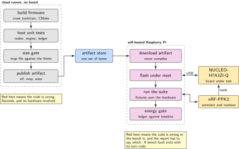
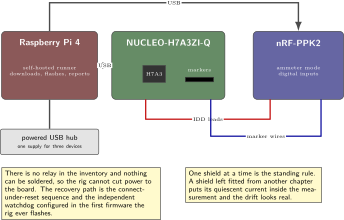
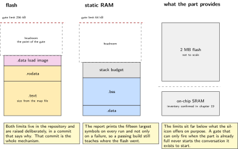
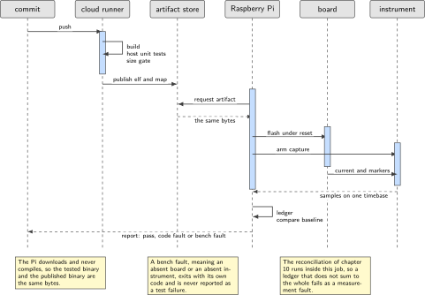
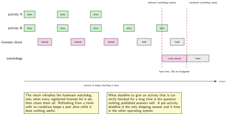

# Chapter 12. Energy as a regression test, and the rig that runs it

> **Target board:** NUCLEO-H7A3ZI-Q with a Raspberry Pi and the nRF-PPK2  
> **Theme:** Host unit tests, size gate, hardware in the loop, watchdogs

> **Key facts**
>
> - **Board:** NUCLEO-H7A3ZI-Q under test, a Raspberry Pi as the self-hosted runner, the nRF-PPK2 as the instrument
> - **Peripherals:** The independent and the window watchdog, the debug freeze bits, and whichever retained memory can hold a crash record
> - **Toolchain:** arm-none-eabi-gcc with CMake for the target; a C test framework with a faking header on the host; a test runner on the Pi
> - **Operating system:** Bare metal on the target; Linux on the runner
> - **Difficulty:** 4 of 5
> - **Effort:** 4 evenings of about four hours
> - **Deliverable:** A pipeline in which a deliberate five percent charge regression turns the build red with nobody at the bench, and a two-layer watchdog that leaves a readable record when the firmware stops

## Why this project

Chapter 10 produces a per-phase charge ledger. It is a good measurement and it has the same problem every good manual measurement has, which is that it is taken once, by the person who cared, on the day they cared. Six commits later somebody adds a retry to the sense path and the charge per cycle grows by eight percent, and nobody finds out until the field trial. A measurement that is not checked automatically is a demonstration. This chapter turns the ledger into a gate.

There are three gates and they are deliberately in increasing order of cost. Host unit tests run in seconds on a cloud runner with no hardware at all, and they catch the majority of ordinary defects in the codec of chapter 9, the engine of chapter 11 and the ledger arithmetic of chapter 10. A size gate reads the map file and fails a build whose flash or static memory has grown past its stated limit, which costs nothing and catches the class of change that quietly consumes the margin. Only then does anything touch hardware: a self-hosted runner on a Raspberry Pi downloads the artifact the cloud built, flashes the board, runs the measurement and compares the ledger against the committed baseline. Every published source on this subject agrees on that architecture, and the reason is simple: cloud runners are cheap and plentiful and have no board attached, and the machine with the board attached should do as little as possible.

The second half of the chapter is watchdogs, and they belong here rather than in a chapter of their own because a rig that resets boards unattended is exactly the thing that needs to tell a stopped firmware from a slow one, and to leave evidence either way. A watchdog that simply resets the part produces a rig that reports intermittent failures and no information. A watchdog designed properly produces a rig that reports which task stopped responding and when, which is a different quality of result.

> [!NOTE]
> **A test nobody runs is documentation with a worse licence**
>
> The acceptance criterion for this chapter is stated in terms of absence: the regression is caught with nobody at the bench. Every design decision below follows from that. If a step needs a person to plug something in, to press reset, or to decide whether a number looks reasonable, it is not part of the gate and it has to be replaced by something that is.

## Prior art and what to reuse

| Source | What it gives | What it does not | Licence |
| --- | --- | --- | --- |
| Unity | A C test framework small enough to run on the target as well as the host | No mocking and no build system, so something has to supply both | MIT |
| Ceedling | Project generation, test runners and mock generation on top of Unity | It needs Ruby. On a Windows host with a Linux subsystem that is a real friction point, worth saying before a reader spends an evening on it | MIT |
| CppUTest | Memory-leak detection between setup and teardown, the one capability the others do not have | It is C++ underneath, so the build is heavier and the messages are further from the C you wrote | BSD |
| fff | Fake functions in a single header, the lightest fit for a C project | Its default call history silently drops calls past ten arguments and past seventeen calls, so a test asserting on the twentieth call passes for the wrong reason | MIT |
| Memfault's framework comparison | A direct, current comparison written by people who ship firmware | It compares frameworks, not rigs | Article |
| Golioth's series on automated hardware testing | The rig: a self-hosted runner, fixtures that power and flash a board, hardware as a test resource | Their boards and their cloud service, so the fixtures transfer and the specifics do not | Article |
| Memfault's watchdog article | The two-layer design, plus a task-liveness bitmask | No code for this part and no per-task timeout policy | Article |
| Ganssle's essay on watchdogs | The clearest statement of why a naive watchdog gives false confidence | It predates this silicon and does not discuss debug freeze | Article |
| The other operating system's task watchdog | The only shipping reference implementation of per-task timeouts | The common kernel ships no task-watchdog abstraction at all | Apache-2.0 |

*Table 12.1. Prior art for chapter 12. The frameworks and the rig are prior art; the architecture that joins them and the energy gate on top are not.*

What is left to write is the energy gate itself, the fixtures that make the instrument a test resource rather than an instrument, and the watchdog layer. Two observations from the sources deserve to be carried forward rather than rediscovered. The first is the fff call-history limit: it is a default, it is documented, and it is the sort of default that produces a green test for the wrong reason, so the project either raises the limit explicitly in its configuration header or asserts on call counts in a way that does not depend on history depth. The second is that nobody has published a comparison between the per-task watchdog abstraction of the other operating system and the absence of one in the common kernel. That comparison is a small piece of original work and it fits inside this chapter.

## Parts from the inventory

| Part | Role | Interface |
| --- | --- | --- |
| NUCLEO-H7A3ZI-Q | The board under test. Its own probe is the programmer, so no separate debug hardware is needed on the rig | USB to the Raspberry Pi |
| Raspberry Pi 4 | The self-hosted runner. It downloads the artifact, flashes, runs the tests and reports | Ethernet or wireless to the cloud; USB to the board and to the instrument |
| nRF-PPK2 | The instrument, driven from the runner rather than by hand | USB to the Pi; measurement leads to the board |
| Powered USB hub | The board, the instrument and the Pi all draw from one supply otherwise, and a runner that resets itself under load is not a runner | USB |
| Jumper wires | The marker pins of chapter 10, so the energy gate can report per phase rather than per cycle | Female headers both ends |
| Host PC | Writing the tests. It is not part of the rig, which is the point | USB |

*Table 12.2. Inventory items used in chapter 12. Nothing is bought and nothing is soldered, so the rig has no relay and cannot cut power to the board. That constraint shapes the recovery design below.*

## System architecture



*Figure 12.1. Three gates in increasing order of cost. The cloud builds and publishes an artifact; the machine with the board attached downloads it and does as little as possible. Every published source on this subject arrives at the same shape.*

The split is not about saving money on compute. It is about failure modes. A cloud runner that fails tells you the build is broken. A self-hosted runner that fails might mean the firmware is broken, or the board has come unplugged, or the instrument has enumerated under a different device name, or somebody has taken the shield off. Keeping those two kinds of failure on separate machines means the first kind is never confused with the second, and it means the expensive, fragile half of the pipeline runs only against a binary that has already passed everything cheap.

## Peripheral configuration

| Peripheral | Mode | Clock source | Pins and function | Interrupt and transfers |
| --- | --- | --- | --- | --- |
| Independent watchdog | Free running, reset on expiry | An internal low-speed oscillator, which is what makes it independent of the rest of the clock tree | None | Reset only. No interrupt |
| Window watchdog | Windowed, early refresh also resets | Peripheral bus, so it stops when that stops | None | Early wake-up interrupt, used to write the record |
| Debug freeze control | Freeze both watchdogs while halted | Debug clock. Confirm whether that clock must be enabled before the freeze write takes effect | None | None |
| Retained memory | Crash record across a reset | Backup domain. Whether it is usable without a coin cell is on the confirm list | None | None |
| GPIO markers | As chapter 10 | Peripheral bus | Free Zio pins | None |
| USART3 console | Test transcript to the runner | Peripheral bus | Confirm in the board manual | Interrupt driven |

*Table 12.3. Peripheral configuration for chapter 12. The two watchdogs are complementary rather than alternative: one is independent of the clock tree and cannot be talked out of a reset, and the other notices a refresh that arrives too early as well as one that arrives too late.*

The difference between the two watchdogs is worth stating plainly because it decides which one carries which job. The independent watchdog runs from its own oscillator, so it survives almost anything that goes wrong with the main clock tree, and that independence is exactly why it cannot tell you anything before it resets the part. The window watchdog runs from the peripheral bus and refuses a refresh that arrives too early as well as one that arrives too late, which catches a loop running away and refreshing in a tight cycle, and it offers an interrupt shortly before it expires. That interrupt is where the crash record gets written.

## Wiring



*Figure 12.2. The rig as it actually sits on the bench. There is no relay and no soldering iron here, so power cannot be cut under program control, and the recovery path has to work with what the probe and the reset line already provide.*

> [!NOTE]
> **The rig cannot cut power and that changes the recovery design**
>
> With no relay in the inventory, a board that has stopped in a way a reset does not clear will stay stopped until somebody unplugs it. The design answer is to make that case impossible rather than recoverable: the independent watchdog is configured in the very first firmware the rig ever flashes, the runner uses the connect-under-reset path rather than assuming the target is responsive, and the job reports a distinct outcome for "the board did not answer" so it is never confused with a test failure.

## Memory and timing budget



*Figure 12.3. The size gate. Both limits are stated in the repository and read by a script from the map file, so growth is refused at the point it happens rather than noticed when something no longer fits.*

| Quantity | Budget | Measured | Margin |
| --- | --- | --- | --- |
| Flash limit for the node image | 256 kB | not measured | not measured |
| Static memory limit | 64 kB | not measured | not measured |
| Crash record size | 128 B | not measured | not measured |
| Host unit test suite, wall time | below 60 s | not measured | not measured |
| Size gate, wall time | below 2 s | not measured | not measured |
| Hardware job, wall time | below 10 min | not measured | not measured |
| Charge per cycle, tolerance | 5 percent of baseline | not measured | not measured |
| Independent watchdog period | 4 s | not measured | not measured |
| Software watchdog lead time | 250 ms before the hardware one | not measured | not measured |

*Table 12.4. The budget for chapter 12. The limits are deliberately far below what the part provides, because a gate set at the hardware limit fires only when it is already too late to be useful. Nothing enters the measured column until the bench produces it.*

## Firmware design (UML)



*Figure 12.4. One job, end to end. The artifact crosses from the cloud to the bench exactly once, and the Raspberry Pi never compiles anything.*

The sequence has one property worth defending: the Raspberry Pi does not build. If it did, the thing being tested would be a build produced by a machine nobody else has, with whatever toolchain version happened to be installed on it, and a green result would mean less than it appears to. Downloading the artifact makes the tested binary and the published binary the same bytes.

The watchdog design that runs inside that binary has two layers. A software watchdog, driven from a timer, expires slightly before the hardware one and its handler writes a record: which activities had checked in, which had not, and the program counter it was interrupted at. Then it stops refreshing, and the hardware watchdog resets the part a short time later. The record survives only if it is written somewhere the reset does not clear, and whether the backup domain on this board is usable without a coin cell is on the confirm list, so the fallback is a region of ordinary static memory that the startup code checks before it zeroes anything.

## Data flow (ASCII)

```text
  commit                cloud runner                    artifact store        self-hosted Pi
  +--------+   push   +------------------------+      +---------------+     +------------------+
  | git    |--------->| 1. build firmware.elf  |      |               |     | 4. download      |
  +--------+          | 2. host unit tests     |      | firmware.elf  |     | 5. flash target  |
                      |    codec, engine, ledger|---->| firmware.map  |---->| 6. run pytest    |
                      | 3. size gate from .map |      | sizes.json    |     | 7. drive PPK2    |
                      +------------------------+      +---------------+     | 8. ledger.json   |
                          |  red here means                                 | 9. compare       |
                          |  the code is wrong                              +------------------+
                          v                                                        |
                      +------------------------+                                   v
                      | no board involved      |                       red here means the code
                      | seconds, not minutes   |                       is wrong OR the bench is
                      +------------------------+                       and the report says which
```

## Repository layout

```text
nucleo-h7a3-node/
  CMakeLists.txt
  src/                           # the node firmware of chapters 8 to 11
  src/wdt_hw.c                   # IWDG and WWDG setup, debug freeze
  src/wdt_soft.c                 # the task-liveness bitmask and the early handler
  src/crash_record.c             # what survives a reset, and where it lives
  test/host/CMakeLists.txt       # the host build: no target toolchain
  test/host/test_codec.c         # chapter 9
  test/host/test_at_engine.c     # chapter 11, with the recorded transcripts
  test/host/test_ledger.c        # chapter 10 arithmetic
  test/host/fff_config.h         # the call-history depth raised, deliberately
  tools/size_gate.py             # reads the map file, fails on growth
  rig/conftest.py                # fixtures: board, serial, instrument
  rig/test_energy.py             # the gate: ledger against baseline
  rig/test_watchdog.py           # deliberate stop, record recovered
  rig/runner_node/               # the same runner in Node.js, built in full here
  rig/runner_java/               # and in Java, for the same reason
  baselines/ledger_baseline.json # committed, and changed only on purpose
  .github/workflows/build.yml    # cloud: build, test, size gate, publish
  .github/workflows/bench.yml    # self-hosted: download, flash, measure
  README.md
```

## Steps

**Step 1.** **Split the firmware so most of it builds on the host.** This is the step that decides whether the rest of the chapter is easy or impossible. Every module that contains logic worth testing gets a hardware-free interface, and the register access lives behind it. The codec of chapter 9 and the ledger arithmetic of chapter 10 are already pure. The engine of chapter 11 needs one seam, which is the function that hands bytes to the transport.

```c
/* The seam. On the target this writes to the transfer engine; on the host the
 * test provides it and records what was written.                           */
void at_port_write(const uint8_t *buf, size_t len);
uint32_t at_port_now_ms(void);
```

Two functions is the right size for a seam. A seam with twenty functions is a second driver that also has to be maintained.

**Step 2.** **Choose the framework and record the reasons.** Unity for the assertions, a faking header for the seams, and a decision about the generator.

```bash
git submodule add https://github.com/ThrowTheSwitch/Unity third_party/unity
git submodule add https://github.com/meekrosoft/fff  third_party/fff
# Ceedling generates all of this and more, and needs Ruby. On a Windows host
# with a Linux subsystem that is an extra runtime to install and keep working.
```

The generator is worth it on a project with many modules and is not worth it on a project with four. State which case you are in rather than following a default.

**Step 3.** **Configure the faking header before writing the first fake.** Its default history depth is the trap most worth documenting in this chapter.

```c
/* test/host/fff_config.h
 * The default history records ten arguments and seventeen calls and then
 * silently drops the rest. A test that asserts on the twentieth call passes
 * because the history is empty, not because the behaviour is right.        */
#define FFF_ARG_HISTORY_LEN   32
#define FFF_CALL_HISTORY_LEN  256
#include "fff.h"
```

If a suite needs leak detection between setup and teardown as well, that is the one thing the C++ framework in the table does and the others do not, and it is a reason to run a second small suite rather than to move everything.

**Step 4.** **Write the host tests that would have caught real defects.** Not coverage for its own sake: three suites, each aimed at a failure that has actually happened. Round-trip property tests for the codec, the four fault classes for the engine replayed from recorded transcripts, and the reconciliation arithmetic for the ledger with a hand-computed example.

```bash
cmake -S test/host -B build/host && cmake --build build/host
ctest --test-dir build/host --output-on-failure
```

**Step 5.** **Add the size gate and make it read the map file.** The size output alone is not enough, because it reports totals and the interesting question is which section grew.

```python
LIMITS = {"flash": 256 * 1024, "sram": 64 * 1024}

def gate(map_path, elf_path):
    used = read_sections(elf_path)              # text + rodata + data, and bss
    over = {k: (v, LIMITS[k]) for k, v in used.items() if v > LIMITS[k]}
    for k, (v, lim) in sorted(over.items()):
        print(f"FAIL {k}: {v} bytes, limit {lim}, over by {v - lim}")
    print_biggest_symbols(map_path, n=15)       # always, not only on failure
    return 1 if over else 0
```

Printing the fifteen largest symbols on every run, not only on failures, is what makes the gate useful rather than annoying. The reader who sees the list on a passing build learns where the flash went.

**Step 6.** **Build the two watchdog layers, and configure the hardware one first.** This is the variant this chapter owns, so both watchdogs are built here in full rather than named.

```c
/* Layer one: the independent watchdog. Its own oscillator, so it survives a
 * clock tree that has gone wrong. Period and prescaler limits come from
 * RM0455 for this part, not from a sibling.                                */
void wdt_hw_init(uint32_t period_ms)
{
    IWDG->KR  = 0x5555u;                 /* unlock the prescaler and reload  */
    IWDG->PR  = IWDG_PRESCALER_FOR(period_ms);
    IWDG->RLR = IWDG_RELOAD_FOR(period_ms);
    IWDG->KR  = 0xCCCCu;                 /* start; it cannot be stopped now  */
    while (IWDG->SR != 0u) { }           /* wait for the registers to settle */
}

/* Layer two: the window watchdog, refreshed only from the liveness check, and
 * with its early interrupt enabled so the record can be written.           */
void wdt_window_init(void)
{
    WWDG->CFR |= WWDG_CFR_EWI;           /* early wake-up interrupt          */
    WWDG->CR   = WWDG_CR_WDGA | WWDG_COUNTER_START;
}
```

The independent watchdog cannot be stopped once started, which is the property that makes it trustworthy and the property that makes the debug freeze bits necessary.

**Step 7.** **Freeze the watchdogs while halted, and check that the freeze took effect.** Without this, every breakpoint resets the part, and the resulting half-hour of confusion is a rite of passage nobody needs.

```c
/* The documented trap: on this family the debug block has its own clock, and
 * a write to the freeze register before that clock is enabled is accepted
 * and does nothing. Enable, write, then read back and assert.              */
void wdt_debug_freeze(void)
{
    RCC_ENABLE_DEBUG_CLOCK();                    /* first, always            */
    DBGMCU->APB1FZR1 |= DBGMCU_IWDG_STOP | DBGMCU_WWDG_STOP;
    if ((DBGMCU->APB1FZR1 & DBGMCU_IWDG_STOP) == 0u)
        panic("debug freeze write did not take effect");
}
```

Confirm the register name, the bit positions and the clock-enable requirement in RM0455 for this part before trusting any of it. The requirement that the debug clock be enabled first is documented and is a silent failure when it is missed, which is exactly why the read-back is in the code rather than in a comment.

**Step 8.** **Give every periodic activity a liveness bit and one honest question.** The software layer keeps a bitmask. Each activity sets its bit when it completes a cycle, and the checker refreshes the hardware watchdog only when every registered bit is set, then clears them all.

```c
static volatile uint32_t live_mask;        /* set by the activities          */
static uint32_t          live_expected;    /* set at registration            */

void wdt_task_alive(uint8_t id) { live_mask |= (1u << id); }

void wdt_check(void)                        /* from the timer, not from main  */
{
    if ((live_mask & live_expected) == live_expected) {
        live_mask = 0u;
        IWDG->KR = 0xAAAAu;                 /* refresh, and only here        */
        WWDG->CR = WWDG_COUNTER_START;
    }
    /* otherwise: do nothing. The hardware layer is the one that acts.       */
}
```

The question this design does not answer, and which nothing in the published material answers well, is what timeout to give an activity that is correctly blocked for a long time. A sensor waiting on a watermark interrupt at a low rate is not stopped, and a network attach that legitimately takes tens of seconds is not stopped either. The honest options are a per-activity deadline rather than one global period, which is what the other operating system's task watchdog provides and the common kernel does not provide at all, or an explicit suspend-and-resume around known long waits. Chapter 20 builds the kernel side; this chapter records that the comparison between the two has not been published.

**Step 9.** **Make the instrument a test fixture.** The rig's test code should never reason about USB device names. Put that in a fixture, make the fixture fail loudly when the hardware is absent, and give that failure its own outcome so the report distinguishes it from a test failure.

```python
@pytest.fixture(scope="session")
def board(request):
    port = request.config.getoption("--port")
    if not flash(elf="artifacts/firmware.elf", port=port, connect_under_reset=True):
        pytest.exit("BENCH: target did not answer", returncode=3)
    return Board(port)

@pytest.fixture(scope="session")
def meter():
    ppk = PPK2Instrument.open()          # GPL-2.0 library, installed not vendored
    ppk.ammeter_mode()
    yield ppk
    ppk.close()
```

Exiting with a distinct code when the bench is at fault is the single most useful thing in the whole rig. It is the difference between a pipeline people trust and a pipeline people rerun until it goes green.

**Step 10.** **Close the loop with the energy gate, and prove it by breaking it on purpose.** The gate compares the ledger produced by this run against the committed baseline and fails outside the tolerance.

```python
def test_charge_per_cycle(board, meter):
    led = run_ledger(board, meter, cycles=10)
    base = json.load(open("baselines/ledger_baseline.json"))
    drift = (led["total_c"] - base["total_c"]) / base["total_c"]
    assert led["residual"] < 0.05, f"phases do not reconcile: {led['residual']:.3f}"
    assert abs(drift) < 0.05, f"charge per cycle moved by {drift:+.1%}"
```

Then prove the gate works by adding a commit that wastes charge deliberately, a spin loop of a known length in the compute phase sized to cost about five percent, and watching the pipeline turn red with nobody present. A gate that has never failed is not known to work.

## Build, flash and debug



*Figure 12.5. The two watchdog layers on one timeline. The software layer expires first and its handler writes the record; the hardware layer resets the part a short time later. The interval between them is the whole reason the record exists.*

```bash
# on the runner, which never compiles:
gh run download --name firmware --dir artifacts
pytest rig/ --port /dev/ttyACM0 --junitxml=report.xml
```

The runner in the repository is written twice, in Node.js and in Java, because this book's variant matrix assigns the host-language axis to this chapter. Both do the same four things: fetch the artifact, invoke the flashing tool, run the test suite and post the report. The comparison is not about which language is better. It is about what each one costs to install on a Raspberry Pi and how each behaves when a subprocess stops responding, which is the only failure the runner itself has to handle well.

> [!NOTE]
> **When the pipeline is red and the code is fine**
>
> In order of likelihood: the board enumerated under a different device name after a reboot, which is why the fixture takes the port as an option and fails with its own exit code; the artifact is stale because the download step succeeded against an older run; the instrument is in the wrong mode, so the ledger is of the instrument supplying the board rather than of the board drawing; the shield was left fitted from another chapter and its quiescent current is inside the measurement; or a previous job left the target halted at a breakpoint and the flashing step needs the connect-under-reset path. Each has a distinct signature in the report if the fixtures are written to produce one.

To recover a board the rig cannot reach, the order is: connect under reset, then mass erase, then reflash the last known good artifact. Nothing here touches option bytes, and nothing in this book does until the question of whether a bad option-byte write can leave this board unrecoverable without external tooling has been answered.

## Verification and acceptance criteria

- A commit that raises charge per cycle by about five percent turns the build red with nobody at the bench, and the failure message names the quantity, the baseline and the drift rather than saying an assertion failed.
- The per-phase reconciliation from chapter 10 runs as part of the same job, and a run whose residual exceeds five percent fails as a measurement fault rather than passing with a plausible-looking ledger.
- A commit that grows the image past the stated flash or static memory limit fails in under two seconds on a machine with no board attached, and the report lists the fifteen largest symbols whether it passed or failed.
- The faking header's call history is configured explicitly, and a test exists that would fail if the default depth were restored, so the trap cannot return quietly.
- A deliberately stopped activity produces a crash record that survives the reset and is read back by the rig, naming which liveness bits were missing.
- The debug freeze configuration is read back and asserted at startup, so a freeze write that did not take effect reports itself instead of producing breakpoints that reset the part.
- A bench fault, meaning an absent board or an absent instrument, exits with its own code and is reported as a bench fault and never as a test failure.
- Both host runners, in Node.js and in Java, drive the same job to the same report, and the installation cost of each on the Raspberry Pi is recorded.

## Variants

| Axis | Variant | What changes | Cost | Built in full in |
| --- | --- | --- | --- | --- |
| Time and safety | Independent watchdog against window watchdog | One runs from its own oscillator and cannot be stopped, the other notices an early refresh and offers an interrupt before it expires. The design here uses both, for different jobs | Two peripherals to configure and a freeze question to settle | Here |
| Language | Host runner in Node.js or Java | The same four steps written twice, compared on installation cost on a Raspberry Pi and on behaviour when a subprocess stops responding | Two runtimes to keep working | Here |
| Language | Host tooling in Python | The test suite and the size gate | None | Chapter 3 |
| Synchronisation | Event group and stream buffer | With a kernel, the liveness bitmask becomes an event group and the test transcript becomes a stream buffer, which removes the hand-written mask entirely | A kernel | Chapter 20 |
| Operating system | Per-task watchdog from the other operating system | A per-activity deadline instead of one global period, which is the only shipping answer to the long-blocked activity question | A different operating system | Chapter 20 |
| Execution model | Run the unit tests on the target as well | The assertion framework is small enough to run on the part, which catches the defects that only appear with real register behaviour | Flash, and a slower loop | Chapter 17 |

*Table 12.5. Variants for chapter 12. The two rows marked here are the ones the book's matrix assigns to this chapter, and both are built rather than described.*

## Pitfalls

- Building the firmware on the machine that tests it. The tested binary and the published binary then differ, and a green result means less than it looks.
- Accepting the faking header's default call history. Past ten arguments and seventeen calls it drops the rest, and the test that asserts on the twentieth call passes because the history is empty.
- Writing the debug freeze register before the debug clock is enabled. The write is accepted and does nothing, which is a documented silent failure, and the symptom is a part that resets at every breakpoint.
- Refreshing the watchdog from a timer interrupt with no liveness condition. The part then stays alive while doing nothing useful, which is the naive design Ganssle's essay is about.
- Giving a correctly blocked activity the same deadline as a fast one. A sensor waiting on a low-rate watermark interrupt is not stopped, and a watchdog that resets it is worse than no watchdog.
- Reporting a missing board as a test failure. The pipeline then loses the trust that makes it useful, and people rerun it until it passes.
- Committing a new energy baseline to make a red build go green. The baseline changes in its own commit, with a reason, or the gate means nothing.

## Best practices applied

- The cheap gates run first and on a machine with no hardware, so a failing build costs seconds and a bench visit is the last resort rather than the first.
- The tested artifact is the published artifact, byte for byte.
- Bench faults have their own outcome and are never reported as test failures.
- A trap in a dependency is configured out explicitly and a test protects the configuration, rather than being written in a comment that survives one refactor.
- The watchdog is two layers, so a stop produces a record and not only a reset.
- A register write whose failure is silent is read back and asserted.
- The gate is proven by making it fail on purpose. A gate that has never fired is not known to work, and every limit and tolerance lives in a file whose changes are reviewed.

## Stretch goals

- Publish the ledger for every commit and plot charge per cycle over the history of the project. The interesting result is rarely the regression that fired the gate; it is the slow growth underneath it.
- Write the comparison nobody has published: the per-task watchdog abstraction of the other operating system against the absence of one in the common kernel, with the long-blocked activity as the test case, using the kernel build from chapter 20.
- Extend the size gate into a symbol-level differential report, so a pull request shows which functions grew rather than only the total.
- Add a second board to the rig and make the suite run on both, which is where fixture design stops being theoretical.
- Run the same host suite under the C++ framework for its leak detection between setup and teardown, and report what it finds that the lighter framework did not.

## Roadmap and next steps

Chapter 13 takes the rig for granted and starts producing the thing it will measure: a sensor logger that never polls. From here on, every chapter that produces a number can add it to this pipeline, and the ones that do are the ones whose claims survive contact with the next six commits.

For the wider path, the community embedded engineering roadmap puts build systems, testing and continuous integration in the band a firmware engineer reaches after the peripheral work and before the system design, which is exactly where this chapter sits, and the accompanying essay on closing the gap between reading and building argues that a working pipeline teaches more than any amount of material about pipelines. Appendix H lists the courses. For the testing material specifically, the comparison article named in the sources is the best current starting point, and the hardware rig series is the only published treatment of the self-hosted half that is written by people with boards on their desks.

## Portfolio evidence

- A public repository whose pipeline runs on every commit, with a badge that reflects a gate rather than a compile.
- The commit that deliberately wastes about five percent of the charge, and the red build it produced, linked from the README as the proof the gate works.
- The size report from a passing build, showing the fifteen largest symbols, which is the artifact reviewers find most immediately readable.
- A recovered crash record from a deliberately stopped activity, naming the liveness bits that were missing.
- A short written comparison of the two host runners, on installation cost on a Raspberry Pi and on behaviour when a subprocess stops responding.

## Sources

Normative references:

- Reference manual RM0455, for the independent and window watchdog register maps, the prescaler and reload limits, the debug freeze bits, whether the independent watchdog survives the low-power modes, and whether the debug clock must be enabled before a freeze write takes effect. Not RM0433, which documents its sibling.
- The board user manual for MB1363, for whether the backup domain is usable without a coin cell, which decides where the crash record can live.
- The STM32H7A3xI datasheet, for the internal low-speed oscillator's frequency tolerance, which is what the watchdog period budget has to absorb.

Reusable implementations:

- Unity, MIT, the C assertion framework.  
  <https://github.com/ThrowTheSwitch/Unity>
- Ceedling, MIT, which generates the scaffolding and needs Ruby.  
  <https://github.com/ThrowTheSwitch/Ceedling>
- CppUTest, BSD, for memory-leak detection between setup and teardown.  
  <https://github.com/cpputest/cpputest>
- fff, MIT, header-only fakes, whose default call history depth is the trap this chapter configures out.  
  <https://github.com/meekrosoft/fff>
- Memfault's comparison of the C unit test and mocking frameworks.  
  <https://interrupt.memfault.com/blog/unit-test-mocking>
- Golioth's series on automated hardware testing with a self-hosted runner.  
  <https://blog.golioth.io/automated-hardware-testing-using-pytest/>
- Memfault's article on watchdog best practice, which is the source for the two-layer design and the task-liveness bitmask.  
  <https://interrupt.memfault.com/blog/firmware-watchdog-best-practices>
- Ganssle's essay on why naive watchdogs give false confidence.  
  <https://www.ganssle.com/watchdogs.htm>
- The other operating system's task watchdog, Apache-2.0, the only shipping reference implementation of per-task timeouts.  
  <https://docs.zephyrproject.org/latest/services/task_wdt/index.html>

---

[Previous](11-an-at-engine-that-never-blocks.md) &nbsp;&nbsp;|&nbsp;&nbsp; [Contents](../README.md) &nbsp;&nbsp;|&nbsp;&nbsp; [Next](13-the-iks4a1.md)
