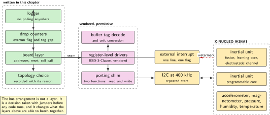
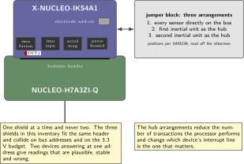
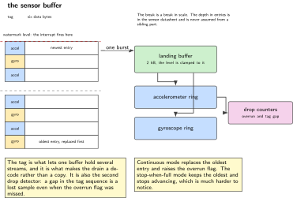
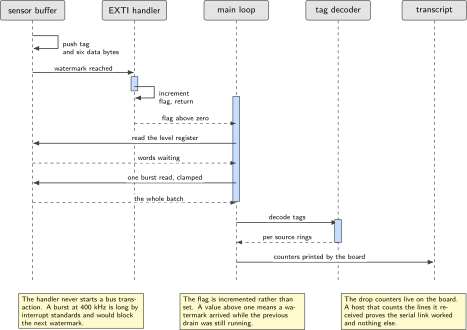
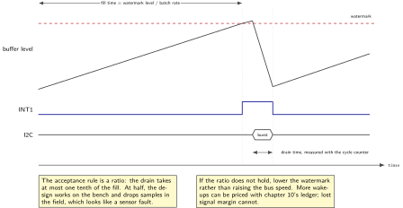

# Chapter 13. The IKS4A1: FIFO, watermark, interrupt

> **Target board:** NUCLEO-H7A3ZI-Q with the X-NUCLEO-IKS4A1  
> **Theme:** Sensor FIFO, watermark interrupt, the three bus topologies

> **Key facts**
>
> - **Board:** NUCLEO-H7A3ZI-Q with the X-NUCLEO-IKS4A1 fitted, and no other shield
> - **Peripherals:** I2C in fast mode, one external interrupt line for the watermark, a timer for the log timebase, USART3 for the transcript
> - **Toolchain:** arm-none-eabi-gcc with CMake, with the register-level driver collection vendored under its permissive licence
> - **Operating system:** Bare metal. The kernel version of the same exercise is chapter 20
> - **Difficulty:** 4 of 5
> - **Effort:** 4 evenings of about four hours
> - **Deliverable:** A logger that never polls a sensor, driven entirely by the sensor's own FIFO watermark interrupt, proven by a ten-minute run at a stated rate with zero dropped samples counted on the board

## Why this project

Reading a sensor in a loop is the default and it is the wrong default for anything that wants to sleep. At a hundred samples a second, polling means the processor wakes a hundred times a second, and almost all of that work is bus transactions that return nothing new. Every sensor on this shield has a first-in first-out buffer and at least one interrupt line, and using them changes the question from "how often does the processor wake" to "how deep is the buffer", which is a question with a much better answer. The chapter's deliverable is a logger with no polling anywhere in it: the sensor fills its own buffer, tells the processor when the buffer reaches a level the firmware chose, and the processor drains it in one burst and goes back to sleep.

The second reason this chapter exists is that the shield is unusually rich and the richness is in the wiring rather than in the sensors. It carries two inertial units, each with a programmable engine of a different kind, an accelerometer, a magnetometer, a pressure sensor, a humidity and temperature sensor, a second temperature sensor, and a detachable electrode add-on for the electrostatic sensing channel. What makes it interesting is that those parts can be arranged on the bus in three different ways, and the arrangement is set by jumpers before any code runs. Choosing the arrangement is a design decision with real consequences for the interrupt routing and for what the firmware can batch together, and it is the part of this exercise that no driver library does for you.

The prior art is exactly the right amount of incomplete. The register-level driver collection covers every sensor on this shield, is permissively licensed, and sits behind a porting shim of two functions. It gives no board layer, no orchestration of the bus arrangements and no build system. That is the correct division: the register maps and the buffer tag decoding are tedious and already done, and the design decisions are left where they belong.

> [!NOTE]
> **One shield at a time and never two**
>
> The three shields in this inventory fit the same header and collide on bus addresses and on the 3.3 V budget. Only one is fitted at a time. This is a standing rule in the sibling lab set and it is repeated here because the failure it prevents is subtle: two devices answering at one address produce readings that are plausible, stable and wrong.

## Prior art and what to reuse

| Source | What it gives | What it does not | Licence |
| --- | --- | --- | --- |
| The register-level driver collection | Every sensor on this shield behind a porting shim of two functions: register maps, the buffer tag decoding, the unit conversions | No board layer, no orchestration of the bus arrangements, no interrupt routing and no build system | BSD-3-Clause |
| The vendor's expansion package | Complete worked examples for this exact shield, and a sensor-fusion middleware | The fusion middleware ships as pre-compiled objects under a restrictive licence and must not be vendored. The examples are tied to the vendor's development environment | Mixed, flagged |
| The upstream shield description in the other operating system's tree | The three bus arrangements set out more clearly than in the vendor's own manual, with the jumper positions named for each | It is a device tree overlay rather than C, so the information transfers and the code does not | Apache-2.0 |
| The shield user manual UM3239 | The normative reference: the sensor complement, the bus addresses and the jumper map | It is a manual. The arrangement it describes least clearly is the one the overlay above describes best | Vendor document |
| Chapters 3 and 10 of this volume | The interrupt discipline that keeps work out of the handler, and the energy ledger that prices batching against polling | Nothing sensor specific | This volume |

*Table 13.1. Prior art for chapter 13. The permissive driver collection is vendored with its copyright headers intact; the fusion middleware is read about and never copied, because pre-compiled objects under a licence tied to one vendor's silicon do not belong in a portfolio repository.*

What is left to write is the board layer, and that is more than it sounds. It means choosing the bus arrangement and recording why, writing the porting shim onto this part's I2C peripheral, configuring the buffer depth and watermark for a stated sample rate, routing the sensor's interrupt to a free pin on this board, draining the buffer in one burst without holding the bus longer than the next watermark allows, decoding the tags, and counting drops on the board rather than inferring them on the host.

## Parts from the inventory

| Part | Role | Interface |
| --- | --- | --- |
| NUCLEO-H7A3ZI-Q | Runs the logger | Micro USB for flashing and the transcript |
| X-NUCLEO-IKS4A1 | The shield. Two inertial units with programmable engines, an accelerometer, a magnetometer, a pressure sensor, a humidity and temperature sensor, a second temperature sensor | Arduino header, I2C, plus interrupt lines |
| The shield's electrode add-on | Detachable, for the electrostatic sensing channel. Not used in the acceptance run, and named so the reader knows it is there | Connector on the shield |
| One jumper wire | The sensor interrupt line to a free header pin, if the shield's own routing does not reach a usable one | Female both ends |
| nRF-PPK2 | Optional, to price batching against polling with chapter 10's ledger | Leads to the board |
| Host PC | Receives the transcript and checks it | USB |

*Table 13.2. Inventory items used in chapter 13. Nothing is bought and nothing is soldered. The other two shields stay in the drawer for the whole chapter.*

## System architecture



*Figure 13.1. Four layers and one seam. Everything below the shim is vendored and permissively licensed; everything above it is this chapter. The bus arrangement is not a layer, it is a decision that changes what the layers above can do.*

The seam is two functions, read and write, and it is worth noticing how much that buys. Every sensor on the shield, and every sensor in the collection that is not on this shield, is reachable through the same two functions, so the board layer is written once and the sensor set becomes a configuration question rather than a porting question. The cost is that the shim has to be correct about repeated starts and about register auto-increment, which are the two places where a bus implementation that works for a single-byte read quietly fails for a burst.

## Peripheral configuration

| Peripheral | Mode | Clock source | Pins and function | Interrupt and transfers |
| --- | --- | --- | --- | --- |
| I2C | Fast mode, 400 kHz, repeated start | Peripheral bus | Arduino D14 and D15 by the usual convention for this board family, checked in the board manual before use | Polled for setup; DMA for the burst drain |
| External interrupt | Rising edge, one line | Peripheral bus | The sensor's first interrupt line, on whichever free header pin the shield routes it to | The handler sets a flag and returns |
| Timer | Up counter, 1 kHz | Peripheral bus | None | Timebase for the transcript |
| USART3 | Asynchronous, 115200 | Peripheral bus | Confirm in the board manual | Interrupt driven, chapter 3 |
| DWT cycle counter | Free running | Core clock | None | Measures the drain, if it works with no debugger attached |

*Table 13.3. Peripheral configuration for chapter 13. Two entries are deliberately not written as facts: which pins the bus reaches and which header pin the interrupt line arrives on are checked against the board manual and UM3239 respectively.*

The bus addresses are not reprinted in this chapter. They are in UM3239 and in the sibling lab set, which is authoritative for them, and reproducing a table of hexadecimal addresses from memory is the single easiest way to cost somebody an evening. Read them from the manual, put them in one header, and have the identification step below prove that every one of them is right before anything else runs.

## Wiring



*Figure 13.2. The shield fits the header and the only decision is the jumper block. Three arrangements are possible and the figure names what each one does to the bus and to the interrupt routing.*

The three arrangements are the reason this chapter has a wiring figure at all. In the first, every sensor sits directly on the bus and the processor addresses each one. In the second and the third, one of the two inertial units acts as the hub and reads the others itself, presenting their data inside its own buffer, and which of the two units takes that role is the difference between the second arrangement and the third. The hub arrangements reduce the number of transactions the processor performs and increase the amount of configuration the firmware has to get right, and they change which device's interrupt line matters.

## Memory and timing budget



*Figure 13.3. The sensor's buffer, which is the silicon this chapter is really about. Each entry carries a tag that says which source it came from, which is what makes one buffer able to hold several data streams and what makes the drain a decode rather than a copy.*

| Quantity | Budget | Measured | Margin |
| --- | --- | --- | --- |
| Sample rate, inertial | 104 Hz | not measured | not measured |
| Watermark level | half the buffer depth | not measured | not measured |
| Time to fill to watermark | from the rate and the level | not measured | not measured |
| Time to drain one burst | below one tenth of the fill time | not measured | not measured |
| Landing buffer in RAM | 2 kB | not measured | not measured |
| Time in the interrupt handler | below 3 µs | not measured | not measured |
| Dropped samples in ten minutes | zero | not measured | not measured |
| Bus occupancy | below 20 percent | not measured | not measured |

*Table 13.4. The budget for chapter 13. The buffer depth is deliberately absent: it is in the sensor datasheet and it is not assumed from a sibling part, because the family shares register names across parts with different depths. Nothing enters the measured column until the bench produces it.*

The one ratio that decides whether this design works is the drain time against the fill time. If a burst takes a tenth of the time the buffer needs to refill to the watermark, there is an order of magnitude of margin for an interrupt that is late, for a bus that is shared and for a drain that is occasionally preempted. If it takes half, the design works on the bench and produces intermittent drops in the field, which is the worst of the available outcomes because it looks like a sensor fault.

## Firmware design (UML)



*Figure 13.4. One watermark event, end to end. The handler sets a flag and returns; everything that takes time happens in the main loop, where it can be interrupted by the next watermark without losing anything.*

The discipline here is the one chapter 3 establishes and it matters more with a bus in the picture. The interrupt handler must not start a bus transaction. A burst read at 400 kHz takes a long time by interrupt standards, and a handler that performs one blocks everything at that priority for the duration, including the next watermark. Setting a flag and returning costs a few cycles and moves the work to a place where it can be measured, bounded and preempted.

The drop counter is the second design decision worth defending. The sensor reports its own overrun condition, and the firmware also checks the tag sequence as it decodes, so a gap is detected two ways. Both counters live on the board and are printed by the board, because a host that counts the lines it received can only prove that the link worked.

## Data flow (ASCII)

```text
  sensor                              MCU                                     host
  +---------------------------+       +---------------------------------+     +-------------+
  | sample at the batch rate  |       |                                 |     |             |
  |   |                       |       | EXTI handler: set flag, return  |     | transcript  |
  |   v                       | INT   |   |                             |     |  reader     |
  | FIFO: tag + 6 data bytes  |------>|   v                             |     |             |
  |   |   |   |   |           |       | main loop: one burst read       |     |  checks the |
  |   v   v   v   v           | I2C   |   |                             |UART |  board's own|
  | watermark reached --------|<----->|   v                             |---->|  counters   |
  |                           | burst | decode tags -> per source rings |     |             |
  | overrun flag if not drained       |   |                             |     +-------------+
  +---------------------------+       |   v                             |
                                      | drop counter: overrun + tag gap |
                                      +---------------------------------+
```

## Repository layout

```text
nucleo-h7a3-iks4a1-fifo/
  CMakeLists.txt
  third_party/stmems/            # vendored, BSD-3-Clause, headers kept intact
  src/bus_shim.c                 # the two functions the drivers need
  src/shield_iks4a1.c            # the board layer: addresses, topology, reset
  src/topology.h                 # which arrangement, and why, in a comment
  src/fifo_drain.c               # burst read, tag decode, per source rings
  src/dropcount.c                # overrun flag plus tag sequence check
  src/exti.c                     # one line, one flag
  src/main.c
  tools/check_transcript.py      # host side: it checks, it does not count
  docs/topology.md               # the three arrangements and the jumper map
  docs/addresses.h.txt           # copied from UM3239 by hand and checked twice
  README.md
```

## Steps

**Step 1.** **Choose the bus arrangement before writing code and write down why.** There are three and they are not interchangeable. Everything on one bus is the simplest to debug and the most transactions. Either inertial unit as the hub reduces transactions and moves configuration into the hub device. The jumper map is in UM3239 and the arrangements are set out more clearly in the upstream shield description in the other operating system's tree, which is worth reading first even though it is not C.

```text
docs/topology.md
  chosen: all sensors directly on the bus
  why:    the acceptance run needs one interrupt source and the simplest
          possible failure mode; the hub arrangements are chapter 16's
          question, where the transaction count is the thing being measured
  jumpers: per UM3239, recorded here after being read off the silkscreen
```

**Step 2.** **Vendor the driver collection and write the shim.** Two functions, and they are the only place this chapter touches the bus peripheral directly.

```c
/* The porting shim. Every driver in the collection reaches the bus through
 * exactly these two, which is why the board layer is written once.        */
int32_t bus_write(void *handle, uint8_t reg, const uint8_t *data, uint16_t len)
{
    const uint8_t addr = *(const uint8_t *) handle;
    return i2c_mem_write(addr, reg, data, len) ? 0 : -1;
}

int32_t bus_read(void *handle, uint8_t reg, uint8_t *data, uint16_t len)
{
    const uint8_t addr = *(const uint8_t *) handle;
    return i2c_mem_read(addr, reg, data, len) ? 0 : -1;   /* repeated start */
}
```

The read must use a repeated start rather than a stop between the register address and the data phase, and the sensors must be left with register auto-increment enabled, or a burst read returns the same register many times. Both failures produce data that looks like a stuck sensor rather than like a bus fault.

**Step 3.** **Prove every address before anything else.** Each device has an identification register with a fixed value. Read all of them at startup and stop with a named error if any disagrees, which turns the most common shield fault into one line of output instead of an afternoon.

```c
static const struct { const char *name; uint8_t addr; uint8_t id; } ROLL[] = {
    /* addresses and identity values are transcribed from UM3239 and the
     * sensor datasheets; nothing here is remembered rather than read      */
    { "imu.fusion",   ADDR_IMU_FUSION,   ID_IMU_FUSION   },
    { "imu.ispu",     ADDR_IMU_ISPU,     ID_IMU_ISPU     },
    { "accel",        ADDR_ACCEL,        ID_ACCEL        },
    { "magnetometer", ADDR_MAG,          ID_MAG          },
    { "pressure",     ADDR_PRESS,        ID_PRESS        },
    { "temperature",  ADDR_TEMP,         ID_TEMP         },
};
```

The humidity and temperature part on this shield does not follow the same identification convention as the others, so it is checked with its own command rather than being forced into this table.

**Step 4.** **Configure the buffer and the watermark, in that order.** Set the batching rate for each source that should appear in the buffer, then the buffer mode, then the watermark level. A watermark set before the batching rate is applied against a buffer nothing is being written into.

```c
/* Continuous mode: when full, the oldest entry is replaced and the overrun
 * flag is raised. The alternative stops writing, which hides the overrun
 * and produces a buffer that silently stops advancing.                    */
imu_fifo_set_batch_rate(&ctx, BATCH_104_HZ_ACCEL | BATCH_104_HZ_GYRO);
imu_fifo_set_mode(&ctx, FIFO_MODE_CONTINUOUS);
imu_fifo_set_watermark(&ctx, WATERMARK_WORDS);     /* half the depth        */
imu_int1_route(&ctx, INT1_FIFO_THRESHOLD);
```

Choosing continuous mode rather than the stop-when-full mode is a deliberate trade: continuous mode loses the oldest samples and tells you it did, and the other mode keeps the oldest samples and stops, which is harder to notice.

**Step 5.** **Route the interrupt and keep the handler empty.** One line, one edge, one flag.

```c
volatile uint32_t fifo_ready;        /* the only thing the handler writes   */

void EXTI_IMU_IRQHandler(void)
{
    EXTI_CLEAR_PENDING(IMU_INT_LINE);
    fifo_ready++;                    /* counted, not set, so a missed drain */
}                                    /* is visible rather than absorbed     */
```

Incrementing rather than setting is a small thing that pays for itself. If the counter is ever above one when the main loop looks at it, a watermark arrived while the previous drain was still running, which is exactly the condition the fill-to-drain ratio is supposed to prevent.

**Step 6.** **Drain in one burst and decode the tags.** The buffer's level register says how many entries are waiting. Read them all in one transaction and decode afterwards, because a transaction per entry converts a cheap drain into an expensive one.

```c
void fifo_drain(void)
{
    uint16_t words = imu_fifo_level(&ctx);
    if (words > LANDING_WORDS) words = LANDING_WORDS;   /* bounded, always  */
    bus_read(&ctx, FIFO_DATA_OUT, landing, words * WORD_BYTES);

    for (uint16_t i = 0; i < words; i++) {
        const uint8_t *w = &landing[i * WORD_BYTES];
        switch (w[0] >> TAG_SHIFT) {                     /* the source tag  */
        case TAG_ACCEL: ring_push(&acc_ring, w + 1); break;
        case TAG_GYRO:  ring_push(&gyr_ring, w + 1); break;
        default:        unknown_tag++;                  break;
        }
    }
}
```

The landing buffer is bounded and the level is clamped to it. An unbounded read driven by a register value is a buffer overflow waiting for a bus fault to trigger it.

**Step 7.** **Count drops on the board, two ways.** The sensor's overrun flag is the first. The tag sequence is the second: each source in the buffer advances in a known order, so a gap in the sequence is a drop even when the overrun flag was missed.

```c
void dropcount_update(const uint8_t *word)
{
    static uint8_t expect_cnt;
    uint8_t cnt = (word[0] >> CNT_SHIFT) & CNT_MASK;
    if (cnt != expect_cnt) drops += (uint8_t)(cnt - expect_cnt);
    expect_cnt = (uint8_t)(cnt + 1u);
}
```

Both counters are printed by the board. A host that counts the lines it received proves the serial link worked and nothing else, which is the failure this whole step exists to avoid.

**Step 8.** **Size the watermark from the ratio and not from a guess.** Fill time is the watermark level divided by the batching rate. Drain time is the transaction length at 400 kHz plus the decode. Measure the drain with the cycle counter, compute the fill from numbers you set, and require an order of magnitude between them.

```bash
# printed by the board at startup, from its own configuration:
# rate 104 Hz  watermark 128 words  fill 1230 ms  drain 000 us (cycle counter)
```

If the ratio is not there, lower the watermark rather than raising the bus speed. A lower watermark costs more wake-ups and is easy to price with chapter 10's ledger; a faster bus costs signal margin and is not.

**Step 9.** **Run it for ten minutes and let the board report.** The acceptance criterion is zero drops over a ten-minute run at a stated rate, counted on the board by both mechanisms.

```bash
python tools/check_transcript.py --minutes 10 --expect-drops 0 \
    --port /dev/ttyACM0 --out runs/iks4a1_10min.json
```

The host script checks the board's own counters and the monotonicity of the timebase. It does not count samples, because then a dropped serial line would look like a dropped sample.

**Step 10.** **Price the design against polling.** Run the same logger twice, once in this form and once with the buffer disabled and the sensor polled at the sample rate, and measure both with chapter 10's per-phase ledger. This is the number that justifies the whole chapter, and it is a number this book can produce and most writing on the subject cannot.

## Build, flash and debug



*Figure 13.5. Fill against drain on one timebase. The interrupt line rises at the watermark, the burst is one transaction, and the margin in the figure is the ratio the budget table requires.*

```bash
cmake -B build-fw -G Ninja -DCMAKE_TOOLCHAIN_FILE=cmake/arm-none-eabi.cmake
cmake --build build-fw -j
cp build-fw/firmware.bin "$PROBE_DISK"/   # onto the probe disk
```

> [!NOTE]
> **When the bus answers but the data is wrong**
>
> In order of likelihood: register auto-increment is not enabled, so a burst read returns the first register repeated; the read uses a stop instead of a repeated start, so the sensor forgets which register was addressed; the shield is in a different bus arrangement from the one the firmware assumes, so a device that should be behind the hub is being addressed directly and answers nothing; two devices share an address because another shield is also fitted, which is the rule this chapter opens with; or the watermark was configured before the batching rate and applies to a buffer nothing writes into. Check the identification roll call first, because it fails cleanly for the first four.

To recover a shield that has stopped answering, reset the sensors through their software reset bit rather than power cycling the board, and confirm the reset completed by reading the identification registers again. Nothing in this chapter touches option bytes, and nothing in this book does until the question of whether a bad option-byte write can leave this board unrecoverable without external tooling has been answered.

## Verification and acceptance criteria

- A ten-minute run at a stated sample rate with zero dropped samples, counted on the board by both the overrun flag and the tag sequence check, and printed by the board rather than inferred by the host.
- No polling anywhere in the logger. Proven by a build in which the only path that reads the buffer is reached from the interrupt flag, and by a transcript whose wake count matches the watermark count.
- The interrupt flag is never above one when the main loop reads it, over the whole ten minutes, which is the direct evidence that the fill-to-drain ratio holds.
- The drain time is measured with the cycle counter and is at most one tenth of the computed fill time, with both numbers printed by the board at startup.
- The identification roll call passes for every device on the chosen bus arrangement, and a deliberately wrong address in the table produces a named error rather than silence.
- The chosen bus arrangement is recorded with its jumper positions and the reason it was chosen, and the firmware refuses to run if the devices it expects to see are not the ones that answer.
- A comparison run against a polled version of the same logger, measured with chapter 10's ledger, gives a charge per sample for each.

## Variants

| Axis | Variant | What changes | Cost | Built in full in |
| --- | --- | --- | --- | --- |
| Operating system | The other operating system | It has an in-tree description of this shield and of this board, so the three bus arrangements become a configuration choice rather than firmware. The comparison is cheap and worth making | A different build system and a kernel | Chapter 20 |
| Execution model | An RTOS task set | The drain becomes a task woken by the interrupt, which removes the flag and makes the wake latency measurable as a distribution | Kernel overhead | Chapter 20 |
| Execution model | DMA for the burst read | The drain stops occupying the core, which matters as the watermark grows | Setup per transfer, and a cache question | Chapters 4 and 19 |
| Peripheral substitution | One inertial unit as the hub | The processor addresses one device and that device reads the others, which reduces transactions and moves configuration into the sensor | More configuration to get right | Chapter 16 |
| Intelligence and reach | The classifier inside the sensor | Both inertial units carry a programmable engine, of different kinds, so the decision can be made before the data ever crosses the bus | A separate toolchain per engine | Chapter 16 |
| Synchronisation | A queue between handler and drain | With a kernel the flag becomes a notification and the rings become queues | Kernel overhead | Chapter 20 |
| Language | Host tooling in Python | The transcript checker here | None | Chapter 3 |

*Table 13.5. Variants for chapter 13. This chapter builds none of them in full, which is deliberate: it establishes the buffer and watermark discipline that chapters 16 and 20 then vary, and the book's matrix assigns each variant to the chapter where it teaches most.*

## Pitfalls

- Starting a bus transaction inside the interrupt handler. A burst at 400 kHz is long by interrupt standards and it blocks the next watermark.
- Leaving register auto-increment disabled. The burst returns one register repeated and the data looks like a stuck sensor.
- Using a stop instead of a repeated start between the register address and the data phase. It works for a single byte and fails for a burst.
- Configuring the watermark before the batching rate, so the level applies to a buffer nothing is writing into.
- Choosing the stop-when-full buffer mode without meaning to. It keeps the oldest samples and stops advancing, which is much harder to notice than losing the oldest and being told.
- Reading the buffer level register and trusting it without bounding it against the landing buffer.
- Counting samples on the host. A dropped serial line then looks like a dropped sample, and the number that matters is the one the board counts.
- Assuming the buffer depth from a sibling part. The family shares register names across parts with different depths, and this volume's standing rule about inheriting from siblings applies to sensors as well as to the processor.
- Fitting a second shield. Two devices at one address give readings that are plausible, stable and wrong.

## Best practices applied

- The vendored dependency keeps its copyright headers and its licence file, and the licence-flagged middleware is named and not copied.
- The seam between vendored code and this chapter's code is two functions, so the boundary is obvious to a reader and cheap to test.
- Every address and identity value is transcribed from the manual and checked by the firmware at startup rather than trusted.
- The design decision that cannot be seen in the code, which is the bus arrangement, is written down next to the code with its reason.
- The evidence for the acceptance criterion is produced by the board, which is the only party that can distinguish a lost sample from a lost line of text.
- The sizing rule is a ratio with an order of magnitude of margin, stated before the measurement.

## Stretch goals

- Repeat the acceptance run in each of the three bus arrangements and report transactions per second, processor wake-ups per second and charge per sample for each. Nothing published compares the three on one board.
- Add the pressure and humidity sources to the same buffer through the hub arrangement and show that the tag decode absorbs them without a second drain path.
- Attach the electrode add-on and log the electrostatic sensing channel alongside the inertial data, which is the one source on this shield that almost nothing is written about.
- Move the drain to a transfer engine and measure what that does to the time the core spends awake, which is the thread chapters 4 and 19 pick up.
- Push the sample rate until drops appear, and report the rate at which the fill-to-drain ratio stops holding. A design whose limit is known is worth more than one that has only been seen to work.

## Roadmap and next steps

Chapter 14 fits the other inertial shield and asks a different question, which is what happens when two full-scale ranges are needed at once. Chapter 16 takes the bus arrangements from here and turns them into the measurement that decides where a classifier should run, and chapter 20 rebuilds this same logger on a kernel, where the shield already has an upstream description and the three arrangements become configuration.

For the wider path, the community embedded engineering roadmap places sensor integration and bus work in the same band as the peripheral drivers of the early chapters and recommends exactly this kind of exercise over further reading, and the accompanying essay on closing the gap between reading and building makes the same case. Appendix H lists the courses. For in-sensor processing specifically, independent writing is almost non-existent, which is recorded in this volume's provenance notes as a gap rather than an oversight, and it is the reason the stretch goal above is worth doing.

## Portfolio evidence

- A public repository with the board layer, the shim, the vendored collection with its headers intact, and a topology document that states which arrangement was chosen and why.
- The ten-minute transcript with the board's own drop counters at zero, and the startup line showing the computed fill time and the measured drain time.
- A short comparison of charge per sample between the buffered logger and a polled one, measured with the instrument named.
- The identification roll call output, including one deliberately broken run showing the named error, which is the clearest evidence that the checks are real.

## Sources

Normative references:

- The shield user manual UM3239, for the sensor complement, the bus addresses and the jumper map that sets the three bus arrangements.
- The datasheet of each sensor used, for the buffer depth, the tag format, the batching rates and the identification register value. The depth is not assumed from a sibling part.
- Reference manual RM0455, for this part's I2C peripheral, its fast-mode timing registers and the external interrupt controller. Not RM0433, which documents its sibling.
- The board user manual for MB1363, for the Arduino header mapping and for which pins remain free while this shield is fitted.

Reusable implementations:

- The register-level driver collection covering every sensor on this shield, BSD-3-Clause, vendored with its copyright headers intact.  
  <https://github.com/STMicroelectronics/STMems_Standard_C_drivers>
- The upstream shield description in the other operating system's tree, Apache-2.0, which sets out the three bus arrangements more clearly than the vendor's own manual.  
  <https://docs.zephyrproject.org/latest/boards/shields/x_nucleo_iks4a1/doc/index.html>
- Ready-made classifier configurations for the in-sensor engine, BSD-3-Clause, for the stretch goal and for chapter 16.  
  <https://github.com/STMicroelectronics/st-mems-machine-learning-core>
- The in-sensor programmable core examples, which declare no licence at their root and so are checked file by file before anything is reused.  
  <https://github.com/STMicroelectronics/st-mems-ispu>
- The upstream board description for this exact board in the other operating system, Apache-2.0, which makes the chapter 20 comparison cheap.  
  <https://docs.zephyrproject.org/latest/boards/st/nucleo_h7a3zi_q/doc/index.html>

---

[Previous](12-energy-as-a-regression-test.md) &nbsp;&nbsp;|&nbsp;&nbsp; [Contents](../README.md) &nbsp;&nbsp;|&nbsp;&nbsp; [Next](14-the-iks5a1.md)
