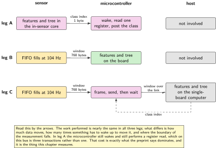
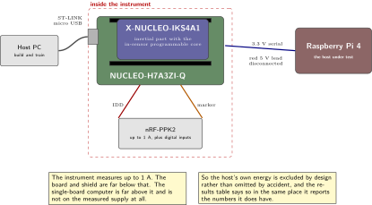
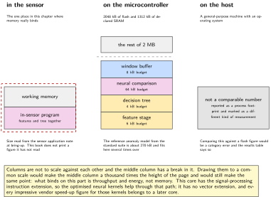
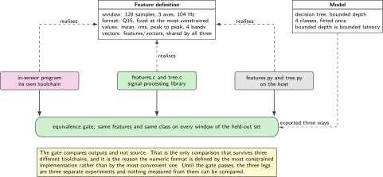
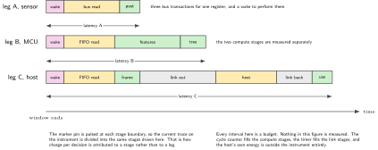

# Chapter 16. Where the classifier runs: sensor, MCU or host

> **Target board:** NUCLEO-H7A3ZI-Q with X-NUCLEO-IKS4A1 and a Raspberry Pi  
> **Theme:** In-sensor engine against on-MCU model against host, measured

> **Key facts**
>
> - **Board:** NUCLEO-H7A3ZI-Q with X-NUCLEO-IKS4A1, and a Raspberry Pi as the host. One shield only
> - **Peripherals:** I2C1 to the shield, the FIFO watermark line, USART3 as the framed link to the host, TIM2 and the cycle counter as instruments, one marker pin
> - **Toolchain:** arm-none-eabi-gcc with CMake, a permissive decision-tree generator, the signal-processing library, and the in-sensor toolchain for the third leg
> - **Operating system:** Bare metal
> - **Difficulty:** 5 of 5
> - **Effort:** 6 evenings of about four hours
> - **Deliverable:** One labelled dataset, one feature definition, one trained model, and the same classification running in three places with latency, memory and charge per decision measured for each

## Why this project

Every discussion of intelligence on small systems eventually reaches the question of where the decision should be computed, and almost every answer is an assertion. The three candidate placements are the sensor, which now contains a programmable core of its own; the microcontroller, which has 1312 kB of declared static memory and a signal-processing instruction set; and a host at the other end of a link. Each placement has an obvious argument in its favour and no published measurement that compares all three on one task, on one set of hardware, with a stated method. That gap is the reason this chapter exists.

The method is deliberately narrow so that the comparison means something. One labelled dataset, collected once. One feature definition, written once. One model, trained once. Then the same model is compiled three ways and placed in three locations, and three quantities are measured for each: latency from the end of a data window to a usable class, memory occupied, and charge consumed per decision. Anything that differs between the legs other than the placement is a confound, and the design of this chapter is mostly the work of removing confounds.

There is one recent preprint that measures two of the three placements and reaches a counter-intuitive conclusion: the host wins, because the cost is dominated by the bus read rather than by the classification. Reading a register over this bus is three transactions, not one, and if the decision is made in the sensor the microcontroller still has to wake up and perform them. That is a genuine insight and it is worth testing. It is also unreviewed, its authors are unaffiliated on the page, and its host is a far heavier machine than anything on this bench. Treat it as the hypothesis, not the answer. A host that is itself a microcontroller, with a wake-up measured in microseconds rather than in tens of milliseconds, could plausibly reverse the ranking, and naming that is part of this chapter's contribution.

> [!NOTE]
> **What this chapter has and has not produced**
>
> The result does not exist yet. What follows is the method that produces it, and every measured column in every table in this chapter stays blank until an instrument has filled it. That is the standing rule of this book and it applies with particular force here, because the whole value of the chapter is that its numbers are new. A chapter that filled them in from plausible expectation would be worth less than no chapter at all.

## Prior art and what to reuse

| Source | What it gives | What it does not | Licence |
| --- | --- | --- | --- |
| The in-sensor processor examples | Working programs for the programmable core in the shield's inertial part, including prebuilt outputs so a demonstration runs before the toolchain is installed | It declares no licence at its root, so files are checked one at a time and nothing is vendored on faith | None at root |
| The ready-made classifier configurations for the in-sensor engine | Complete worked configurations for the other in-sensor engine, and the clearest statement of what that engine can express | It replaced a predecessor that was withdrawn in 2025, so a great deal of existing writing points at addresses that no longer resolve | BSD-3-Clause |
| The in-sensor state machine collection | The same for the state-machine engine, which is the right tool when the decision is a sequence rather than a classification | Nothing about features or training | BSD-3-Clause |
| A permissive decision-tree and anomaly generator for small targets | C output for trees, forests and naive Bayes from about 2 kB of flash, which is the model this chapter compiles three ways | No feature extraction and no data collection | MIT |
| The signal-processing library | The transforms and statistics the feature stage is built from, with a Python wrapper whose API mirrors the C API so both sides run the same test vectors | No model and no training | Apache-2.0 |
| The permissive neural runtime | A clean path for the neural comparison leg, with optimised kernels that do help on this core through its signal-processing instructions | It is the comparison, not the baseline, and its speed-up figures in vendor material belong to later cores | Apache-2.0 |
| One recent preprint on placement | The hypothesis, and a measurement of two of the three placements | Review, affiliation, and a host anywhere near this size | Reading only |

*Table 16.1. Prior art for chapter 16. The repository with no licence at its root is the one most likely to end up copied by accident, because it is the one that ships ready-to-run outputs.*

What is left to write is the comparison itself, which is the part nobody has published, plus the two pieces of discipline that make it a comparison rather than three demonstrations: a feature definition that produces bit-identical values in all three implementations, and a measurement protocol that states what is inside and outside each boundary.

> [!NOTE]
> **Writing that points at addresses which no longer resolve**
>
> Both in-sensor repositories replaced predecessors that were discontinued during 2025. A large amount of tutorial material, including material that is otherwise good, still links to the old locations. When a search result for this engine looks authoritative and its links do not resolve, that is the reason, and the current repositories are named in the sources at the end of this chapter.

## Parts from the inventory

| Part | Role | Interface |
| --- | --- | --- |
| NUCLEO-H7A3ZI-Q | The middle placement, and the bus master and link driver for the other two | Micro USB to the host |
| X-NUCLEO-IKS4A1 | The sensor, including the inertial part with the programmable core that hosts the first placement. The only shield on the board | I2C1 plus the watermark line |
| Raspberry Pi 4 | The third placement, at the far end of a framed serial link | USB serial, or the header serial pins |
| Renkforce USB/TTL cable | The link between the board and the host when the header pins are used. The red 5 V lead is disconnected | 3.3 V serial |
| nRF-PPK2 | Charge per decision for the node. It measures up to 1 A and the host is outside its range and outside this measurement | IDD jumper and one digital input |
| Host PC | Data collection, training, and the build for all three legs | Windows with the Linux subsystem |

*Table 16.2. Inventory items used in chapter 16. Nothing is bought. The single-board computer is the host under test and is deliberately not the machine that trains the model, so that the training environment is not accidentally part of the comparison.*

## System architecture



*Figure 16.1. The same model in three places, and what crosses each boundary. The boundaries are where the cost is, which is the preprint's insight and the thing this chapter is built to measure.*

Read that figure by the arrows rather than by the boxes. In the first leg a class index crosses the bus. In the second a window of samples crosses the bus and nothing crosses the link. In the third a window of samples crosses the bus and then crosses the link as well. The work performed is nearly identical in all three; what differs is how much data moves and how many times something has to wake up to move it.

## Peripheral configuration

| Peripheral | Mode | Clock source | Pins and function | Interrupt and transfers |
| --- | --- | --- | --- | --- |
| I2C1 | Fast mode, 400 kHz | Peripheral bus, source selected in RCC | D14 and D15 on the Arduino header. Confirm in MB1363 | Interrupt-driven. DMA is a variant and Chapter 4 owns it |
| GPIO input | Rising edge, external interrupt | Peripheral bus | FIFO watermark line, or the in-sensor result line in the first leg | EXTI, pre-emption priority 6 |
| USART3 | Asynchronous, 115200 8N1 | Peripheral bus | The framed link to the single-board computer | Polled here, DMA in Chapter 4 |
| TIM2 | Free running, 32-bit, 1 MHz | Peripheral bus | None | The timestamp on every window |
| DWT cycle counter | Free running | Core clock | None | The instrument for the compute stages |
| GPIO output | Marker pin, one pulse per stage | Peripheral bus | One free Zio pin into a PPK2 digital input | None |

*Table 16.3. Peripheral configuration. The marker pin is the instrument that makes the three legs comparable: it separates wake, read, compute and send inside one current trace, which is the method Chapter 10 builds and this chapter applies.*

## Wiring



*Figure 16.2. The shield on the board, the instrument across the board's own supply, and the host at the end of a serial link. What the instrument can and cannot see is drawn deliberately, because the boundary of the measurement is part of the result.*

The safety points are the ones this bench always has, plus one that is specific here. Everything is 3.3 V logic. The red 5 V lead of the serial cable is disconnected, because the board and the single-board computer both have their own supplies and joining them is how a ground loop or a back-powered board happens. The instrument measures up to 1 A, which is ample for the board and shield and nowhere near enough for the single-board computer, so the host's own energy is not measured in this chapter and is named as excluded rather than quietly omitted.

## Memory and timing budget



*Figure 16.3. Footprint in the three placements, drawn to make one point: on this part memory is not the binding constraint. The reference anomaly model from the standard suite is about 270 kB and fits into this part several times over. In the sensor it does not fit at all.*

| Quantity | Budget | Measured | Margin |
| --- | --- | --- | --- |
| Feature stage, flash on the MCU | 6 kB | not measured | not measured |
| Decision tree, flash on the MCU | 4 kB | not measured | not measured |
| Neural comparison model, flash | 64 kB | not measured | not measured |
| Window buffer, SRAM | 8 kB | not measured | not measured |
| In-sensor program memory | read from the application note | not measured | not measured |
| Latency, sensor placement | 5 ms | not measured | not measured |
| Latency, MCU placement | 5 ms | not measured | not measured |
| Latency, host placement | 30 ms | not measured | not measured |
| Charge per decision, node | not budgeted | not measured | not measured |
| Charge per decision, host | outside the instrument | not measured | excluded by design |

*Table 16.4. The budget table. The last row is the honest statement of what this bench cannot do, and it is also the row that stops this chapter from claiming to have settled the preprint's question in the general case.*

> [!NOTE]
> **Memory is almost never the binding constraint on this part**
>
> This part declares 1312 kB of static memory across five regions, plus a tightly coupled instruction memory that neither of the machine-readable sources for this die states, and 2048 kB of flash. The commonly repeated figure of about 1.4 megabytes is reached only by adding that instruction memory in, which is why this book states the declared total and names the addition separately. Either way the part sits at the large end of the envelope that small-system machine learning literature assumes. Most of that literature was written for parts an order of magnitude smaller, and its central anxiety, fitting the model, does not apply here. What binds instead is throughput and energy: one core, no accelerator, and no vector extension. This core does have the signal-processing instruction extension, so the optimised neural kernels genuinely help, through that path rather than through vectors. Every impressive vendor speed-up figure for those kernels belongs to a later core than this one, and a chapter that implied otherwise would be repeating the error this whole volume is about.

## Firmware design (UML)



*Figure 16.4. One feature definition, one trained model, three implementations. The dashed arrows are claims of conformance; the gate underneath is what turns a claim into evidence, and it compares outputs rather than source.*

The design is a compiler problem more than a firmware problem. The feature definition exists once, as a specification and as a set of test vectors. Three implementations claim to satisfy it: one in the in-sensor toolchain, one in C against the signal-processing library, and one in Python on the host. The tree exists once as trained coefficients and is emitted three times. Before any measurement is taken, all three implementations are fed the same recorded window and must produce the same class, on every window in the test set. Until that holds, the three legs are three different experiments and their numbers cannot be compared.

That equivalence is easier to state than to obtain, and the usual cause of failure is numeric rather than logical. The in-sensor leg may work in a fixed point format the other two do not use. The host may compute in double precision where the microcontroller computes in single. The fix is to define the feature values in the format the most constrained implementation can produce and to require the other two to match it, rather than the other way around, which is the opposite of what is comfortable and the only version that works.

## Data flow (ASCII)

```text
  collection, once               training, once                 deployment, three ways
  +------------------------+     +------------------------+     +------------------------+
  | shield to board        |     | features in Python,    |     | A: features and tree   |
  |   raw labelled windows +---->|   mirroring the C API  |     |    in the sensor core  |
  |   stored on the host   |     | tree fitted once,      +---->| B: features and tree   |
  |                        |     | exported three ways    |     |    on the MCU          |
  |                        |     |                        |     | C: window over the     |
  +------------------------+     +------------------------+     |    link, tree on host  |
                                                                +------------------------+
                                              |
                                              v
  +--------------------------------------------------------------------------------------+
  | equivalence gate: all three produce the same features and the                        |
  |   same class on every window of the held-out set                                     |
  +--------------------------------------------------------------------------------------+
                                              |
                                              v
  +--------------------------------------------------------------------------------------+
  | measurement: DWT cycles, TIM2 timestamps, marker pin into the                        |
  |   instrument. Latency as median, p99 and maximum; flash and                          |
  |   SRAM; charge per decision. The host's own energy is outside                        |
  |   the instrument and is named as outside the comparison.                             |
  +--------------------------------------------------------------------------------------+
```

## Repository layout

```text
nucleo-h7a3-classifier-placement/
  CMakeLists.txt
  dataset/
    raw/                        # labelled windows, one file per session
    protocol.md                 # how each class was produced, in detail
  features/
    features.md                 # the definition, and the fixed-point format
    features.c  features.h      # the C implementation, CMSIS-DSP
    features.py                 # the Python implementation, same test vectors
    vectors/                    # inputs and expected outputs, shared by all
  model/
    train.py                    # fit once, export three ways
    tree_mcu.c                  # generated, permissive generator
    tree_host.py
    ispu/                       # the in-sensor program and its build
  src/leg_a_sensor.c            # read a class index, nothing else
  src/leg_b_mcu.c               # window, features, tree, on the board
  src/leg_c_host.c              # window, frame, send, wait for the class
  src/measure.c                 # DWT, TIM2, marker pin
  tools/equivalence.py          # the gate: three implementations, one answer
  tools/collect.py  tools/report.py
  docs/PROVENANCE.md            # every dependency, its licence, the date
  README.md
```

## Steps

**Step 1.** **Choose a task the bench can actually produce and write the protocol down.** Four classes of movement of the board and shield on a table: still, sliding, tapped, and lifted and rotated. Write `dataset/protocol.md` describing exactly how each class is produced, including how long each session runs and who produced it. Hand-generated data limits what can be claimed about accuracy, and the protocol is what makes the limitation visible rather than hidden. The accuracy of the classifier is not this chapter's result; the placement comparison is.

**Step 2.** **Collect the dataset once, and never collect it again.** Stream raw windows over the link with timestamps and labels, and store them on the host. Every later leg is fed from these files, including the legs that run on the board, because a leg fed from live movement is being fed different data from the others and the comparison is void.

```bash
python tools/collect.py --port /dev/ttyACM0 --label still --seconds 120
python tools/collect.py --port /dev/ttyACM0 --label sliding --seconds 120
python tools/collect.py --port /dev/ttyACM0 --label tapped --seconds 120
python tools/collect.py --port /dev/ttyACM0 --label rotated --seconds 120
```

**Step 3.** **Define the features in the most constrained format first.** Decide the window length, the overlap and the feature list, and decide the numeric format that the in-sensor implementation can produce. Then write that down as the definition and make the other two implementations match it.

```c
/* One window: 128 samples of three axes at 104 Hz, about 1.23 s.
   Features are computed in Q15 because that is what the most
   constrained of the three implementations can produce. */
#define WIN_N      128u
#define WIN_AXES     3u
typedef struct {
    q15_t mean[WIN_AXES];
    q15_t rms[WIN_AXES];
    q15_t p2p[WIN_AXES];          /* peak to peak */
    q15_t band[WIN_AXES][4];      /* energy in four bands, from the FFT */
} features_t;
```

**Step 4.** **Build the equivalence gate before building any leg.** This is the step that turns three demonstrations into one experiment, and doing it later never works because by then each implementation has its own quiet assumption.

```python
# Every implementation reads the same vectors and must agree exactly.
for name, impl in (("c", run_c_features), ("py", run_py_features),
                   ("ispu", run_ispu_features)):
    for vec in load_vectors("features/vectors"):
        assert impl(vec.input) == vec.expected, (name, vec.id)
```

**Step 5.** **Train once and export three times.** The tree is fitted on the host with the Python feature implementation, and the same fitted coefficients are emitted as C for the microcontroller, as a program for the in-sensor core, and as a Python object for the host leg. A tree with a bounded depth is chosen deliberately, because bounded depth is bounded latency, and bounded latency is half of what makes a classifier acceptable in a control loop.

**Step 6.** **Leg A, in the sensor.** Load the in-sensor program, configure the part to run it on its own data, and have the microcontroller do nothing but wait for the line and read the result. Start from the prebuilt outputs in the examples repository, which run before the toolchain is installed and prove the path works, then replace them with your own. Audit the licence of every file you keep, because the repository declares none at its root.

```c
void EXTI_result_handler(void)          /* leg A: the whole of the work */
{
    marker_pulse(MARKER_WAKE);
    const uint32_t t = timebase_ticks();
    uint8_t klass;
    i2c1_read_reg(IMU_ADDR, ISPU_RESULT_REG, &klass, 1);  /* three transactions */
    decision_post(t, klass);
    marker_pulse(MARKER_DONE);
}
```

Note what the comment records. A one-byte register read is an address write, a repeated start and a data read. That is the cost the preprint says dominates, and here it is, in the leg that was supposed to avoid work.

**Step 7.** **Leg B, on the microcontroller.** Drain the FIFO on the watermark line into a window, compute the features with the signal-processing library, and evaluate the generated tree. Measure the two compute stages separately, because the feature stage and the model are different sizes of problem and a single number hides which one matters.

```c
const uint32_t c0 = DWT->CYCCNT;
features_t f;  features_compute(&win, &f);
const uint32_t c1 = DWT->CYCCNT;
const uint8_t k = tree_predict((const q15_t *) &f);
const uint32_t c2 = DWT->CYCCNT;
printf("feat %lu cyc, tree %lu cyc\r\n",
       (unsigned long)(c1 - c0), (unsigned long)(c2 - c1));
```

**Step 8.** **Leg C, on the host.** Send the window over the framed link from Chapter 5 and wait for the class to come back. Measure the round trip from the board's side, which is the only side that matters for the node's latency, and record the host's own processing time separately so that the two are not confused.

```python
# On the single-board computer. Same features, same tree, different machine.
win = codec.decode(frame)
f = features.compute(win)          # the Python implementation, gated above
k = tree.predict(f)
port.write(codec.encode_class(k))
```

**Step 9.** **Add the neural comparison, and hold it to the same gate.** Train a small network on the same features, run it on the microcontroller under the permissive runtime with the optimised kernels enabled, and compare it against the tree on three axes: accuracy, kilobytes, and the spread of its latency. The thesis worth testing is that the transform plus the statistical model wins on accuracy per kilobyte, is deterministic in latency, and can be explained to a customer. One peer-reviewed paper argues exactly that, and this is the chapter that can check it on this part.

**Step 10.** **Measure all three legs with one protocol and publish the protocol.** For each leg: one hundred decisions, the marker pin pulsed at wake and at done, the current trace captured, and the cycle counts recorded. Report median, ninety-ninth percentile and maximum rather than a mean, because the maximum is what a control loop has to tolerate. State which boundaries are inside each measurement, and state that the host's own energy is outside all of them.

```bash
python tools/report.py --leg a --n 100 --out results/leg_a.json
python tools/report.py --leg b --n 100 --out results/leg_b.json
python tools/report.py --leg c --n 100 --out results/leg_c.json
python tools/report.py --compare results/ --out results/README.md
```

## Build, flash and debug



*Figure 16.5. One decision in each of the three placements, on one time axis. The shaded stages are what the marker pin separates inside the current trace. Every interval is a budget until an instrument has replaced it.*

```bash
cmake -B build -DCMAKE_TOOLCHAIN_FILE=cmake/arm-none-eabi.cmake -DLEG=B
cmake --build build -j
probe-rs run --chip STM32H7A3ZITx build/placement.elf
python tools/equivalence.py        # must pass before any result is recorded
```

Recovering a board that will not answer is Chapter 1's material. The failure specific to this chapter is subtler and does not present as a failure at all: three legs that produce slightly different classes and a comparison that is quietly meaningless. The equivalence gate is the only defence, and it belongs in the build rather than in a habit.

> [!NOTE]
> **When the three legs disagree**
>
> In order of likelihood: the window boundaries differ, because one leg starts its window at a FIFO watermark and another at a sample count; the numeric format differs, and a rounding rule that is invisible in one implementation changes a feature at the last bit; the sample rate is not what was configured, because the sensor's actual rate and its nominal rate differ by a few tenths of a percent; one implementation normalises and another does not; and the tree was exported from a different fit than the one deployed. Check them by feeding a recorded window through all three and comparing the features before the class, which localises the disagreement to a stage instead of to a leg.

## Verification and acceptance criteria

- The equivalence gate passes: all three implementations produce identical features and identical classes on every window of the held-out set. The build fails if it does not.
- Every number in the results directory names the instrument that produced it, and every number that has not been produced is absent rather than estimated.
- Latency is reported as median, ninety-ninth percentile and maximum over at least one hundred decisions per leg, never as a mean.
- Memory is reported from the size output for the microcontroller legs and from the in-sensor toolchain's own output for the sensor leg, with the two clearly not being the same kind of number.
- Charge per decision for the node is reported for all three legs, and the exclusion of the host's own energy is stated in the same table rather than in a footnote elsewhere.
- The neural comparison is reported on accuracy, kilobytes and latency spread, and the conclusion is stated even if it contradicts the thesis this chapter set out to test.
- The dataset protocol is published with the dataset, so that a reader can see exactly how limited the hand-generated data is.

## Variants

| Axis | Variant | What changes | Cost | Built in full in |
| --- | --- | --- | --- | --- |
| Intelligence and reach | Classifier in the sensor | The decision is made on the sensor's own core and the microcontroller reads a class index. The bus read it still has to perform is the thing under test | A toolchain, and a repository with no licence at its root | Here |
| Intelligence and reach | Model on the MCU | Raw windows cross the bus, the features and the tree run on the board, and nothing crosses the link | Core time and flash, neither of which is scarce here | Here |
| Intelligence and reach | Model on the host | The window crosses the link and the class comes back. The node becomes a sensor and a modem | Link energy, and a host that must be awake | Here. The framed link itself is Chapter 9 |
| Intelligence and reach | Local only | No host at all, which is the baseline the first two legs already are | Nothing | Chapters 8 and 13 |
| Execution model | DMA into the window | The FIFO drain stops occupying the core, which matters most in the leg that has the most work to do | Cache maintenance on the window buffer | Chapter 4 and Chapter 19 |
| Operating system | An RTOS task set | The three stages become tasks with stated priorities and a measured latency distribution, which is a better home for the ninety-ninth percentile question | A scheduler to justify | Chapter 20 |
| Language | Host in Python | The host leg as written. A compiled host would change the host's numbers and not the node's | Host-side latency | Chapter 3 |

*Table 16.5. Variants for chapter 16. The three placements are this chapter's own, which is why the whole comparison lives here rather than being spread over three chapters where nothing could be compared.*

## Pitfalls

- Comparing three legs that were fed different data. A leg driven by live movement is not comparable with a leg driven by a recording, however carefully the movement is repeated.
- Letting the numeric formats differ. The equivalence has to be defined in the format the most constrained implementation can produce, which is not the format that is most convenient to train in.
- Reporting a mean latency. The interesting quantity is the tail, and the mean hides exactly the behaviour that decides whether a classifier can sit inside a control loop.
- Assuming the in-sensor leg does no work on the microcontroller. It still wakes, still performs a multi-transaction bus read, and that cost is the preprint's whole argument.
- Vendoring from a repository that declares no licence at its root because its prebuilt outputs made the demonstration easy. Read it, run it, and check each file before keeping any of it.
- Quoting a vendor speed-up figure for the optimised neural kernels. Those figures belong to later cores with a vector extension this part does not have.
- Treating the popular training service as a supported path. It treats this part as a porting target rather than a supported board: no ready-made firmware, no data forwarder, and an exported kit that declares no single machine-readable licence, with one optimising component proprietary and another sold only at the top tier. The permissive runtime is the clean path and this chapter uses it.
- Presenting the host's energy as unmeasured when it is in fact unmeasurable on this bench. Those are different statements and the second one has to be said out loud.
- Claiming the comparison settles the question in general. It settles it for this task, this data, this model and these three machines, which is already more than anyone has published.

## Best practices applied

- The experiment is designed to remove confounds before it is designed to produce numbers, and the equivalence gate is in the build rather than in the author's discipline.
- Every dependency's licence is stated before code is written around it, and the one dependency with no licence at its root is named as such in the same sentence that recommends reading it.
- The boundary of the measurement is published with the measurement. What the instrument cannot see is part of the result.
- The claim is scoped to what was measured, and the configuration that could overturn it, a microcontroller host with a short wake-up, is named rather than left for a reader to discover.
- Tail statistics rather than means, which is the reporting method the serious real-time measurement literature uses and almost no vendor material does.

## Stretch goals

- Add a fourth leg with a microcontroller as the host, using one of the radio coprocessor boards on this bench over a serial link. Its wake-up is orders of magnitude shorter than the single-board computer's, and it is the configuration most likely to reverse the preprint's ranking. That result would be new and it is within reach of this bench.
- Run the standard small-system machine learning benchmark suite on this part. No published result exists for this core: the suite's reference baseline is a smaller core, the recent vendor submissions are a different core and an accelerated preview part, and the vendor's own harness for running it has been dormant since 2024.
- Repeat the comparison with the state-machine engine rather than the classifier engine for the in-sensor leg, which suits a decision that is a sequence rather than a snapshot and would show whether the placement ranking depends on the kind of decision.
- Replace the hand-generated dataset with a mechanically repeatable one, which is the single change that would turn the accuracy numbers from illustrative into citable.

## Roadmap and next steps

Chapter 17 changes the subject from where code runs to how much a layer of abstraction costs, and it uses the same instruments: the cycle counter, the size output and the marker pin. Chapter 18 builds the transform stage this chapter depends on, with a numerical acceptance test, and Chapter 20 gives the three stages somewhere sensible to live when they have to share a processor with anything else.

For going deeper on the machine-learning side, the free open textbook that grew out of a university course and an online certificate is the closest thing to a canonical curriculum for this material, and it is the right next step after this chapter rather than before it. The free-to-audit course on embedded machine learning, taught by the author of several widely used video series, covers the same ground with exercises. The community embedded engineering roadmap is the map for everything around it, and its central claim, that projects outrank reading, is the reason this chapter is a build rather than a survey. Appendix H lists them with their licences, including the two whose terms make them something to recommend and never to quote.

## Portfolio evidence

- A public repository containing a labelled dataset, its collection protocol, one feature definition with shared test vectors, and three implementations that provably agree.
- A results directory with latency, memory and charge for three placements, each number naming its instrument, and a stated boundary for what the instrument could not see.
- A short written result that says which placement won on this task and by how much, what the preprint predicted, and where the two agree and disagree. That is a new result and it should be presented as one.
- The equivalence gate running in the build, which is the piece of engineering judgement in this chapter that a reviewer will recognise fastest.

## Sources

Normative references:

- UM3239, the user manual for the X-NUCLEO-IKS4A1, for the sensor complement, the addresses and the three bus topologies.
- The datasheet and the application note for the inertial part that carries the programmable core, for the core's program memory size, its instruction set and how a program is loaded.
- Reference manual RM0455 for I2C1, USART3, the cycle counter and the timer on this part. Not RM0433, which documents its better-known sibling.
- The board user manual for MB1363, for the Arduino header mapping and the free Zio pins that carry the marker signals.

Reusable implementations:

- The in-sensor processor examples, which ship prebuilt outputs so a demonstration runs before the toolchain is installed. No licence is declared at the repository root, so every file is checked individually.  
  <https://github.com/STMicroelectronics/st-mems-ispu>
- Ready-made configurations for the in-sensor classifier engine, BSD-3-Clause. This repository replaced one that was discontinued in 2025.  
  <https://github.com/STMicroelectronics/st-mems-machine-learning-core>
- The in-sensor state machine collection, BSD-3-Clause, with the same history of replacing a discontinued predecessor.  
  <https://github.com/STMicroelectronics/st-mems-finite-state-machine>
- The permissive generator for trees, forests, naive Bayes and anomaly detection on small targets, MIT, from about 2 kB of flash.  
  <https://github.com/emlearn/emlearn>
- The signal-processing library, Apache-2.0, whose Python wrapper mirrors the C API so that both sides run the same test vectors.  
  <https://github.com/ARM-software/CMSIS-DSP>
- The optimised neural kernels, Apache-2.0, which help on this core through its signal-processing instructions rather than through a vector extension it does not have.  
  <https://github.com/ARM-software/CMSIS-NN>
- The permissive neural runtime, Apache-2.0, which is the clean path for the comparison leg.  
  <https://github.com/tensorflow/tflite-micro>
- The peer-reviewed argument that classical models plus good features outperform neural networks per kilobyte on small targets.  
  <https://arxiv.org/pdf/2107.09448>
- The unreviewed preprint that measures two of the three placements and reaches the counter-intuitive result this chapter treats as its hypothesis.  
  <https://arxiv.org/abs/2606.00524>
- The free open textbook that is the closest thing to a canonical curriculum for this material.  
  <https://mlsysbook.ai/>

---

[Previous](15-eight-by-eight-time-of-flight.md) &nbsp;&nbsp;|&nbsp;&nbsp; [Contents](../README.md) &nbsp;&nbsp;|&nbsp;&nbsp; [Next](17-the-same-driver-twice.md)
