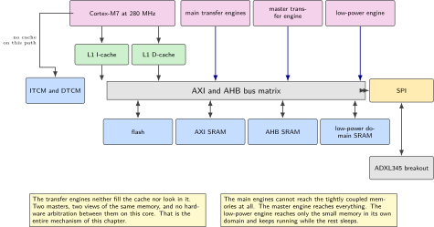
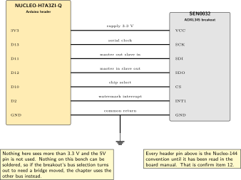
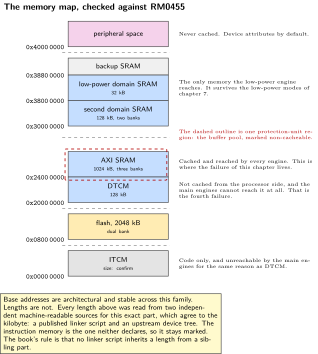
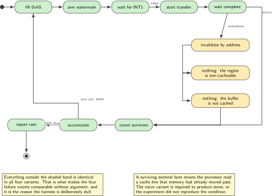
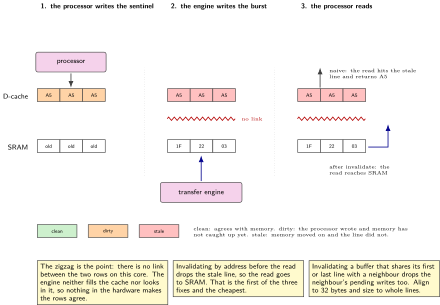

# Chapter 19. Caches, the MPU, and why DMA reads stale bytes

> **Target board:** NUCLEO-H7A3ZI-Q + DFRobot SEN0032 (ADXL345)  
> **Theme:** D-cache maintenance, MPU regions, which engine reaches which memory

> **Key facts**
>
> - **Board:** NUCLEO-H7A3ZI-Q with the ADXL345 breakout on the Arduino header, wired with jumpers
> - **Peripherals:** SPI with transfers in both directions, the main transfer engine, the L1 data cache, the memory protection unit, GPIO for chip select and the sensor's interrupt line
> - **Toolchain:** arm-none-eabi-gcc with CMake, a debug probe that can halt and dump memory, and a host script that counts failures
> - **Operating system:** Bare metal
> - **Difficulty:** 5 of 5
> - **Effort:** 4 evenings of about four hours
> - **Deliverable:** A repository that reproduces silent data corruption on purpose at a measured rate, removes it three separate ways, and ships a small declarative region table with cache attributes, which nothing permissive and maintained currently provides

## Why this project

This is the trap that costs this family of parts more engineering time than anything else, and it is the one a reader is most likely to meet in a hurry, at the end of a week, in somebody else's code. A transfer engine writes a buffer, the processor reads it, and the values are wrong. Not obviously wrong: plausibly wrong, sometimes, on some builds, and never under the debugger. The cause is that the processor has a data cache and the transfer engine does not go through it, so the two have different opinions about what is in memory. The fix is well known and the failure is still shipped regularly, including in the silicon vendor's own example projects, where it has been an open report for a long time, and in at least two widely used open projects.

So the chapter does not begin with the fix. It begins by producing the failure deliberately and measuring how often it happens, because a fault that cannot be reproduced cannot be proved fixed. The harness fills the receive buffer with a sentinel byte, starts the transfer, waits for the completion flag, and then counts how many of the sentinel bytes survived into what the processor reads. A surviving sentinel means the processor read a cache line that memory has since moved on from. Run that a thousand times and the result is a rate, not an anecdote.

Then it is removed three ways, and the three are different engineering decisions rather than three spellings of one. Maintenance operations put the burden at every call site and are exact. A protection-unit region marked non-cacheable puts the burden in one table and costs performance on every access to that memory. Placement decides the question once in the memory map. There is also a fourth failure that is not a coherency problem at all and is the most common version of this bug in this family: a buffer placed in a memory the transfer engine cannot reach, which looks exactly like a configuration error.

> [!NOTE]
> **The domains are not the ones in the popular manual**
>
> The three-domain vocabulary that most writing about this family uses belongs to RM0433 and the STM32H743. This part is documented by RM0455 and names its domains differently. A blog post that tells you to put a buffer in "D3 SRAM" is describing a memory this part does not call by that name, and following it literally produces a linker script that either fails to link or places a buffer somewhere useful only by accident. Every region name, base address and length in this chapter is checked against RM0455 before it is written into a script.

## What is already done, and measured

Half of this chapter was taken out of sequence on Saturday 3 October 2026, because it turned out to block every cycle figure in the volume rather than being a late topic about transfer engines.

The instruction cache needs nothing from RM0455. Its enable sequence is in ARM's `cachel1_armv7.h`, which `core_cm7.h` includes only when the device header declares a cache present, and the H7A3 header declares both present on a Cortex-M7 r1p2. Every name in the sequence is ARMv7-M: invalidate `ICIALLU`, set `CCR.IC`, with a data synchronisation and an instruction barrier around each step. It is in `c/board/icache.c` and `board_icache_enable()` returns the state read back from the register rather than the fact of having written to it.

It is deliberately NOT enabled by `board_init`, which makes a measurement possible that no pair of builds could provide: the cache is off at reset, so one image can measure a function cold, enable the cache, and measure the same function again at the same address in the same build.

| Quantity | Measured | Where | Note |
| --- | --- | --- | --- |
| I-cache line length | 32 bytes | architecture | fixed for Cortex-M7 |
| Cache gain, chapter 9 encoder | 1.33 to 1.35 times | board | one address, one build |
| Placement effect, cold | 57 cycles, 1.8 per cent | board | four displacements |
| Placement effect, cached | none measurable | board | identical to 0.01 cycle |

*Table 19.1. The instruction cache half of this chapter, measured on Saturday 3 October 2026 on the chapter 9 encoder. The placement rows come from four images displaced by 0, 16, 32 and 48 bytes and otherwise identical.*

The second and third rows are the useful pair. With the cache off, cost depends on a function's offset within a 32 byte granule: 3 220.99 cycles at offset 0 and 3 163.98 at offset 16, with the two images at each offset agreeing to the hundredth of a cycle. With the cache on, all four images report 2 378.99, identical. So the cache does not merely make the code faster, it makes a cycle figure a property of the code instead of a property of where the linker put it, and that is why this had to come before chapter 2's comparison of ordering barriers rather than after it.

Two honest limits. The displacements are multiples of 16 because the linker rounds anything finer up, so a granule narrower than 16 bytes is invisible to this measurement; the cause of that rounding is unexplained, since `arm-none-eabi-gcc -Q` reports `-falign-functions` disabled at `-Os` and the obvious explanation is therefore ruled out.

The data cache is untouched and is the rest of this chapter. It is declared present and enabling it changes what a buffer shared with a bus master means, which is exactly the failure this chapter exists to produce and then fix. That half still needs a transfer engine, and the transfer engine still needs the reference manual.

## Prior art and what to reuse

| Source | What it gives | What it does not | Licence |
| --- | --- | --- | --- |
| The vendor's application notes on the L1 cache, on the memory protection unit, and on using the cache for performance | The normative account: what the cache does, how regions are described, which attribute combinations are legal, and what each maintenance operation means | They are written for the family, so the region inventory and the domain names are checked against the manual for this part before use | Vendor documentation, read do not copy |
| A community article by one of the vendor's own engineers on using the protection unit to manage coherency | Exactly the three fixes, with complete configuration code for each, which makes it the single best starting page on the subject | It is one part's configuration, not a reusable component, and there is no build system or test around it | Community post, cite and re-derive |
| The same vendor's write-up of why transfers fail on this family | The fourth failure, which the coherency literature usually omits: a buffer in tightly coupled memory that the main engines cannot reach at all | It is a troubleshooting page rather than a design method | Community post, cite and re-derive |
| Three application briefs from another silicon vendor | The same three fixes, mapped one to one, and clearer than the originals because each brief covers exactly one fix | Written for that vendor's parts, so the register names differ | Vendor documentation, read do not copy |
| A three-part written series on the Cortex-M7 cache | The best teaching treatment in print: cache basics, then the coherency problem, then the maintenance operations, all at the architecture level where it is all true | No board, no build, no measurement | Blog series, cite |
| One video walking this through on an H7 with a non-cacheable region and a custom linker section | Proof that the linker-section approach works end to end, and a sanity check on the section attributes | Not this part, and a video is not a reference | Video, cite |

*Table 19.2. Prior art for chapter 19. This is the richest pool in the book, and the reason the chapter still has work to do is at the end of the next paragraph.*

What is left to write is the part every one of those sources leaves out. None of them measures anything: they explain the failure and then assert the fix. So the harness, the failure rate and the thousand-run comparison are new. And no maintained permissively licensed library offers a declarative table of memory regions with their cache attributes, checked at build time for the alignment and size rules the protection unit imposes. That is a small, sharp, useful piece of software that does not exist, it is about two hundred lines, and it is this chapter's deliverable.

## Parts from the inventory

| Part | Role | Interface |
| --- | --- | --- |
| NUCLEO-H7A3ZI-Q | The processor, its caches, its protection unit and its transfer engines | Micro USB to the host |
| DFRobot SEN0032 (ADXL345) | Supplies a stream of real bytes at a known rate, with a 32-sample first in first out buffer that makes a burst transfer natural | SPI at up to 5 MHz, or I2C. 3.3 V only |
| Jumper wires | Six connections. Confirm that male to male wires exist in the drawer before planning the evening | Arduino header to breakout |
| A USB data cable | Power, programming and the failure count | Micro USB |
| Host PC | Runs the thousand iterations and tabulates the rate | Python over the virtual COM port |

*Table 19.3. Inventory items used in chapter 19. Nothing is bought. The sensor is chosen because it produces bursts, not because the acceleration matters; the experiment is about the bytes.*

## System architecture



*Figure 19.1. Who reaches what. The processor sees memory through two caches for everything on the far side of the bus matrix and through neither for the tightly coupled memories. The transfer engines sit on the matrix and see memory directly, which is the whole problem in one picture.*

Read the figure as a reachability question rather than a performance one. The processor's path to the tightly coupled memories does not pass the caches, which is why a buffer there is never stale and why it is also unreachable by the main transfer engines. Everything else the processor touches goes through the data cache. The transfer engines are separate masters on the matrix: they neither fill the cache nor look in it. Two masters, two views, no hardware arbitration between them on this core. Once that is stated plainly the three fixes become three places to put a decision.

## Peripheral configuration

| Peripheral | Mode | Clock source | Pins and function | Interrupt and transfers |
| --- | --- | --- | --- | --- |
| SPI on the Arduino header | Master, mode 3, 5 MHz maximum for this sensor | Peripheral bus | D11 to D13, instance confirmed in the board manual | Two transfer streams, one each way |
| GPIO chip select | Push-pull output, software controlled | Peripheral bus | D10, confirm | None |
| GPIO sensor interrupt | Input with edge detect | Peripheral bus | D2, confirm | External interrupt line |
| Main transfer engine | Peripheral to memory and memory to peripheral, single buffer | Bus clock | None | Complete and error interrupts |
| L1 data cache | On for the experiment. Off is one of the controls | Core clock | None | Write-back, write-allocate by default |
| Memory protection unit | One region per entry in the region table | Core clock | None | Memory management fault enabled |
| USART3 | Asynchronous, 115200 8N1 | Peripheral bus | Board manual pins | Carries the failure count |

*Table 19.4. Peripheral configuration. Enabling the memory management fault rather than leaving it to escalate is deliberate: a region table with a bad alignment should stop the board at the offending access with a named fault, not somewhere else later.*

> [!NOTE]
> **Three point three volts only**
>
> The breakout is wired to the 3V3 pin and to ground, never to 5V, and no signal from it reaches a processor pin at more than 3.3 V. Nothing on this bench can be soldered, so if the breakout's bus selection turns out to need a solder bridge moved, the chapter uses the other bus and says so rather than inventing a workaround.

## Wiring



*Figure 19.2. Six wires. The interrupt line is not optional here: it is what makes the burst arrive on the sensor's schedule rather than the processor's, which is what gives the failure its intermittent character.*

| Breakout pin | Board pin | Function | Note |
| --- | --- | --- | --- |
| VCC | 3V3 | Supply | Never 5V |
| GND | GND | Return | Common return, one wire |
| SCL or SCK | D13 | Serial clock | Instance confirmed in the board manual |
| SDA or SDI | D11 | Master out, slave in | Mode 3 for this sensor |
| SDO | D12 | Master in, slave out | Leave unconnected only in three-wire mode |
| CS | D10 | Chip select | Software controlled, not the peripheral's own |
| INT1 | D2 | Watermark interrupt | Rising edge, confirm the polarity bit |

*Table 19.5. Wiring table. Every row whose pin mapping comes from the Nucleo-144 convention rather than from the board manual is confirmed before the first power-on, which is confirm item 12 of the authoring list.*

## Memory and timing budget



*Figure 19.3. The memory map, which is this chapter's silicon figure and the reference for the whole book. Sizes marked for confirmation are read from RM0455 and the datasheet for this part before any linker script uses them. The dashed outline is one protection-unit region.*

| Quantity | Budget | Measured | Margin |
| --- | --- | --- | --- |
| Receive buffer, 32 samples of 6 bytes | 192 B, padded to 256 B | not measured | not measured |
| Alignment required for maintenance | 32 B, both ends | not measured | not measured |
| Protection-unit regions used | 4 of the available set | not measured | not measured |
| Failure rate, naive variant, 1000 runs | no budget, this is the result | not measured | not measured |
| Failure rate, each of the three fixes | 0 in 1000 runs | not measured | not measured |
| Added cycles per transfer, maintenance | 600 | not measured | not measured |
| Added cycles per transfer, non-cacheable region | 2000 | not measured | not measured |
| Region table code size | 2 kB | not measured | not measured |

*Table 19.6. The budget table. The two cycle rows are the honest cost of the two fixes and are the reason the chapter does not simply recommend one: maintenance is cheap and easy to forget, a non-cacheable region is impossible to forget and is not cheap. The instrument for both is the core's cycle counter, as in chapter 18.*

The alignment row is the second bug, the one that arrives after the first is fixed. Maintenance acts on whole cache lines, and a line is 32 bytes on this core. Invalidating a buffer that is not aligned to 32 bytes, or whose length is not a multiple of 32, also invalidates the neighbouring bytes that share the first and last lines, and any processor writes to those neighbours that have not reached memory are lost. The symptom is corruption in an unrelated variable.

## Firmware design (UML)



*Figure 19.4. One run of the harness as a state machine. The four variants differ only in which of the three shaded states is entered, which is what makes the failure counts comparable.*

The harness is deliberately boring. Fill the buffer with the sentinel, arm the sensor's watermark interrupt, start the transfer when it fires, wait for completion, then read the buffer and count surviving sentinel bytes. The only difference between the four variants is which optional state the run passes through: none at all, an invalidate, nothing because the region is non-cacheable, or nothing because the buffer lives in a memory that is not cached. Keeping everything else identical is what lets the four failure counts be compared without argument.

## Data flow (ASCII)

```text
    processor                 L1 data cache            SRAM                 transfer engine
  +-------------+          +----------------+     +---------------+       +-----------------+
  | fill 0xA5   | -------> | line dirty A5  | --> | A5 A5 A5 A5   |       |                 |
  +-------------+          +----------------+     +---------------+       +-----------------+
                                                          ^                        |
  sensor watermark fires, the engine writes the FIFO burst |<-----------------------+
                                                          v
  +-------------+          +----------------+     +---------------+
  | read buffer | <------- | line STALE A5  |  x  | 1F 22 03 FE   |   the engine never
  +-------------+          +----------------+     +---------------+   touched the cache
        |
        +--> naive: sees A5, the run is counted as a failure
        +--> invalidate by address first: the line is dropped, the read reaches SRAM
        +--> region marked non-cacheable: there was never a line to go stale
        +--> buffer in DTCM: no cache on that path, and the main engine cannot reach it
```

## Repository layout

```text
nucleo-h7a3-cache-coherency/
  CMakeLists.txt
  cmake/arm-none-eabi.cmake
  ld/stm32h7a3zi.ld              # carries the .dma_buffers and .noncacheable sections
  include/mpu_table.h            # the declarative region table, the deliverable
  src/mpu_table.c                # one call configures every region in the table
  src/mpu_static_assert.h        # build-time checks: power of two, aligned to size
  src/adxl345.c                  # FIFO setup, watermark, burst read
  src/variant_naive.c            # no maintenance, the control
  src/variant_maintain.c         # clean before, invalidate after
  src/variant_region.c           # buffer pool inside a non-cacheable region
  src/variant_placement.c        # buffer in a memory the map already settles
  src/harness.c                  # 1000 runs, sentinel count, result line
  tools/run_matrix.py            # drives all four, tabulates, exits nonzero
  results/failure_rates.csv
  docs/region_map.md             # the table in prose, generated from the header
  README.md
```

## Steps

**Step 1.** **Bring the sensor up with no transfer engine at all.** Polled register reads first, so that a later failure is known to be about coherency and not about the bus. Confirm the device identification register reads the documented value before anything else happens.

```c
uint8_t who = adxl_read_reg(0x00);      /* DEVID */
if (who != 0xE5) {                      /* documented value for this part */
    printf("sensor not answering: 0x%02X\n", who);
    for (;;) { }
}
```

**Step 2.** **Configure the FIFO so a burst is natural.** The sensor holds 32 samples. Set the watermark, enable the interrupt on the first line, and let the sensor decide when the burst is ready. A burst on the sensor's schedule is what gives the failure its intermittent character, and an intermittent failure is the one worth reproducing.

**Step 3.** **Write the harness and make it fail.** This is the step that is usually skipped and it is the one that makes the rest defensible.

```c
#define SENTINEL 0xA5u
static uint8_t rx_buf[256] __attribute__((aligned(32),
                                          section(".dma_buffers")));

static unsigned one_run(void)
{
    memset(rx_buf, SENTINEL, sizeof rx_buf);   /* dirties the lines */
    adxl_start_burst_dma(rx_buf, 192);
    while (!dma_complete_flag) { }
    dma_complete_flag = 0;

    unsigned survivors = 0;                    /* no maintenance here */
    for (unsigned i = 0; i < 192; i++)
        if (rx_buf[i] == SENTINEL) survivors++;
    return survivors;
}
```

A run with any survivor is a failure. Report the count of failing runs out of a thousand and the distribution of survivors, because a run where all 192 bytes survived and a run where 32 survived are different stories: the first is a whole buffer of stale lines, the second is one line that was not evicted.

**Step 4.** **Do not believe a run under the debugger.** Halting the processor changes the cache. So does a breakpoint, and so does reading the buffer from the debug view, which can fill lines that would not otherwise be filled. The harness runs free and reports over the serial port. The debugger is used to look at the state after a failure, never to produce the count.

**Step 5.** **Fix it the first way: maintenance operations at the call site.** Clean before the engine reads memory, invalidate after the engine has written it. Both take an address and a length, and both round outward to whole lines, which is why the alignment matters.

```c
/* memory to peripheral: the engine must see what the processor wrote */
SCB_CleanDCache_by_Addr((uint32_t *) tx_buf, (int32_t) tx_len);
dma_start_tx(tx_buf, tx_len);

/* peripheral to memory: the processor must not see what it cached before */
dma_start_rx(rx_buf, rx_len);
wait_complete();
SCB_InvalidateDCache_by_Addr((uint32_t *) rx_buf, (int32_t) rx_len);
```

Both buffers are declared with an alignment of 32 and a size rounded up to a multiple of 32. Add a build-time check so the rule cannot be broken quietly.

```c
_Static_assert(sizeof rx_buf % 32u == 0u, "buffer must be whole cache lines");
_Static_assert(((uintptr_t) &rx_buf[0] % 32u) == 0u, "buffer must be aligned");
```

**Step 6.** **Fix it the second way: a region marked non-cacheable.** The protection unit describes a region by base address, size and attributes. Normal memory that is not cached is one attribute combination; device memory is another and is stricter than needed here. The rules that catch people are that the size is a power of two, that the base is aligned to the size, and that a later region wins where two overlap.

```c
#include "mpu_table.h"

static const mpu_region_t regions[] = {
  /* name             base          size        attributes            */
  { "flash",          0x08000000u,  MPU_2MB,    MPU_NORMAL_WT_RO      },
  { "axi_sram",       0x24000000u,  MPU_1MB,    MPU_NORMAL_WB_RW      },
  { "dma_buffers",    0x24080000u,  MPU_32KB,   MPU_NORMAL_NONCACHE   },
  { "peripherals",    0x40000000u,  MPU_512MB,  MPU_DEVICE_NX         },
};

void board_mpu_init(void) { mpu_apply(regions, MPU_COUNT(regions)); }
```

That header is the deliverable. It is small, it is declarative, it checks its own alignment at build time, and nothing permissive and maintained currently offers it. Every base address and length in the array above is a placeholder until it has been checked against RM0455 for this part, and the header's comment says so at the top so that a reader cannot copy it by accident.

**Step 7.** **Fix it the third way: decide it once in the memory map.** Give the buffer pool a section of its own, place that section in a known area, and let the region table above cover exactly that area. Now no call site has to remember anything, and a new buffer joins the scheme by being declared in the right section.

```ld
MEMORY
{
  FLASH      (rx)  : ORIGIN = 0x08000000, LENGTH = 2048K
  AXI_SRAM   (rwx) : ORIGIN = 0x24000000, LENGTH = 512K   /* confirm RM0455 */
  DMA_POOL   (rw)  : ORIGIN = 0x24080000, LENGTH = 32K    /* confirm RM0455 */
}
SECTIONS
{
  .dma_buffers (NOLOAD) : ALIGN(32) { *(.dma_buffers*) } > DMA_POOL
}
```

Say plainly what this fix does and does not do. Placement alone does not make anything coherent: with the data cache on, the default memory map treats every one of these memories as cacheable write-back. What placement buys is a boundary the region table can describe in one line, so the decision lives in the map instead of at four hundred call sites.

**Step 8.** **Meet the fourth failure on purpose.** Move the buffer into the data-side tightly coupled memory and watch the transfer fail to happen at all. This is not a coherency problem: that memory is not cached from the processor's side, so the bytes would have been correct. The main transfer engines simply cannot reach it.

```c
/* This compiles, links, and does not work. It is the most common version
   of this bug in this family. The master engine can reach this memory;
   the engine driving the serial peripheral cannot. */
static uint8_t rx_buf_dtcm[256] __attribute__((aligned(32),
                                               section(".dtcm_bss")));
```

Record what the failure actually looks like, because that is the part nobody writes down: whether the transfer never starts, whether it raises a transfer error, or whether it completes with a count that never decremented.

**Step 9.** **Write down the reachability rule and test it.** Three engines, three different answers, and the difference is the reason the third one exists at all.

| Engine | Reaches | Does not reach | Why it exists |
| --- | --- | --- | --- |
| Main transfer engines | The main SRAM regions, the peripheral space, flash | The tightly coupled memories | The ordinary workhorse for peripheral traffic |
| Master transfer engine | Everything, including the tightly coupled memories | Nothing of consequence | Large block moves and the only path into tightly coupled memory |
| Low-power engine | One small memory in the low-power domain, and the peripherals in that domain | The main SRAM regions | It keeps running while the rest of the part sleeps, which is its entire purpose |

*Table 19.7. The reachability rule. Confirm each row against RM0455 for this part before relying on it; the equivalent table for the better-known sibling is not the same table and names domains this part does not have.*

**Step 10.** **Run the matrix and publish the rates.** Four variants, a thousand runs each, one table.

```bash
python tools/run_matrix.py --port /dev/ttyACM0 --runs 1000 \
  --variants naive,maintain,region,placement --out results/failure_rates.csv
```

The script exits with a nonzero status if the naive variant did not fail at all, because a control that passes means the experiment did not reproduce the condition and the other three results prove nothing.

## Build, flash and debug



*Figure 19.5. The coherency figure. Three moments in one transfer: the processor's write leaves a dirty line, the engine's write leaves that line stale, and the processor's read then has two possible answers depending on what happened in between.*

```bash
cmake -B build-fw -G Ninja -DVARIANT=naive -DCMAKE_TOOLCHAIN_FILE=cmake/arm-none-eabi.cmake
cmake --build build-fw -j
cp build-fw/firmware.bin "$PROBE_DISK"/   # onto the probe disk
```

When the board stops in a memory management fault, the protection unit is doing its job and the region table is wrong. Read the fault status and the faulting address, and check the two rules first: the size is a power of two and the base address is a multiple of that size. When the board stops in a bus fault during a transfer, suspect reachability rather than attributes. When the board does not stop at all and simply produces wrong numbers, that is the original condition and the harness should already be counting it.

> [!NOTE]
> **Why it always works under the debugger**
>
> Halting the processor and inspecting memory from the debug view changes the cache state, often in the direction that hides the problem. A team that debugs only interactively can spend a week concluding the fault is in the sensor. The harness exists so that the evidence is produced by a free-running board and reported over a serial port, and so that a failure count can be compared between two builds rather than argued about.

## Verification and acceptance criteria

- The naive variant fails at a rate greater than zero over a thousand runs, reported as failing runs out of a thousand together with the distribution of surviving sentinel bytes. A naive variant that does not fail is a failed experiment and the harness says so.
- Each of the three fixes produces zero failures in a thousand runs, with the same sensor, the same rate and the same build options apart from the one thing that differs.
- The two cycle costs are measured with the core's cycle counter and reported per transfer, so that the choice between maintenance and a non-cacheable region can be made on numbers rather than on taste.
- Every buffer in the repository is aligned to 32 bytes and sized to a multiple of 32 bytes, and both facts are enforced by a build-time assertion rather than by a comment.
- The region table is applied at startup and a deliberately misaligned entry stops the build, not the board.
- The fourth failure is reproduced and described: what the transfer engine actually does when it is pointed at a memory it cannot reach, in words, with the register evidence.
- The reachability table is checked row by row against RM0455 for this part, and each row carries the manual section it came from.
- The result table is generated from the CSV file, so it cannot drift from the data it claims to summarise.

## Variants

| Axis | Variant | What changes | Cost | Built in full in |
| --- | --- | --- | --- | --- |
| Execution model | Interrupt with a flag | The control path here: the completion interrupt sets a flag and the main loop reads the buffer | Nothing else runs while waiting | Chapter 3 |
| Execution model | DMA | The subject of the chapter. Every other execution model in the book that moves a buffer this way depends on getting this right | The whole coherency problem | Chapter 4 |
| Execution model | DMA double buffered | Two buffers alternate, so the maintenance step has to name the right half, which is where this gets genuinely easy to get wrong | One more thing to get wrong | Chapter 6 |
| Operating system | An RTOS task | Maintenance moves into a driver layer with a lock around it, and the non-cacheable pool becomes a shared resource with an owner | Allocation policy | Chapter 20 |
| Peripheral substitution | The same experiment over I2C | Slower, so the window in which a line can be evicted is wider and the failure rate changes. A useful second data point | A second wiring | Chapter 17 |
| Language | Rust | The buffer pool becomes a type that cannot be constructed outside the non-cacheable section, which is the strongest version of this fix that exists | The library ecosystem here is thinner | Chapter 17 |
| Time and safety | Write-through instead of non-cacheable | Cures the direction where the processor writes and the engine reads, and leaves the other direction broken. A half fix that looks like a whole one | A false sense of correctness | Here, as a note |

*Table 19.8. Variants for chapter 19. The last row is included because it is the most common wrong answer given in forum threads on this subject and it deserves to be named.*

## Pitfalls

- Invalidating a buffer that shares its first or last cache line with another variable. The neighbour's pending writes are dropped and the corruption appears somewhere unrelated.
- Cleaning when you meant to invalidate. Clean pushes the processor's view out to memory; invalidate drops the processor's view. Using the wrong one leaves the problem in place and adds cost.
- Assuming a transfer that completed successfully means the data is visible. The completion flag describes the engine's work, not the processor's view of it.
- Putting a buffer in tightly coupled memory because it is fast, and then pointing the main transfer engine at it. The code compiles and links.
- Copying a region table from material written for the better-known sibling part. The domain names differ and the addresses differ.
- Marking a region device memory when non-cacheable normal memory was meant. Device memory forbids reordering and unaligned access, and the cost is paid on every access forever.
- Turning the data cache off to make the problem go away. It does, at a price that is never measured and never revisited, and it removes the reason the part was chosen.
- Producing the failure count under the debugger. Halting changes the cache, and a run that is watched behaves differently from a run that is not.
- Believing that the transfer engine snoops the cache. On this core it does not. There is no hardware arbitration between the two views.

## Best practices applied

- The failure is reproduced and measured before any fix is written, so the fix has something to prove itself against.
- The control variant is required to fail. An experiment whose control passes reports nothing.
- Three fixes are implemented and their costs are measured, rather than one being recommended on the strength of a preference.
- Rules the compiler can check are checked by the compiler: alignment, size, and the power-of-two region rule.
- The memory decisions live in one declarative table, in a header, next to a generated prose description, instead of being distributed through the driver layer.
- Everything inherited from material about a sibling part is marked as such and checked against the manual for this one before it is written as fact.

## Stretch goals

- Publish the region table as a small standalone library with its build-time checks and a test suite, under a permissive licence. It is the missing piece named in the gap list and it is a weekend of work.
- Add a region-table linter that reads the linker map file and reports any section that lands outside every declared region, which catches the whole class of faults where a buffer moved and nobody noticed.
- Reproduce the reported problem in the vendor's own example tree on this board, confirm it is the same mechanism, and write it up with the register evidence.
- Add the master transfer engine as a fourth path and measure whether moving into tightly coupled memory through it is faster than leaving the buffer where the main engine can reach it.

## Roadmap and next steps

Chapter 20 is the next step for a reader who now has a correct transfer, because the moment two tasks share that buffer the question changes from coherency to ownership, and the answer is a different kind of design. Chapters 13, 15 and 18 all move a buffer with a transfer engine and all depend on this chapter being understood first.

For going deeper, read the three-part written series on the Cortex-M7 cache in order: it is the clearest teaching treatment available and it sits at the architecture level, so nothing in it goes stale when the silicon changes. Then read the vendor's application notes on the cache and on the protection unit, and the community article by their own engineer that puts the three fixes side by side with complete configuration code. The three application briefs from the other silicon vendor are worth reading afterwards precisely because they cover one fix each. The community roadmap places this material in the firmware track rather than the embedded Linux one, and its central advice, that projects teach what reading does not, is why this chapter is an experiment rather than an explanation. Appendix H lists the courses and their licences.

## Portfolio evidence

- A public repository containing the harness, the four variants and the region table, with a README that opens with the coherency figure and states the measured failure rate in the first paragraph.
- The result table: four variants, a thousand runs each, failures and cycle cost, generated from the CSV file.
- The region table header with its build-time checks, published separately under a permissive licence, since nothing maintained currently provides it.
- A short written note on the fourth failure, describing exactly what the transfer engine does when pointed at a memory it cannot reach, with register evidence rather than a description.
- A checked reachability table for this part, each row carrying its manual section, which is a thing a reader currently has to assemble themselves.

## Sources

Normative references:

- Reference manual RM0455, for the memory map, the domain names, the region inventory and which master reaches which memory. Not RM0433, whose domain vocabulary this part does not use.
- The STM32H7A3xI datasheet, for the memory sizes that RM0455 leaves to the part-specific document.
- The Armv7-M architecture reference manual, for the protection unit's region rules and attribute encodings, and the Cortex-M7 technical reference manual for the cache line size and the maintenance operations.
- The vendor's application notes on the L1 cache, on the memory protection unit, and on using the cache for performance.

Reusable implementations:

- The vendor engineer's community article putting the three fixes side by side with complete configuration code.  
  <https://community.st.com/t5/stm32-mcus/>  
  <how-to-use-the-memory-protection-unit-to-manage-cache-coherency/ta-p/858387>
- The same vendor's write-up of why transfers fail on this family, which adds the fourth failure.  
  <https://community.st.com/t5/stm32-mcus/dma-is-not-working-on-stm32h7-devices/ta-p/49498>
- The three-part written series on the Cortex-M7 cache, which is the best teaching treatment in print.  
  <https://blog.feabhas.com/2020/10/>  
  <introduction-to-the-arm-cortex-m7-cache-part-1-cache-basics/>
- One video doing this on an H7 with a non-cacheable region and a custom linker section.  
  <https://www.youtube.com/watch?v=_K3GvQkyarg>
- The open report against the vendor's own examples, which is the evidence that this is a shipping problem and not a teaching example.  
  <https://github.com/STMicroelectronics/STM32CubeH7/issues/153>

---

[Previous](18-transforms-and-filters-with-a-numerical-acceptance-test.md) &nbsp;&nbsp;|&nbsp;&nbsp; [Contents](../README.md) &nbsp;&nbsp;|&nbsp;&nbsp; [Next](20-three-jobs-at-once.md)
