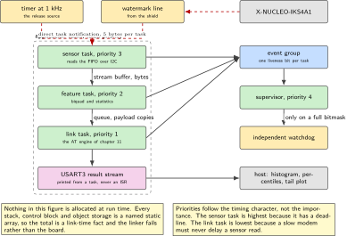
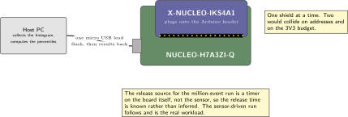
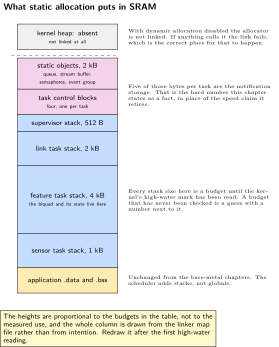
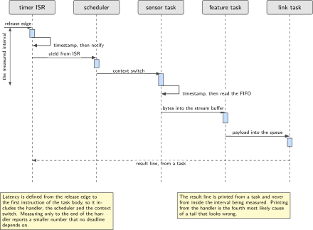
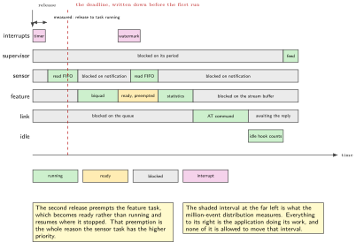

# Chapter 20. Three jobs at once: the node as an RTOS application

> **Target board:** NUCLEO-H7A3ZI-Q + X-NUCLEO-IKS4A1  
> **Theme:** Static allocation, synchronisation, measured latency distribution

> **Key facts**
>
> - **Board:** NUCLEO-H7A3ZI-Q with the X-NUCLEO-IKS4A1 on the Arduino header, one shield only
> - **Peripherals:** I2C to the shield, one interrupt line for the watermark, a general timer as the synthetic release source, the system tick, USART3 for the result stream
> - **Toolchain:** arm-none-eabi-gcc with CMake for the first kernel, and the other operating system's own build tool for the comparison
> - **Operating system:** FreeRTOS, statically allocated, with a Zephyr variant built in full
> - **Difficulty:** 5 of 5
> - **Effort:** 6 evenings of about four hours
> - **Deliverable:** The node of chapters 8 to 12 as a three-task application with no dynamic allocation anywhere, a written design that states its deadline before any measurement, and a latency distribution over a million events reporting the median, the 99.9th percentile and the maximum

## Why this project

This is the chapter the book exists to make possible. A job-fit note written against real vacancies records one standing gap in the portfolio, and it is not a language or a bus or a sensor: it is that there is no shipped application built on a real-time kernel. Everything earlier in this book is a superloop with interrupts, which is the right architecture for what it does and is not what a job advertisement means when it asks for experience with a kernel. One exercise on a board already owned closes the gap, and this is it.

The second reason is that the node of chapters 8 to 12 has outgrown its own structure. Sensing, computing a feature and getting bytes onto a link are three jobs with three different timing characters: one is driven by a sensor and must not be late, one is compute-bound and can be interrupted, and one spends most of its life waiting for a modem that answers when it feels like it. A superloop can do all three, and the chapter that rebuilds them as three tasks is worthwhile precisely because it must then prove that the rebuild did not make the first one late.

The third reason is evidence. This subject area carries more confident numbers with no method behind them than any other in the book, and the loudest is retired below. The corrective is a deadline written down before the first run, a distribution rather than an average, and a million events so that the 99.9th percentile means something.

> [!NOTE]
> **A number this chapter retires**
>
> The most repeated claim in this field is that waking a task by direct notification is forty-five percent faster than by a semaphore. Its origin is a vendor tutorial page that states no processor, no compiler, no optimisation level and no measurement method. The kernel's own official book has since dropped the figure and now says only that notifications are significantly faster. The hard, current, falsifiable number is the memory cost, which is five bytes per task for one notification entry. So this chapter states the memory cost as a fact and turns the speed claim into an exercise measured here, with its conditions printed next to it.

## Prior art and what to reuse

| Source | What it gives | What it does not | Licence |
| --- | --- | --- | --- |
| The kernel and its free official book | The scheduler, the synchronisation objects, static allocation, and a book that is the normative description of all of it | No application architecture, no task watchdog abstraction, and no measurement method | MIT |
| The other operating system, with an upstream in-tree port for this exact board | A second implementation of the same application with a different primitive vocabulary, on a board definition somebody else already wrote and tested, which makes the comparison cheap rather than heroic | Its primitives do not map one to one, and neither project publishes the mapping | Apache-2.0 |
| The third commercial kernel | Silicon-level support for this family | No example for this board at all, so it is named here and not used | Vendor terms |
| The tick-based measurement library | A cycle-accurate stopwatch that deliberately uses the system tick rather than the cycle counter, because the tick is present on every part and in every build | It is an instrument, not an experiment. The histogram, the release source and the percentiles are the author's | Apache-2.0 |
| A two-part published study comparing two kernels | The method worth copying exactly: a stated release source, a large sample, and a report of median, high percentile and maximum rather than an average | Its platform is a Cortex-M4 at 80 MHz and not this core, so none of its numbers transfer. Only the method does | Article, cite |
| The active-object framework and its free course | The strongest available argument that tasks blocking on multiple objects is the wrong structure, and a complete framework that implements the alternative | The framework is GPL or commercial, its safety editions are commercial only, and the course code is AGPL-3.0, which is the most restrictive licence in this book's pool | GPL or commercial; course AGPL-3.0 |

*Table 20.1. Prior art for chapter 20. The last row is recommended and never quoted: its licence terms make reproduction in a commercial work impossible, and the chapter respects that by re-deriving the pattern rather than copying it.*

What is left to write is most of it. Neither operating system publishes a mapping of its synchronisation primitives to the other's, and the third-party attempts are partial, so the mapping tables below are checked against both projects’ own documentation and are original work. Nobody has implemented the active-object pattern twice, by hand on ordinary queues and on the framework, and compared them honestly on one board, so that comparison is new. And there is no published latency distribution for either kernel on this core, which is why the method is borrowed and the numbers are not.

## Parts from the inventory

| Part | Role | Interface |
| --- | --- | --- |
| NUCLEO-H7A3ZI-Q | The application, the scheduler and the instrument | Micro USB to the host |
| X-NUCLEO-IKS4A1 | The sensor source for the real workload. One shield at a time, never two | Arduino header, I2C, one interrupt line |
| A USB data cable | Power, programming and the result stream | Micro USB |
| Host PC | Collects the histogram, computes the percentiles and plots the tail | Python over the virtual COM port |

*Table 20.2. Inventory items used in chapter 20. Nothing is wired: the shield plugs onto the header. The one-shield-at-a-time rule is inherited from the kit labs and is about address collisions and the supply budget, not about convenience.*

## System architecture



*Figure 20.1. The three tasks, the two interrupt sources, and every object that carries data between them. Nothing in this figure is allocated at run time: each object's storage is a named static array.*

Three tasks, and the priorities follow from the timing characters rather than from importance. The sensor task is highest because it has a deadline. The feature task is next because it has work but no deadline. The link task is lowest because it spends its life waiting for a modem and because making it higher would let a slow modem delay a sensor read. A fourth task, the supervisor, runs at the top priority, does almost nothing, and exists to check the liveness bitmask of chapter 12 and to service the independent watchdog. The idle hook counts, which is the cheapest processor-load measurement there is.

## Peripheral configuration

| Peripheral | Mode | Clock source | Pins and function | Interrupt and transfers |
| --- | --- | --- | --- | --- |
| I2C to the shield | Fast mode, addresses from the shield manual | Peripheral bus | D14 and D15, confirm in the board manual | Interrupt driven, transfers optional |
| Watermark interrupt | Input, rising edge | Peripheral bus | Shield interrupt line, confirm | External interrupt, priority below the kernel's ceiling |
| General timer | Periodic at 1 kHz, the synthetic release source | Peripheral bus | None | Update interrupt, the release event |
| System tick | 1 kHz kernel tick, shared with the measurement library | Core clock | None | The kernel's own exception |
| USART3 | Asynchronous, 115200 8N1 | Peripheral bus | Board manual pins | Stream buffer from a task, never from an interrupt |
| Independent watchdog | Enabled, fed only by the supervisor | Low-speed internal | None | Reset on timeout |

*Table 20.3. Peripheral configuration. Every interrupt that calls a kernel function has a priority at or below the kernel's ceiling, and one that does not is the single most common way to produce a kernel that fails in a way nobody can reproduce.*

> [!NOTE]
> **Interrupt priority is the first thing to get right**
>
> On this core a numerically lower priority value is more urgent, and the kernel refuses to be called from any interrupt more urgent than its configured ceiling. An interrupt above the ceiling that calls a kernel function does not fail immediately: it corrupts a list and fails later, somewhere else. Build with the kernel's assertion hook enabled during development so that the mistake stops the board at the offending call.

## Wiring



*Figure 20.2. Nothing is wired. The shield plugs onto the header, and the only cable is the one to the host. The synthetic release source for the latency run is a timer on the board itself, which is what makes the release time known rather than assumed.*

## Memory and timing budget



*Figure 20.3. Static allocation as a picture. Every stack, every control block and every object's storage is a named array in a known section, so the total is known at link time and the linker fails rather than the board.*

| Quantity | Budget | Measured | Margin |
| --- | --- | --- | --- |
| Sensor task stack | 1 kB | not measured | not measured |
| Feature task stack | 4 kB | not measured | not measured |
| Link task stack | 2 kB | not measured | not measured |
| Supervisor task stack | 512 B | not measured | not measured |
| Kernel objects, all static | 2 kB | not measured | not measured |
| Notification storage per task | 5 B | fixed by the kernel | none needed |
| Release to sensor task running, median | 100 µs | not measured | not measured |
| Release to sensor task running, 99.9th | 250 µs | not measured | not measured |
| Release to sensor task running, maximum | 1 ms | not measured | not measured |
| Processor load at 104 Hz sensor rate | 20 percent | not measured | not measured |

*Table 20.4. The budget table, and the deadline is in it. The three latency rows are written before the first run and are the acceptance criteria for the whole chapter. The instrument is the tick-based measurement library, cross-checked against the core's cycle counter.*

Stack sizes are budgets until the high-water mark says otherwise. The kernel reports, for each task, the smallest amount of free stack that task has ever had, and that number is collected in the same result line as everything else.

## Firmware design (UML)



*Figure 20.4. One event through the system, and the two points between which latency is defined. The definition matters more than the number: from the release edge to the first instruction of the task body, not to the end of the interrupt handler.*

The design is written before the code, which for a task set means four things on one page: the tasks and their priorities, the objects between them and which task owns each one, the blocking points of every task, and the deadline. The last of these is what makes the rest checkable. A task set with no stated deadline cannot be shown to work; it can only be shown to run.

Every task blocks on exactly one thing. That is a design rule and not an accident of the kernel: a task that waits on several objects at once needs a queue set or a polling object, both of which cost memory and make the worst case harder to reason about. Where a task genuinely needs several sources, the sources are merged into one queue of tagged events before the task sees them. That rule is also the bridge to the active-object argument below, which says the same thing more forcefully.

## Data flow (ASCII)

```text
   timer 1 kHz            watermark IRQ
        |                      |
        v                      v
  +-----------------------------------+   notification (5 bytes per task)
  |  ISR: timestamp, notify, return   | ------------------+
  +-----------------------------------+                   |
                                                           v
  +------------------+  stream buffer  +------------------+   queue   +---------------+
  | sensor task      | --------------> | feature task     | --------> | link task     |
  | prio 3, I2C FIFO |   bytes         | prio 2, biquad   |  payload  | prio 1, AT    |
  +------------------+                 +------------------+           +---------------+
        |                                    |                              |
        +----------------+-------------------+------------------------------+
                         v  event group bit per task, one 32-bit word
                  +---------------------+       +-------------------------+
                  | supervisor, prio 4  | ----> | independent watchdog    |
                  +---------------------+       +-------------------------+
```

## Repository layout

```text
nucleo-h7a3-rtos-node/
  CMakeLists.txt
  cmake/arm-none-eabi.cmake
  third_party/FreeRTOS-Kernel/       # vendored, MIT, LICENSE kept
  third_party/perf_counter/          # vendored, Apache-2.0
  config/FreeRTOSConfig.h            # static only, assertions on
  src/tasks_sensor.c                 # highest application priority
  src/tasks_feature.c                # biquad and statistics, chapter 18
  src/tasks_link.c                   # AT engine of chapter 11, or the stub
  src/tasks_supervisor.c             # liveness bitmask, watchdog, chapter 12
  src/objects_static.c               # every queue, buffer and semaphore
  src/latency.c                      # histogram, percentiles, result line
  src/release_timer.c                # the synthetic 1 kHz release source
  docs/DESIGN.md                     # tasks, priorities, objects, deadline
  docs/PRIMITIVE_MAP.md              # the mapping between the two kernels
  zephyr/                            # the same application, second kernel
    prj.conf  CMakeLists.txt  src/
  active_object/                     # the pattern by hand, on plain queues
  tools/percentiles.py               # reads the histogram, plots the tail
  results/latency_million.csv
  README.md
```

## Steps

**Step 1.** **Write the design page before any code.** Four tasks, their priorities, the objects between them, where each task blocks, and the deadline. If that page cannot be written, the task set is not understood yet and the code will encode the confusion.

**Step 2.** **Turn dynamic allocation off and keep it off.** This is one configuration line and it changes the character of the project. With it off, every object's storage is visible, the total is known at link time, and there is no allocator to fragment.

```c
#define configSUPPORT_STATIC_ALLOCATION     1
#define configSUPPORT_DYNAMIC_ALLOCATION    0
#define configUSE_MUTEXES                   1
#define configUSE_TASK_NOTIFICATIONS        1
#define configTASK_NOTIFICATION_ARRAY_ENTRIES 1   /* 5 bytes per task */
#define configCHECK_FOR_STACK_OVERFLOW      2
#define configASSERT(x) if ((x) == 0) { taskDISABLE_INTERRUPTS(); for(;;); }
```

With dynamic allocation off the kernel asks the application for the idle task's and the timer task's memory. Providing those two hooks is not optional and the link fails without them, which is the correct behaviour.

**Step 3.** **Create the task set statically.** Each task owns a named stack array and a named control block, so the memory figure above can be drawn from the map file rather than from intention.

```c
static StackType_t  sensor_stack[256];          /* words, so 1 kB */
static StaticTask_t sensor_tcb;

TaskHandle_t sensor_task = xTaskCreateStatic(
    sensor_task_body, "sensor", 256, NULL,
    PRIO_SENSOR, sensor_stack, &sensor_tcb);
```

**Step 4.** **Wake the sensor task from the interrupt, and define latency before measuring it.** The interrupt timestamps the release and notifies; the task timestamps again as its first act. Latency is the difference, which includes the handler, the scheduler and the context switch, because all three are between the event and the work.

```c
void TIM_Release_IRQHandler(void)             /* the synthetic release */
{
    release_ts = perf_counter_now();
    BaseType_t woken = pdFALSE;
    vTaskNotifyGiveFromISR(sensor_task, &woken);
    portYIELD_FROM_ISR(woken);
}

static void sensor_task_body(void *arg)
{
    for (;;) {
        ulTaskNotifyTake(pdTRUE, portMAX_DELAY);
        latency_record(perf_counter_now() - release_ts);   /* first act */
        sensor_read_fifo();
    }
}
```

**Step 5.** **Record a distribution, not an average.** A million samples are not stored. A fixed-bin histogram plus a running maximum is, and the percentiles come from the histogram on the host.

```c
#define BINS 1024                       /* one bin per microsecond */
static uint32_t hist[BINS];
static uint32_t hist_over, hist_max, hist_n;

void latency_record(uint32_t cycles)
{
    uint32_t us = cycles / CYCLES_PER_US;
    if (us < BINS) hist[us]++; else hist_over++;
    if (us > hist_max) hist_max = us;
    hist_n++;
}
```

The overflow counter is not decoration. A distribution that silently discards its tail reports a maximum that is a property of the histogram rather than of the system.

**Step 6.** **Run a million events with a known release source.** A timer at 1 kHz gives a million releases in about seventeen minutes, with a release time that is known rather than inferred. The sensor-driven run follows and is the real workload; the timer-driven run is what makes the distribution comparable between builds.

```bash
python tools/percentiles.py --port /dev/ttyACM0 --events 1000000 \
  --out results/latency_million.csv
```

**Step 7.** **Measure the claim instead of repeating it.** Build the same harness twice, once notifying and once giving a binary semaphore, change nothing else, and report both distributions with the conditions printed beside them.

```c
#if WAKE_BY_NOTIFICATION
    vTaskNotifyGiveFromISR(sensor_task, &woken);
#else
    xSemaphoreGiveFromISR(sensor_sem, &woken);
#endif
```

Print the processor, the clock, the compiler and its optimisation level, the kernel version, the cache state and the release source in the result header. Those are exactly the six things the widely repeated figure omits, which is why it cannot be checked and should not be quoted.

**Step 8.** **State what the mutex does and does not do.** This kernel implements a basic form of priority inheritance. It assumes a task holds one mutex at a time, it is not transitive, and there is no priority ceiling protocol. That is a design constraint, not a defect, and a design that needs more than it offers needs a different structure rather than a different opinion.

```c
/* Correct use: one mutex, held briefly, released on every path. */
if (xSemaphoreTake(i2c_mutex, pdMS_TO_TICKS(10)) == pdTRUE) {
    i2c_transfer(...);
    xSemaphoreGive(i2c_mutex);
}
```

**Step 9.** **Build the same application on the other kernel.** The upstream in-tree board definition exists, so this costs an evening rather than a week. The point is not that one is better: it is that writing the same design twice exposes which parts were design and which were the first kernel's vocabulary.

```bash
west build -b nucleo_h7a3zi_q zephyr/
west flash
```

**Step 10.** **Write the mapping table, because nobody else has.** Neither project documents the correspondence and the third-party attempts are partial. Each row below is checked against both projects’ own reference documentation, and the rows with no equivalent are the interesting ones.

| This kernel | The other kernel | What actually differs |
| --- | --- | --- |
| Task, created statically | Thread with a statically defined stack | The other declares the stack with a macro that also handles guard regions and alignment |
| vTaskDelay | k\_sleep or k\_msleep | Equivalent. Both are relative delays |
| vTaskDelayUntil | No direct equivalent | The closest is a kernel timer or a work item rescheduled from its own handler |
| Binary semaphore | Semaphore with a limit of one | Equivalent |
| Counting semaphore | Semaphore with a limit of N | Equivalent |
| Mutex with priority inheritance | Mutex with priority inheritance | Both are basic forms. Neither offers a priority ceiling protocol |
| Queue, copies fixed-size items | Message queue, copies fixed-size items | Equivalent, and both have static variants |
| Queue of pointers | Queue or first-in-first-out list | The other's list is intrusive: the item carries the link word |

*Table 20.5. Primitive mapping, part one: threads, time and the basic objects. Checked against both projects’ own reference documentation on Sunday 20 September 2026. Neither project publishes this table.*

| This kernel | The other kernel | What actually differs |
| --- | --- | --- |
| Stream buffer, bytes, one reader one writer | Pipe, bytes | The other's pipe does not assume a single reader and a single writer, so it takes a lock the stream buffer does not need |
| Message buffer, variable-length messages | No direct equivalent | Framing over a pipe, or a message queue sized for the largest message |
| Event group, 24 usable bits | Event object, 32 bits | The other has more bits and no reserved range |
| Direct task notification | No direct equivalent | The nearest is a per-thread semaphore or a poll signal. This is the sharpest difference between the two |
| Queue set | Poll | The other's poll is the general mechanism and is not limited to queues |
| Software timer | Kernel timer or delayable work | The other separates a timer callback in interrupt context from work deferred to a thread |
| Deferred interrupt handling to the timer task | Work submitted to the system work queue | The other's name for it is clearer and the mechanism is the same |
| Critical section macros | Interrupt lock or a spin lock | The other's spin lock is the multiprocessor-safe form and is the one to use |
| Tickless idle | Tickless kernel | Both are a configuration option. Chapter 7 is where the consequences were measured |

*Table 20.6. Primitive mapping, part two: data movement, events and deferral. The row with no equivalent on either side is the one worth reading twice, because it is where a design does not port by renaming.*

**Step 11.** **Implement the active-object pattern twice.** By hand first: one queue per task, one run-to-completion event handler per task, a static event pool, and no task ever blocking anywhere except on its own queue. Then on the framework. Compare code size, cycles per event and the same latency distribution. Keep the two in separate repositories: the hand-written one can carry a permissive licence, the framework one cannot.

## Build, flash and debug



*Figure 20.5. The schedule figure: two releases, four tasks, and the deadline drawn where it was written down. The marked interval at the left is what the million-event distribution measures.*

```bash
cmake -B build -DWAKE=notification \
  -DCMAKE_TOOLCHAIN_FILE=cmake/arm-none-eabi.cmake
cmake --build build -j
probe-rs run --chip STM32H7A3ZITx build/firmware.elf
```

A debugger that understands the kernel shows the task list, each task's state and each task's stack high-water mark, which turns a hung board into a reading. When the board stops in the assertion hook the cause is usually one of three: an interrupt above the kernel ceiling called a kernel function, a task returned instead of looping forever, or a stack overflowed. All three are configuration rather than logic.

> [!NOTE]
> **When the board runs and the distribution is wrong**
>
> A tail that is far worse than the median usually has one of four causes, in order of likelihood: an interrupt somewhere that runs for longer than anyone thinks; a critical section held across something slow, such as a bus transfer; a lower-priority task holding a mutex the sensor task needs, which is priority inversion and is the one the kernel only partly protects against; and the measurement itself, if the result line is printed from inside the timed path. Print from a task, never from the interrupt, and never inside the interval being measured.

## Verification and acceptance criteria

- The design page exists and states the deadline before any measurement appears anywhere in the repository history.
- No dynamic allocation anywhere: the configuration disables it, the allocator is not linked, and the map file is the evidence.
- A million release events are recorded with the timer source, and the report gives the median, the 99.9th percentile and the maximum, with the overflow count shown so the tail can be trusted.
- All three latency figures meet the budget written in the budget table above, or the table is updated with the reason and the design is revisited.
- The same distribution is reported for the notification wake and the semaphore wake, with the six conditions printed in the header, and the chapter states the measured relationship rather than repeating the claim it retires.
- Every task's stack high-water mark is reported in the same result line, and no task has used more than eighty percent of its budget.
- The application runs unmodified on both kernels, and the mapping table names every place where the design had to change rather than be renamed.
- The active-object implementation exists twice and is compared on code size, cycles per event and the same latency distribution, with the counter argument stated in the text.
- The supervisor services the watchdog only when every task has set its liveness bit since the last cycle, and a deliberately stalled task produces a reset with a crash record, as in chapter 12.

## Variants

| Axis | Variant | What changes | Cost | Built in full in |
| --- | --- | --- | --- | --- |
| Execution model | An RTOS task set, statically allocated | The whole chapter. Four tasks, fixed priorities, no allocator | A scheduler in the timing path | Here |
| Synchronisation | Binary and counting semaphore | The signal from interrupt to task, and the resource count for the shield's bus | One object per signal | Here |
| Synchronisation | Mutex with priority inheritance | Exclusive access to the shared bus, with the kernel's basic inheritance and its stated limits | Inversion the kernel only partly prevents | Here |
| Synchronisation | Queue | Payloads from the feature task to the link task, copied rather than shared | A copy per message | Here |
| Synchronisation | Direct task notification | The cheapest wake, at five bytes per task, and the subject of this chapter's measured exercise | One signal per task at a time | Here |
| Synchronisation | Event group | The liveness bitmask the supervisor reads, one bit per task in one word | Bits are not counters | Here |
| Synchronisation | Stream buffer | Sensor bytes to the feature task without framing, one reader and one writer | That assumption is load bearing | Here |
| Operating system | The other kernel | The same design on an upstream in-tree port for this exact board, with a different primitive vocabulary | A second toolchain | Here, and referenced from chapter 13 |
| Operating system | Bare metal | What chapters 8 to 12 already are, and the thing this chapter is measured against | No scheduler, no latency to measure | Chapter 8 |
| Time and safety | Tickless idle | The kernel stops the tick when every task is blocked, which is what makes an RTOS node a low-power node | Wake latency | Chapter 7 |
| Time and safety | Independent watchdog | The supervisor is the only feeder, and it feeds only on a full liveness bitmask | A reset is a real outcome | Chapter 12 |
| Language | C++ | Tasks as objects with their stacks as members, which makes static allocation natural and the ownership explicit | Care with construction order | Chapter 9 |
| Intelligence and reach | Feature on the MCU | The feature task is chapter 18's pipeline, now sharing a processor with two other jobs | Jitter enters the compute path | Chapter 16 |

*Table 20.7. Variants for chapter 20. This chapter carries more of the book's variant matrix than any other, which is why it is last and why it is six evenings rather than four.*

## Pitfalls

- An interrupt above the kernel's ceiling calling a kernel function. It does not fail at the call. It corrupts a list and fails later somewhere else.
- Reporting an average latency. A real-time system is described by its tail, and an average hides exactly the events that matter.
- Sizing a histogram so that the interesting events land in the overflow bin, and then reporting a maximum that is a property of the histogram.
- Assuming the kernel's priority inheritance is a full protocol. It is a basic form, it assumes one mutex at a time, it is not transitive, and there is no priority ceiling.
- Printing the result line from inside the interval being measured.
- Letting a task return. A task function must never return; the kernel has no sensible behaviour for it.
- Quoting the forty-five percent figure. It has no stated processor, compiler, optimisation level or method, and the kernel's own book has dropped it.
- Porting a design to the other kernel by renaming functions. Two rows of the mapping tables have no equivalent, and those are where the design has to change.
- Moving a buffer into a task and forgetting that a transfer engine still writes it. Chapter 19 does not stop applying because there is now a scheduler.

## Best practices applied

- The deadline is written down before the first measurement, and the acceptance criteria are the budget table rather than a judgement afterwards.
- Nothing is allocated at run time, so the memory total is a link-time fact.
- Every task blocks on exactly one object, which keeps the worst case possible to reason about.
- A claim with no method is measured rather than repeated, and the conditions the original omitted are printed with the result.
- A licence that forbids reproduction is respected by re-deriving the pattern rather than copying the code, and the two implementations live in separate repositories with separate terms.
- The comparison between the two kernels is made by writing the same design twice, which is the only way to find out which parts were design.

## Stretch goals

- Measure priority inversion directly: a low-priority task holding the bus mutex while the sensor task waits, with and without inheritance enabled. No published measurement of inversion blocking exists for this core.
- Add the task watchdog abstraction that the other kernel ships and this one does not, as a small permissive library, and compare it against the supervisor of chapter 12.
- Run the distribution again with the caches off, and again with the code in tightly coupled memory, joining this chapter to chapters 18 and 19.
- Publish the mapping tables as a standalone document. It does not exist anywhere, and it is the kind of reference other people link to.

## Roadmap and next steps

This is the last chapter, so the roadmap is about what comes after the book. The community roadmap that runs through this volume separates firmware from embedded Linux from hardware and is explicit that projects teach what reading does not, which is the thesis this chapter ends on.

For the kernel itself, the free official book is the normative description and is worth reading cover to cover once, now that there is an application to read it against. For the other kernel, the best free course comes from a different silicon vendor and its concepts transfer directly. For the mathematics of real-time scheduling, which almost nothing else teaches, there is one university specialisation that actually covers it, and the free course whose code is under a permissive licence and whose slides are freely licensed is the safest material to build further exercises on, although its examples are not on this board. The free course that walks a single problem from a superloop to an event-driven architecture across fifty-six lessons is the best companion to this chapter specifically, and its licence means it is recommended and never quoted. Appendix H lists all of them with their terms, and appendix I sets out what a reader does next.

## Portfolio evidence

- A public repository with the design page dated before the first result, the static task set, and a README whose first figure is the schedule diagram.
- The latency report: a million events, median, 99.9th percentile and maximum, the overflow count, the tail plotted on a logarithmic axis, and the six conditions in the header.
- The two wake methods measured side by side, with a sentence saying what the widely repeated figure omits and what this board actually did.
- The stack high-water marks for every task next to their budgets.
- The same application on the second kernel, in the same repository, with the mapping tables as a document rather than as comments.
- The active-object pattern implemented twice, with the counter argument stated fairly and the comparison published, since nobody has published it.

## Sources

Normative references:

- The kernel's own official book, which is the normative description of the scheduler, the objects and static allocation, and which no longer carries the speed figure this chapter retires.
- The other operating system's reference documentation for kernel services, which is the authority for every row of the mapping tables on that side.
- Reference manual RM0455 for the interrupt controller's priority grouping, and the Armv7-M architecture reference manual for how priority values order.
- The board user manual for MB1363 and the shield user manual UM3239, for the header pins and the shield's bus topologies.

Reusable implementations:

- The kernel, MIT, vendored with its licence file.  
  <https://github.com/FreeRTOS/FreeRTOS-Kernel>
- The kernel's free official book, MIT.  
  <https://github.com/FreeRTOS/FreeRTOS-Kernel-Book>
- The other operating system's in-tree port for this exact board, Apache-2.0.  
  <https://docs.zephyrproject.org/latest/boards/st/nucleo_h7a3zi_q/doc/index.html>
- The tick-based measurement library, Apache-2.0.  
  <https://github.com/GorgonMeducer/perf_counter>
- The two-part study whose method this chapter copies and whose numbers it does not, since its platform is a different core.  
  <https://www.ul.com/sis/blog/>  
  <measuring-real-time-operating-system-performance-part-ii-comparing-freertos-vs-zephyr>
- The active-object framework, GPL or commercial, recommended and never quoted.  
  <https://www.state-machine.com/products/qp>

---

[Previous](19-caches.md) &nbsp;&nbsp;|&nbsp;&nbsp; [Contents](../README.md) &nbsp;&nbsp;|&nbsp;&nbsp; [Next](21-appendix.md)
